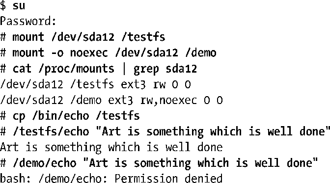

### 14.9.3　基于每次挂载的挂载标志

在内核2.4版本以前，文件系统和挂载点之间是一一对应的关系。由于从Linux 2.4开始，这一特征不再适用，故而14.8.1节所述的某些mountflag标志值可以基于每次挂载来设置。这包括MS_NOATIME (始于Linux 2.6.16)、MS_NODEV、MS_NODIRATIME (始于Linux 2.6.16)、MS_NOEXEC、MS_NOSUID、MS_RDONLY (始于Linux 2.6.26)，以及MS_RELATIME。以下shell会话演示了使用MS_NOEXEC标志的效果：

