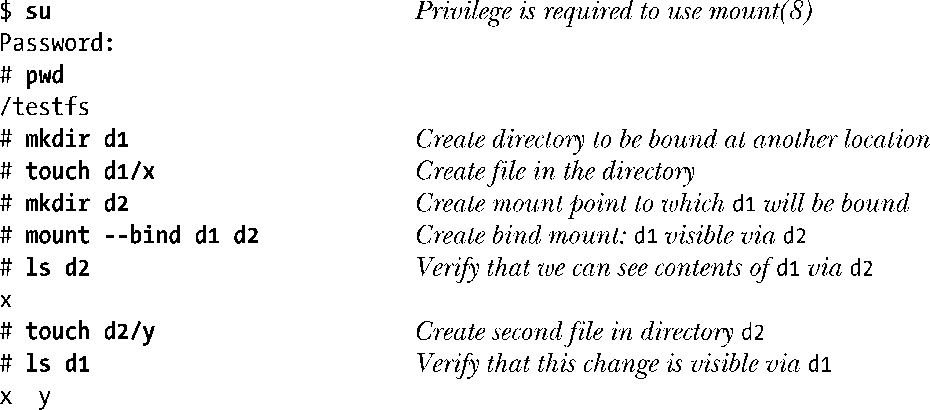
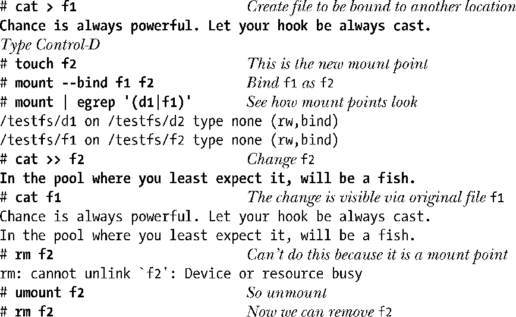

### 14.9.4　绑定挂载

始于内核版本2.4，Linux支持了创建绑定挂载。绑定挂载（由使用MS_BIND标志的mount()调用来创建）是指在文件系统目录层级的另一处挂载目录或文件。这将导致文件或目录在两处同时可见。绑定挂载有些类似于硬链接，但存在两个方面的差异。

+ 绑定挂载可以跨越多个文件系统挂载点，甚至不拘于chroot监禁区（jail）。
+ 可针对目录执行绑定挂载。

可使用mount(8)的bind选项，在shell中创建绑定挂载，如下面几个例子所示。

第一个例子在另一处绑定挂载了一个目录，并展示了在一处目录中所创建的文件，对另一处目录同样可见。

第二个例子会在另一处绑定挂载文件，并展示了在一处挂载下，可以看见另一处挂载下对文件所做的改变。

绑定挂载的应用场景之一是创建chroot监禁区（jail）（参见18.12节）。在监禁区下，无需将各种标准目录（诸如/lib）复制过来，为这些路径创建绑定挂载（可能是以只读方式）即可轻而易举地解决问题。

