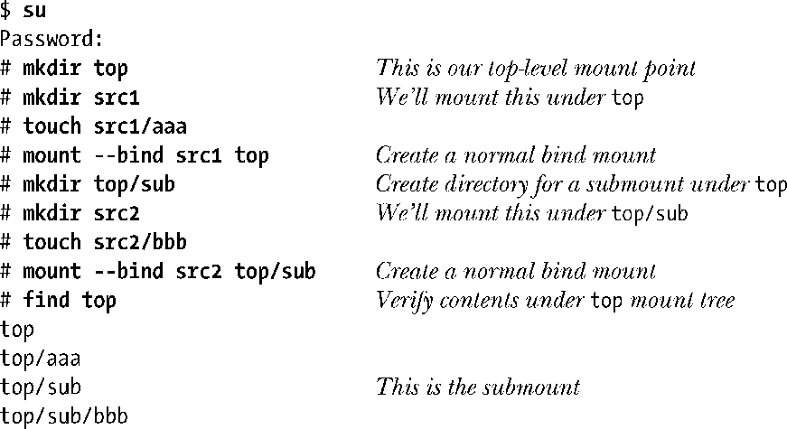
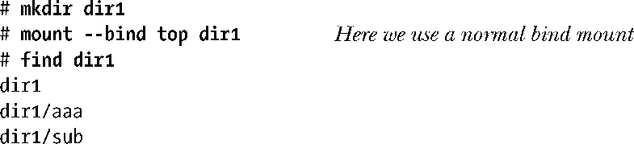
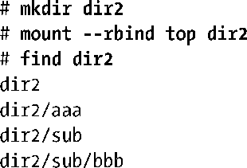

### 14.9.5　递归绑定挂载

默认情况下，如果使用MS_BIND为某个目录创建了绑定挂载，那么只会将该目录挂载到新位置。假设源目录下还存在子挂载（submount），则不会将这些子挂载复制到挂载target之下。Linux 2.4.11添加了MS_REC标志，若与MS_BIND 相或（OR）并作为标志参数的一部分传入mount()，则会将子挂载复制到挂载目标下，此之谓递归绑定挂载。采用mount(8)命令所提供的--rbind选项，可在shell中完成相同任务，参见如下shell会话。

首先创建了一个目录树(src1)，并将其挂载在top之下。top目录树下（top/sub），包括了一个子挂载(src2)。

现在以top作为源目录，另行创建绑定挂载(dir1)。由于属于非递归操作，新挂载不会复制子挂载。

输出中并未发现dir1/sub/bbb，这表明并未复制子挂载top/sub。

再以top作为源目录来创建递归绑定挂载。

从输出中可以发现dir2/sub/bbb，这表明已然复制了子挂载top/sub。

