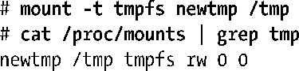

### 14.10　虚拟内存文件系统：tmpfs

到目前为止，本章已论及的所有文件系统均驻留在磁盘之上。然而，Linux同样支持驻留于内存中的虚拟文件系统。对应用程序来说，此类文件系统看起来与任何其他文件系统别无二致——可施以相同操作（open()、read()、write()、link()、mkdir()等）。不过，二者之间还是存在一个重要差别：由于不涉及磁盘访问，虚拟文件系统的文件操作速度极快。

在Linux上，已经开发出了林林总总基于内存的文件系统。迄今为止，其中最为复杂的则非tmpfs文件系统莫属，该系统在Linux 2.4中首度出现。较之于其他基于内存的文件系统，其独特之处在于它属于虚拟内存文件系统。这意味着，该文件系统不但使用RAM，而且在RAM耗尽的情况下，还会利用交换空间。（虽然此处描述的tmpfs文件系统为Linux所专有，但大多数UNIX实现都提供某种形式的基于内存的文件系统。）

> tmpfs文件系统是一个Linux内核的可选组件，通过CONFIG_TMPFS选项加以配置。

要创建tmpfs文件系统，请使用如下形式的命令：

其中“source”可以是任意名称，其唯一的意义是在/proc/mounts中“抛头露面”，并通过mount和df命令显示出来。与往常一样，target是该文件系统的挂载点。请注意，无需使用mkfs预先创建一个文件系统，内核会将此视为mount()系统调用的一部分自动加以执行。

作为使用tmpfs的例子之一，可采用堆叠挂载（无需顾忌/tmp目录目前是否处于在用状态），创建一tmpfs文件系统并将其挂载至/tmp，如下所示：

有时，会使用如上命令（或/etc/fstab中的等价条目）来改善应用程序（比如，编译器）的性能，此类应用程序因创建临时性文件而频繁使用/tmp目录。

默认情况下，允许将tmpfs文件系统的大小提高至RAM容量的一半，但在创建文件系统或之后重新挂载时，可使用 mount的size=nbytes选项为该文件系统的大小设置不同的上限值。（tmpfs文件系统仅会根据其当前所持有的文件来消耗内存和交换空间。）

一旦卸载tmpfs文件系统，或者遭遇系统崩溃，那么该文件系统中的所有数据都将丢失，“tmpfs”正是得名于此。

除了用于用户应用程序以外，tmpfs文件系统还有以下两个特殊用途。

+ 由内核内部挂载的隐形tmpfs文件系统，用于实现System V共享内存（第48章）和共享匿名内存映射（第49章）。
+ 挂载于/dev/shm的tmpfs文件系统，为glibc用以实现POSIX共享内存和POSIX信号量。

