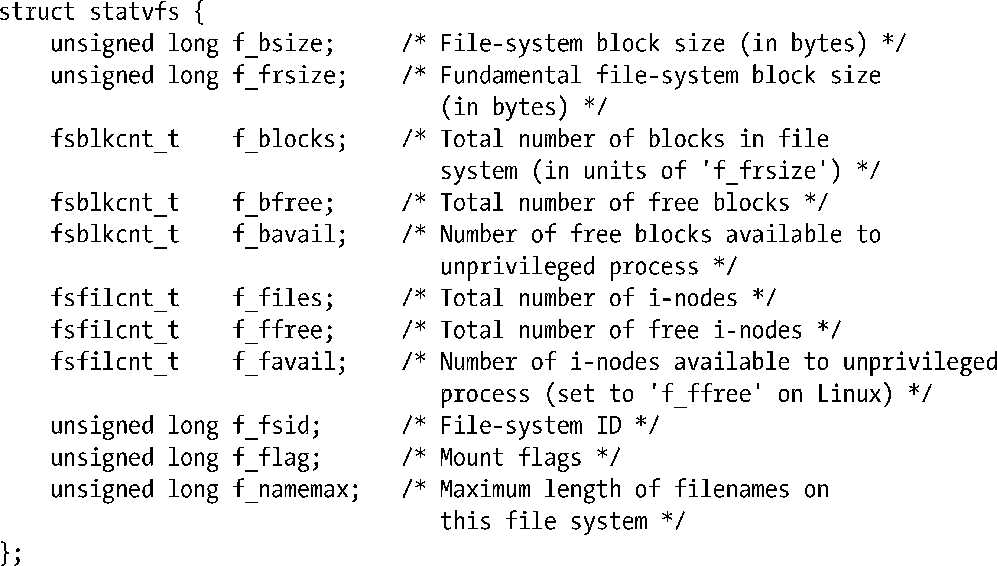

### 14.11　获得与文件系统有关的信息：statvfs()

statvfs()和fstatvfs()库函数能够获得与已挂载文件系统有关的信息。

两者之间唯一的区别在于其标识文件系统的方式。statvfs()需使用 pathname 来指定文件系统中任一文件的名称。而 fstatvfs()则需使用打开文件描述符fd，来指代文件系统中的任一文件。二者均返回一个 statvfs结构，属于由statvfsbuf所指向的缓冲区，其中包含了关乎文件系统的信息。statvfs结构的形式如下：

上述注释已然清晰地描述出statvfs结构中大多数字段的用途。对其中一些字段，这里还要深入交代几句。

+ fsblkcnt_t和fsfilcnt_t数据类型是由SUSv3所定义的整型。
+ 对绝大多数Linux文件系统而言，f_bsize和f_frsize的取值是相同的。然而，某些文件系统支持块片段的概念，在无需使用完整数据块的情况下，可在文件尾部分配较小的存储单元，从而避免因分配完整块而导致的空间浪费。在此类文件系统上，f_frsize和f_bsize分别为块片段和整个块的大小。（据[McKusick et al.，1984]所述，UNIX文件系统的块片段概念首现于20世纪80年代初期的4.2BSD快速文件系统。）
+ 许多原生UNIX和Linux文件系统，都支持为超级用户预留一部分文件系统块，如此一来，即便在文件系统空间耗尽的情况下，超级用户仍可以登录系统解决故障。如果文件系统中确有预留块，那么statvfs结构中f_bfree和f_bavail字段间的差值则为预留块数。
+ f_flag字段是一个位掩码标志，用于挂载文件系统。也就是说，该字段所包含的信息类似于传入mount(2)的mountflags参数。然而，该字段所使用的标志位在命名时均冠以 ST_，这不同于 mountflags中冠以 MS_的命名手法。SUSv3仅规范了ST_RDONLY和ST_NOSUID常量，而glibc实现则支持与MS_系列(参见mount()中对mountflags参数的描述)相对应的全系列常量。
+ 某些UNIX实现会使用f_fsid字段来返回文件系统的唯一标识符，比方说，根据文件系统所驻留设备的标识符来取值。对大多数UNIX实现来说，该字段为0。

SUSv3规范了statvfs()和fstatvfs()。对于Linux（其他几种UNIX实现也一样），二者均位于与其颇为相似的statfs()和fstatfs()系统调用之上。（有些UNIX实现只提供statfs()系统调用，而不提供statvfs()。）以下列出函数与系统调用间的主要区别（除去字段命名差异以外）。

+ statvfs()和 fstatvfs()函数均返回 f_flag 字段，内含关于文件系统的挂载标志信息。（glibc实现通过扫描/proc/mounts或/etc/mtab来获取上述信息。）
+ statfs()和fstatfs()系统调用返回f_type字段，内含文件系统类型（比如，返回值为0xef53则表示文件系统类型为ext2）。

> 随本书发布源码的filesys子目录中包含了t_statvfs.c和t_statfs.c文件，用来演示对statvfs()和statfs()的运用。

