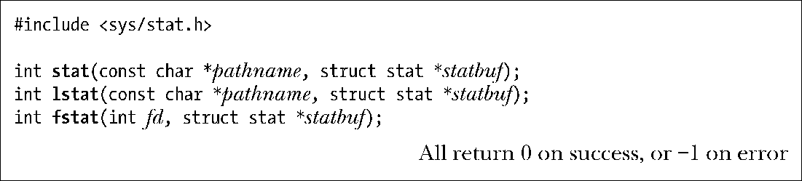
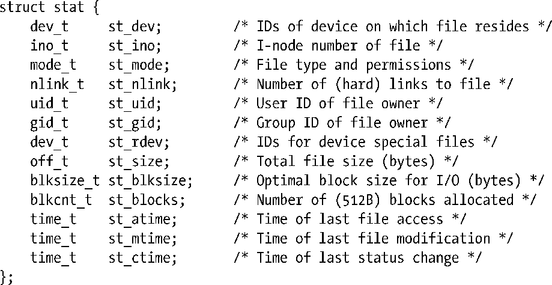
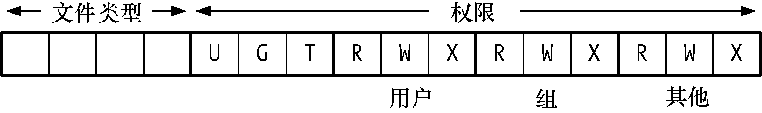
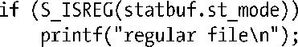
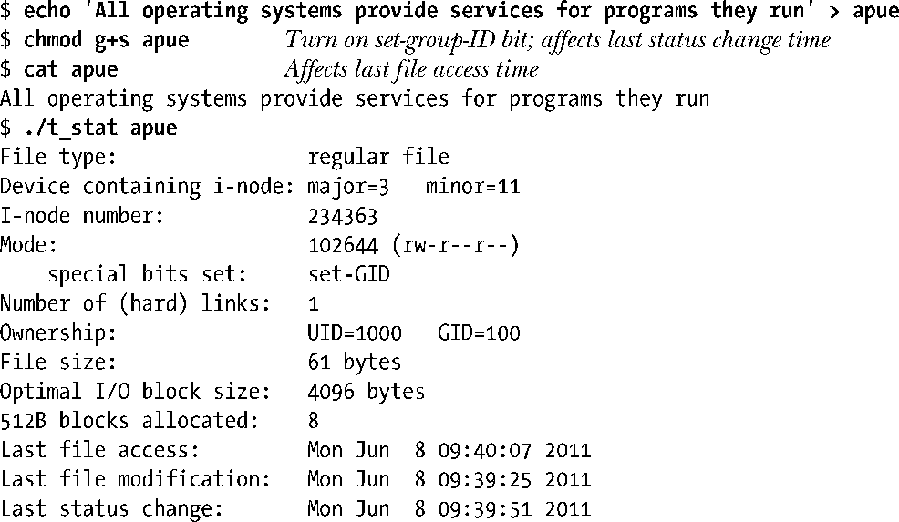
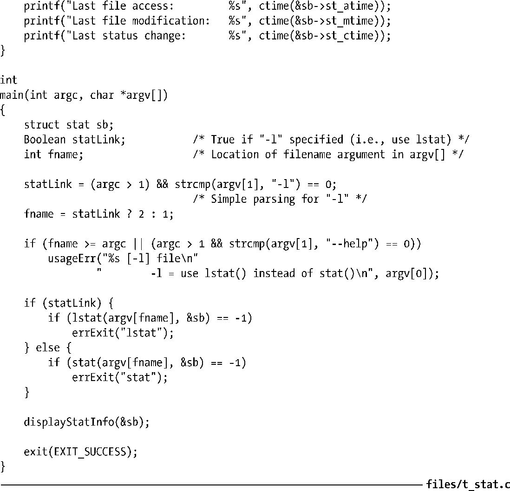

### 15.1　获取文件信息：stat()

利用系统调用stat()、lstat()以及fstat()，可获取与文件有关的信息，其中大部分提取自文件i节点。

以上3个系统调用之间仅有的区别在于对文件的描述方式不同。

+ stat()会返回所命名文件的相关信息。
+ lstat()与stat()类似，区别在于如果文件属于符号链接，那么所返回的信息针对的是符号链接自身（而非符号链接所指向的文件）。
+ fstat()则会返回由某个打开文件描述符所指代文件的相关信息。

系统调用 stat()和 lstat()无需对其所操作的文件本身拥有任何权限，但针对指定pathname 的父目录要有执行（搜索）权限。而只要供之以有效的文件描述符，fstat()系统调用总是成功。

上述所有系统调用都会在缓冲区中返回一个由statbuf指向的stat结构，其格式如下：

在SUSv3中，明确定义了供stat结构各字段使用的不同数据类型。更多与这些数据类型有关的信息，请参考3.6.2节。

> 根据 SUSv3，将 lstat()应用于符号链接时，只需在 st_size 字段和描述文件类型的st_mode字段（稍后介绍）返回有效信息，并不要求所返回的其他字段（比如，time字段）信息有效。如此一来，出于效率的原因，系统实现可选择不维护此类字段。说透彻一点，早期UNIX标准的意图在于把符号链接要么实现为i节点，要么实现为目录中的一条记录。如果是后一种实现方式，在实现中顾及stat结构的所有字段是不现实的。（在所有当代主流的UNIX实现中，符号链接都是以i节点的方式来实现的。）在Linux上，将lstat()应用于符号链接时，会返回所有stat字段的信息。

接下来，会对stat结构的某些字段做重点介绍。最后，还会给出展示完整stat结构的程序示例。

#### 设备ID和i节点号

st_dev字段标识文件所驻留的设备。st_ino字段则包含了文件的i节点号。利用以上两者，可在所有文件系统中唯一标识某个文件。dev_t类型记录了设备的主、辅ID（见14.1节）。

如果是针对设备的i节点，那么st_rdev字段则包含设备的主、辅ID。

利用宏major()和minor()，可提取dev_t值的主、辅ID。获取对两个宏声明的头文件则随UNIX实现而各异。在Linux系统上，若定义了_BSD_SOURCE宏，则两个宏定义于<sys/types.h>中。

由major()和minor()所返回的整形值大小也随UNIX实现的不同而各不相同。为保证可移植性，打印时应总是将返回值强制转换为long（见3.6.2节）。

#### 文件所有权

st_uid和st_gid字段分别标识文件的属主（用户ID）和属组（组ID）。

#### 链接数

st_nlink字段包含了指向文件的（硬）链接数。本书第18章将详细介绍链接。

#### 文件类型及权限

st_mode字段内含有位掩码，起标识文件类型和指定文件权限的双重作用。图15-1所示为该字段所含各位的布局情况。

<b class="my_markdown">图15-1：st_mode位掩码的布局</b>

与常量S_IFMT相与（&），可从该字段中析取文件类型。（Linux使用了st_mode字段中的4位来标识文件类型位。但由于SUSv3并未对文件类型位的表示方式做出任何规定，故而其具体细节随各实现而异。）将计算结果与一系列常量进行比较，即可确定文件类型，如下所示：

鉴于上述操作属于常见操作，因此可利用标准宏将其简化为：

表15-1所列为全套文件类型宏（定义于<sys/stat.h>）。这些宏均由SUSv3定义，并为Linux所支持。一些其他的UNIX实现还定义了别的文件类型（比如，用于Solaris door files的S_IFDOOR）。因为调用 stat()时会循符号链接而直抵实际文件，所以只有在调用 lstat()时才有可能返回类型S_IFLNK。

> 想从<sys/stat.h>中获得S_IFSOCK和S_ISSOCK()的定义，必须定义_BSD_SOURCE特性测试宏，或是将_XOPEN_SOURCE定义为不小于500的值。（具体规则随glibc版本而异。在某些情况下，需将_XOPEN_SOURCE的值定义为不小于600。）

最初的POSIX.1标准并未定义表15-1中第一列所列的常量，尽管其中的大部分已为多数UNIX实现所支持。而SUSv3则把这些常量纳入规范。

<b class="my_markdown">表15-1：针对stat结构中的st_mode来检查文件类型的宏</b>

| 常　　量 | 测　试　宏 | 文 件 类 型 |
| :-----  | :-----  | :-----  | :-----  | :-----  |
| S_IFREG | S_ISREG() | 常规文件 |
| S_IFDIR | S_ISDIR() | 目录 |
| S_IFCHR | S_ISCHR() | 字符设备 |
| S_IFBLK | S_ISBLK() | 块设备 |
| S_IFIFO | S_ISFIFO() | FIFO或管道 |
| S_IFSOCK | S_ISSOCK() | 套接字 |
| S_IFLNK | S_ISLNK() | 符号链接 |

st_mode字段的低12位定义了文件权限，会在15.4节介绍。目前，只要知道其中最低9位分别用来表示文件属主、属组以及其他用户的读、写、执行权限。

#### 文件大小、已分配块以及最优I/O块大小

对于常规文件，st_size字段表示文件的字节数。对于符号链接，则表示链接所指路径名的长度，以字节为单位。对于共享内存对象（见第54章），该字段则表示对象的大小。

st_blocks字段表示分配给文件的总块数，块大小为512字节，其中包括了为指针块所分配的空间（参见图14-2）。之所以选择512字节大小的块作为度量单位，有其历史原因——对于UNIX所实现的任何文件系统而言，最小的块大小即为512字节。更为现代的UNIX文件系统则使用更大尺寸的逻辑块。例如，对于ext2文件系统，取决于其逻辑块大小为1024、2048还是4096字节，st_blocks的取值将总是2、4、8的倍数。

> SUSv3并未定义度量st_blocks时所使用的单位，故而UNIX实现可以不使用512字节作为其单位。大多数UNIX实现使用512字节作为st_blocks字段的单位，但HP-UX 11所使用的单位则视文件系统而定（有时为1024字节）。

st_blocks字段记录了实际分配给文件的磁盘块数量。如果文件内含空洞（见4.7节），该值将小于从相应文件字节数字段（st_size）的值。（执行显示磁盘使用情况的du –k file命令，便可获悉分配给文件的实际空间，单位为KB。亦即，得自对文件st_blocks值，而非st_size值的计算结果。）

st_blksize字段的命名多少有些令人费解。其所指并非底层文件系统的块大小，而是针对文件系统上文件进行I/O操作时的最优块大小（以字节为单位）。若I/O所采用的块大小小于该值，则被视为低效（参阅13.1节）。一般而言，st_blksize的返回值为4096。

#### 文件时间戳

st_atime、st_mtime和st_ctime字段，分别记录了对文件的上次访问时间、上次修改时间，以及文件状态发生改变的上次时间。这3个字段的类型均属time_t，是标准的UNIX时间格式，记录了自Epoch以来的秒数。15.2节对此有深入描述。

#### 程序示例

程序清单 15-1所列程序使用 stat()去获取文件（文件名由该程序的命令行提供）的相关信息。若以−l选项执行命令，程序会改用 lstat()，以获取与符号链接（而非该链接所指代的文件）有关的信息。该程序会将返回stat结构的所有字段一一打印出来。（至于程序中将st_size和st_blocks字段强制转换为long long类型的原因，请参考5.10节。）该程序所调用的filePermStr()函数源码见之于程序清单15-4。

以下为对该程序的执行情况。

程序清单15-1：获取并解释文件的stat信息

