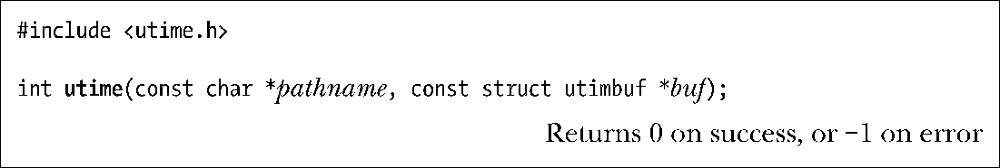
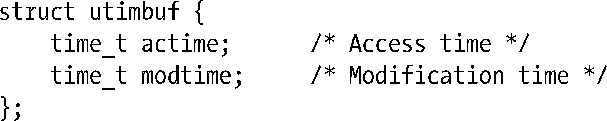
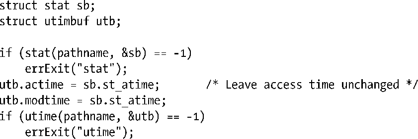
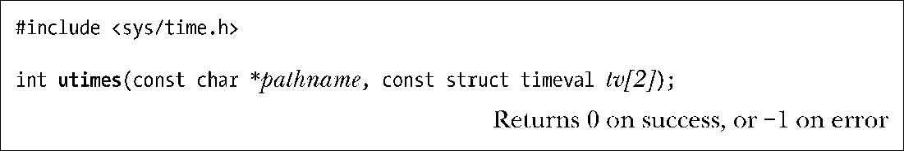

### 15.2.1　使用utime()和utimes()来改变文件时间戳

使用utime()或与之相关的系统调用集之一，可显式改变存储于文件i节点中的文件上次访问时间戳和上次修改时间戳。解压文件时，tar(1)和unzip(1)之类的程序会使用这些系统调用去重置文件的时间戳。

参数pathname用来标识欲修改时间的文件。若该参数为符号链接，则会进一步解除引用。参数buf既可为NULL，也可为指向utimbuf结构的指针。

该结构中的字段记录了自Epoch（见10.1节）以来的秒数。

utime()的运作方式则视以下两种不同情况而定。

+ 如果buf为NULL，那么会将文件的上次访问和修改时间同时置为当前时间。这时，进程要么具有特权级别（CAP_FOWNER或CAP_DAC_OVERRIDE），要么其有效用户ID与该文件的用户ID（属主）相匹配，且对文件有写权限（逻辑上，对文件拥有写权限的进程在调用其他系统调用时，可能会于无意间改变这些时间戳）。（准确地说，如9.5节所述，在Linux系统中，用来与文件用户ID做比对的是进程的文件系统用户ID，而非其有效用户ID。）
+ 若将buf指定为指向utimbuf结构的指针，则会使用该结构的相应字段去更新文件的上次访问和修改时间。此时，要么调用程序具有特权级别（CAP_FOWNER），要么进程的有效用户ID必需匹配文件的用户ID（仅对文件拥有写权限是不够的）。

为更改文件时间戳中的一项，可以先利用stat()来获取两个时间，并使用其中之一来初始化utimbuf结构，然后再将另一时间置为期望值。下列代码演示了这一操作，将文件的上次修改时间改为与上次访问时间相同。

只要调用utime()成功，总会将文件的上次状态更改时间置为当前时间。

Linux还提供了源于BSD的utimes()系统调用，其功用类似于utime()。

utime()与 utimes()之间最显著的差别在于后者可以以微秒级精度来指定时间值（timeval结构请见10.1节）。Linux 2.6为文件时间戳提供了纳秒级的精度支持，在这里也部分得以体现。新的文件访问时间在tv[0]中指定，新的文件修改时间在tv[1]中指定。

> utimes()的使用例子请参考随本书一同发行的源码中的files/t_utimes.c文件。

futimes()和lutimes()库函数的功能与utimes()大同小异。前两者与后者之间的差异在于，用来指定要更改时间戳文件的参数不同。

调用futimes()时，使用打开文件描述符fd来指定文件。

调用lutimes()时，使用路径名来指定文件，有别于调用utimes()的是：对于lutimes()，若路径名指向一符号链接，则调用不会对该链接进行解引用，而是更改链接自身的时间戳。

glibc自2.3版本开始支持futimes()函数，自2.6版本开始支持lutimes()函数。

