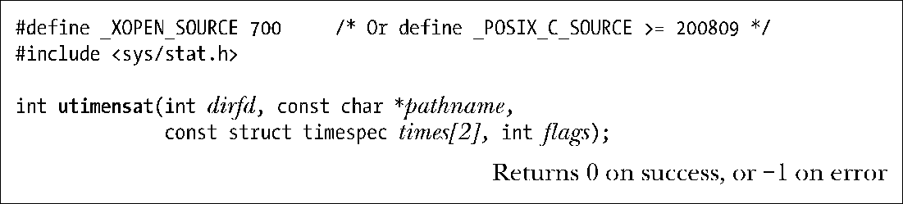
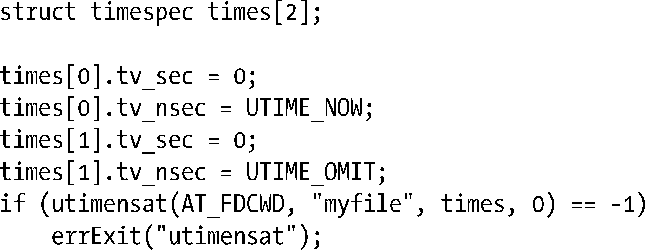
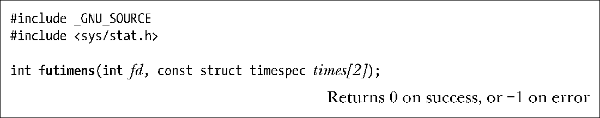

### 15.2.2　使用utimensat()和futimens()改变文件时间戳

utimensat()系统调用（内核自2.6.22版本开始支持）和futimens()库函数（glibc自版本2.6开始支持）为设置对文件的上次访问和修改时间戳提供了扩展功能。以下对这两个编程接口的优点列举一二。

+ 可按纳秒级精度设置时间戳。相对于提供微秒级精度的utimes()，这是重大改进。
+ 可独立设置某一时间戳（一次只设置其一）。如前所述，要使用旧编程接口去改变时间戳之一，需要首先调用 stat()获取另一时间戳的值。然后再将获取值与打算变更的时间戳一同指定。（若另一进程在这两步之间执行了更新时间戳的操作，将会导致竞争状态。）
+ 可独立将任一时间戳置为当前时间。要使用旧编程接口将一个时间戳改为当前时间，需要调用stat()去获取那些保持不变的时间戳的设置情况，并调用gettimeofday()以获得当前时间。

在SUSv3中并未定义以上两个接口，但SUSv4将其纳入规范。

utimensat()系统调用会把由pathname指定文件的时间戳更新为由数组times指定的值。

若将times指定为NULL，则会将以上两个文件时间戳都更新为当前时间。若times值为非NULL，则会针对指定文件在times[0]中放置新的上次访问时间，在times[1]中放置新的上次修改时间。数组times所含的每一元素都是如下格式的一个结构：

结构所含的字段分别指定自Epoch (10.1节)以来的秒数和纳秒数。

若有意将时间戳之一置为当前时间，则可将相应的tv_nsec字段指定为特殊值UTIME_NOW。若希望某一时间戳保持不变，则需把相应的tv_nsec字段指定为特殊值UTIME_OMIT。无论是上述哪一种情况，都将忽略相应tv_sec字段中的值。

可以将dirfd参数指定为AT_FDCWD，此时对pathname参数的解读与utimes()相类似。或者，也可以将其指定为指代目录的文件描述符，18.11节将描述这一用法的目的所在。

flags参数可以为0，或者AT_SYMLINK_NOFOLLOW，意即当pathname为符号链接时，不会对其解引用（也就是说，改变的是符号链接自身的时间戳）。相形之下，utimes()总是对符号链接进行解引用。

以下代码片段在将对文件的上次访问时间置为当前时间的同时，上次修改时间则保持不变。

利用 utimensat()(和futimens())改变时间戳时所遵循的权限规则与旧有 API 函数相类似，utimensat(2)手册页对此有详细讨论。

使用futimens()库函数可更新打开文件描述符fd所指代文件的各个文件时间戳。

其中，times参数的使用方法与utimensat()相同。

