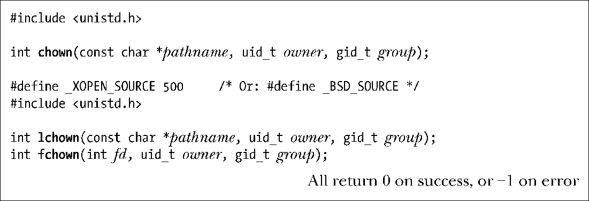

### 15.3.2　改变文件属主：chown()、fchown()和lchown()

系统调用chown()、lchown()和fchown()可用来改变文件的属主（用户ID）和属组（组ID）。

以上3个系统调用之间的区别类似于stat()系统调用一族。

+ chown()改变由pathname参数命名文件的所有权。
+ lchown()用途与chown()相同，不同之处在于若参数pathname为一符号链接，则将会改变链接文件本身的所有权，而与该链接所指代的文件无干。
+ fchown()也会改变文件的所有权，只是文件由打开文件描述符fd所引用。

参数owner和group分别为文件指定新的用户ID和组ID。若只打算改变其中之一，只需将另一参数置为−1，即可令与之相关的ID保持不变。

> Linux2.2之前，chown()不对符号链接进行解引用。从Linux 2.2开始，chown()的语义发生了变化，并且添加了新系统调用lchown()，以提供老系统调用chown()的行为。

只有特权级进程(CAP_CHOWN)才能使用 chown()改变文件的用户ID。非特权级进程可使用 chown()将自己所拥有文件的组 ID 改为其所从属的任一属组的ID，前提是进程的有效用户ID与文件的用户ID相匹配。特权级进程则可将文件的组ID修改为任意值。

> 当超级用户改变可执行文件的属主和属组时，是否应当屏蔽 set-user-ID 和set-group-ID位？SUSv3对此未置可否。Linux 2.0确实会屏蔽以上各位，但某些2.2版本（不超过2.2.12）的早期内核则不然。其后的2.2内核又回归了2.0内核的行为——造成变化的无论是超级用户还是其他用户，系统在处理时都将一视同仁。（但若以root登录后执行chown(1)命令来改变文件的所有权，则chown命令会在调用chown(2)之后利用系统调用chmod()来重新激活set-user-ID和set-group-ID位。）

如果文件组的属主或属组发生了改变，那么set-user-ID和set-group-ID权限位也会随之关闭。这一安全举措是为了防止如下行为：普通用户若能打开某一可执行文件的set-user-ID（或 set-group-ID）位，然后再设法令其为某些特权级用户（或组）所拥有，就能在执行该文件时获得特权用户身份。

改变文件的属主和属组时，如果已然屏蔽了属组的可执行权限位，或者要改变的是目录的所有权时，那么将不会屏蔽set-group-ID权限位。在上述两种情况下，set-group-ID位的用途并非是去创建一个启用了set-group-ID的程序，因此将该位屏蔽并不可取。set-group-ID的其他用途如下所示。

+ 若屏蔽了属组的可执行权限位，则可利用set-group-ID权限位来启用强制文件锁定（请参阅55.4节）。
+ 当作用于目录时，可利用set-group-ID位来控制在该目录下创建文件的所有权（见15.3.1节）。

程序清单15-2演示了chown()的用法，该程序允许用户改变任意数量文件（由命令行参数指定）的属主和属组。（该程序使用程序清单 8-1 中的userIdFromName()和groupIdFromName()函数，将用户名和组名转换为相应的数字ID。）

程序清单15-2：改变文件的属主和属组

