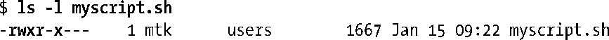
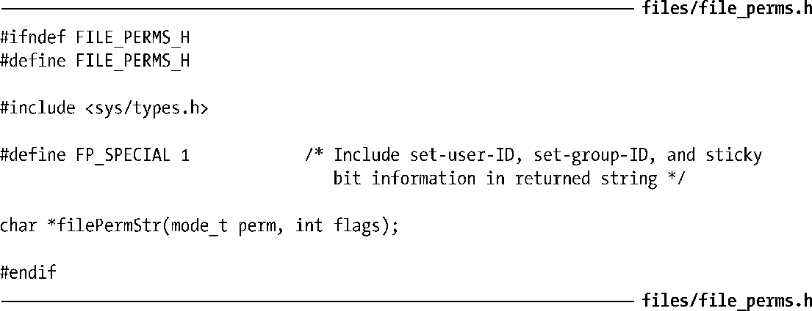

### 15.4.1　普通文件的权限

如15.1节所述，stat结构中st_mod字段的低12位定义了文件权限。其中的前3位为专用位，分别是set-user-ID位、set-group-ID位和sticky位（在图15-1中分别被标注为U、G、T位），将在15.4.5节中详细介绍。其余9位则构成了定义权限的掩码，分别授予访问文件的各类用户。文件权限掩码分为3类。

+ Owner（亦称为user）：授予文件属主的权限。

> chmod(1)之类的命令使用术语user的缩写u来指代该类权限。

+ Group：授予文件属组成员用户的权限。
+ Other：授予其他用户的权限。

可为每一类用户授予的权限如下所示。

+ Read：可阅读文件的内容。
+ Write：可更改文件的内容。
+ Execute：可以执行文件（亦即，文件是程序或脚本）。要执行脚本文件（比如，一个bash脚本），需同时具备读权限和执行权限。

执行ls–l命令，可查看文件的权限和所有权，如下所示：

在以上输出中，将文件权限显示为“rwxr-x---”（该字符串起始处的连接号“-”表明该文件属于普通文件）。在解释该字符串时，需将其一剖为三，以3个字符为一组，分别表示读、写、可执行权限具备与否。第一组字符用来表示文件属主的权限，在本例中，则是读、写、执行权限俱全。第二组字符用来表示属组权限，对于本例，组内用户具有读和可执行权限，但不具有写权限。最后一组字符用来表示其他用户的权限，本例中的其他用户没有任何权限。

头文件<sys/stat.h>定义了可与stat结构中st_mode相与（&）的常量，用于检查特定权限位置位与否。（<fcntl.h>为open()系统调用提供了原型，在程序中包含该头文件也可定义这些常量。）表15-4列出了这些常量。

<b class="my_markdown">表15-4：用来表示文件权限位的常量</b>

| 常　　量 | 其　他　值 | 权　限　位 |
| :-----  | :-----  | :-----  | :-----  | :-----  |
| S_ISUID | 04000 | Set-user-ID |
| S_ISGID | 02000 | Set-group-ID |
| S_ISVTX | 01000 | Sticky |
| S_IRUSR | 0400 | User-read |
| S_IWUSR | 0200 | User-write |
| S_IXUSR | 0100 | User-execute |
| S_IRGRP | 040 | Group-read |
| S_IWGRP | 020 | Group-write |
| S_IXGRP | 010 | Group-execute |
| S_IROTH | 04 | Other-read |
| S_IWOTH | 02 | Other-write |
| S_IXOTH | 01 | Other-execute |

除表15-4所列常量以外，还分别将各类（属主、属组及其他）权限掩码定义为常量： S_IRWXU (0700)、S_IRWXG (070)和S_IRWXO (07)。

程序清单15-3声明的函数filePermStr()，会针对给定的文件权限掩码返回一个静态分配的字符串，以ls(1)所采用的风格来表示该掩码。

程序清单15-3：file_perms.c文件的头文件

如果在filePermStr()的flag参数中设置了FP_SPECIAL标志，那么返回的字符串将包括set-user-ID、set-group-ID，以及sticky位的设置信息，其表现形式同样会沿袭 ls(1)的风格。

程序清单15-4展示了filePermStr()函数的实现。程序清单15-1中的程序调用了该函数。

程序清单15-4：将文件权限掩码转换为字符串

