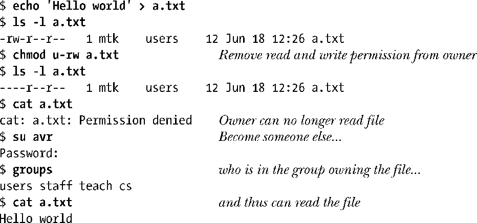

### 15.4.3　权限检查算法

只要在访问文件或目录的系统调用中指定了路径名称，内核就会检查相应文件的权限。如果赋予系统调用的路径名还包含目录前缀时，那么内核除去会检查对文件本身所需的权限以外，还会检查前缀所含每个目录的可执行权限。内核会使用进程的有效用户ID、有效组ID以及辅助组ID，来执行权限检查。（准确说来，Linux内核会使用文件系统用户ID和组ID，而非相应的有效用户ID和组ID，来进行文件权限检查，这一点9.5节已经提及。）

> 一旦调用open()打开了文件，针对返回描述符的后续系统调用（比如，read()、write()、fstat()、fcntl()，以及mmap()）将不再进行任何权限检查。

检查文件权限时，内核所遵循的规则如下。

**1．** 对于特权级进程，授予其所有访问权限。

**2．** 若进程的有效用户ID与文件的用户ID（属主）相同，内核会根据文件的属主权限，授予进程相应的访问权限。比方说，若文件权限掩码中的属主读权限（owner-read permission）位被置位，则授予进程读权限。否则，则拒绝进程对文件的读取操作。

**3．** 若进程的有效组ID或任一附属组ID与文件的组ID（属组）相匹配，内核会根据文件的属组权限，授予进程对文件的相应访问权限。

**4．** 若以上三点皆不满足，内核会根据文件的other(其他)权限，授予进程相应权限。

> 其实，内核代码在实现上述检查规则时，在构造上也颇具匠心。只有当进程通过其他测试未能获得所需要的权限时，才去检查进程是否属于特权级进程。这就省去了对ASU进程记账标志的设置，该标志用于标记进程是否曾利用过超级用户特权（见28.1节）。

内核会依次执行针对属主、属组以及其他用户的权限检查，只要匹配上述检查规则之一，便会停止检查。这样得出的结果可能会在意料之外，比方说，若组权限超过了属主权限，那么文件属主所拥有的权限要低于组成员的权限，如下例所示：

若为文件的其他用户分配的权限大于文件属主或属组，上述论述也同样适用。

由于文件的权限及所有权信息都维护于文件的i节点之内，故而也为指向同一i节点的所有文件名（链接）所共享。

Linux2.6支持访问控制列表，从而可以以每用户或每组为基础来定义文件权限。若文件与一ACL挂钩，内核则会在上述算法的基础上略作改动。本书第17章将会介绍ACL。

#### 检查特权级别进程的权限

上文曾提及，若进程为特权级进程，则内核在检查权限时将授予进程所有的访问权限。这一论述成立，其实还要加个限制条件。对于非目录文件，仅当该文件的3种权限类型（至少）之一具有可执行权限时，Linux才会将该权限赋予一特权级进程。而在其他一些UNIX的实行中，即使文件的任何权限类型都不具有可执行权限，特权级进程还是能执行该文件。而当访问目录时，特权级进程总是拥有可执行（搜索）权限。

> 就两种Linux进程能力：CAP_DAC_READ_SEARCH和CAP_DAC_OVERRIDE（参见39.2节）而言，有必要修改之前对特权级进程的描述。具备CAP_DAC_READ_SEARCH能力的进程对任何类型的文件都拥有读权限，对于目录则总是具有可执行和写权限（即总能访问目录中的文件，并能读取目录中的文件列表）。具备CAP_DAC_OVERRIDE能力的进程对任何类型的文件都拥有读、写权限，对于目录或是文件在权限分类中的至少一类具有可执行权限的情况下，则该进程对其还拥有可执行权限。

