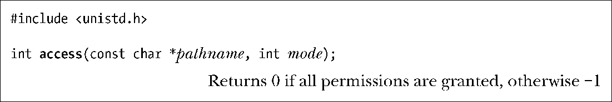

### 15.4.4　检查对文件的访问权限：access()

如上节所述，当进程访问文件时，系统会以其effective(有效)用户ID、effective(有效)组ID以及附属组ID来确定权限。当然，对于程序（比如，set-user-ID 或set-group-ID程序）来说，根据进程的real（真实）用户ID和组ID来检查对文件的访问权限，也并非没有可能。

系统调用 access()就是根据进程的真实用户ID和组ID（以及附属组ID），去检查对pathname参数所指定文件的访问权限。

若pathname为符号链接，access()将对其解引用。

参数mode是由表15-5中常量相或（|）而成的位掩码。若由pathname所指定的文件具备mode参数包含的所有权限，access()将返回0；只要有一项权限未得到满足（或者有错误发生），access()则返回−1。

<b class="my_markdown">表15-5：access()的mode常量</b>

| 常　　量 | 描　　述 |
| :-----  | :-----  | :-----  | :-----  |
| F_OK | 有这个文件吗 |
| R_OK | 对该文件有读权限吗 |
| W_OK | 对该文件有写权限吗 |
| X_OK | 对该文件有执行权限吗 |

由于对某一文件调用access()与对同一文件的后续操作之间存在时间差，因此（不论间隔多么短暂）执行后续操作时，也无法保证在对文件的后续操作时由access()所返回的信息依然正确。在某些应用程序设计中，上述情形可能会导致安全漏洞。

比方说，假设有一set-user-ID-root程序，使用access()来检查程序的真实用户id是否可以访问某文件，如果可以访问，就对其执行（open()或exec()之类的)操作。

问题是，若输入access()的路径名为符号链接，而恶意用户可抢在第二步检查之前设法更改该链接，使其指向另一文件，则最终会导致set-user-ID-root去操作真实用户ID并无权限的文件。(这也是对38.6节所述检查时间与调用时间之间竞争条件的例证。)正因如此，建议杜绝使用access()(参见[Borisov，2005])。对于前文所举示例，可以暂时更改set-user-ID进程的有效（或文件系统）用户ID来实施（open()或exec()之类的）文件操作，并通过对返回值和errno的检查来判断，操作失败是否应归咎于权限问题。

> GNU C库提供了一个功能相似的非标准函数euidaccess()（及其同义函数eaccess()），该函数使用进程的有效用户ID来检查对文件的访问权限。

