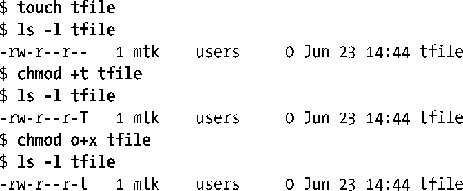

### 15.4.5　Set-User-ID、Set-Group-ID和Sticky位

除了9位用来表明属主、属组和其他用户的权限之外，文件权限掩码还另设有3个附加位，分别为set-user-ID (bit 04000)、set-group-ID (bit 02000)和sticky (bit 01000)位。9.3节讨论了创建特权级程序时对set-user-ID和set-group-ID权限位的使用。set-group-ID位还有两种其他用途：对于在以nogrpid选项装配的目录下所新建的文件，控制其群组从属关系；可用于强制锁定文件。以上两种用途分别在15.3.1节和55.4节有所介绍。本节将重点讨论sticky位的用途。

在老的UNIX实现中，提供sticky位的目的在于让常用程序的运行速度更快。若对某程序文件设置了sticky位，则首次执行程序时，系统会将其文本②拷贝保存于交换区中，即“粘”（stick）在交换区内，故而能提高后续执行的加载速度。现代UNIX实现对内存的管理更为精准，故而也将权限位的这一用法束之高阁。

> 表 15-4所示Sticky权限位的常量名称——S_ISVTX源于对 sticky 位的别称：saved-text位。

在现代UNIX实现（包括Linux）中，sticky权限位所起的作用全然不同于老的UNIX实现。作用于目录时，sticky权限位起限制删除位的作用。为目录设置该位，则表明仅当非特权进程具有对目录的写权限，且为文件或目录的属主时，才能对目录下的文件进行删除（unlink()、rmdir()）和重命名（rename()）操作。（具有CAP_FOWNER能力的进程可省去对属主的检查。）可藉此机制来创建为多个用户共享的一个目录，各个用户可在其下创建或删除属于自己的文件，但不能删除隶属于其他用户的文件。为/tmp目录设置sticky权限位，原因正在于此。

可通过chmod命令(chmod +t file)或chmod()系统调用来设置文件的sticky权限位。若对某文件设置了sticky权限位，则当执行ls–l命令显示该文件时，会在其他用户执行权限字段上看到字母T，其大小写则要取决于是否对文件开启了其他用户执行权限位，如下所示：

