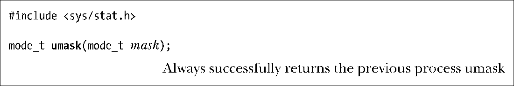
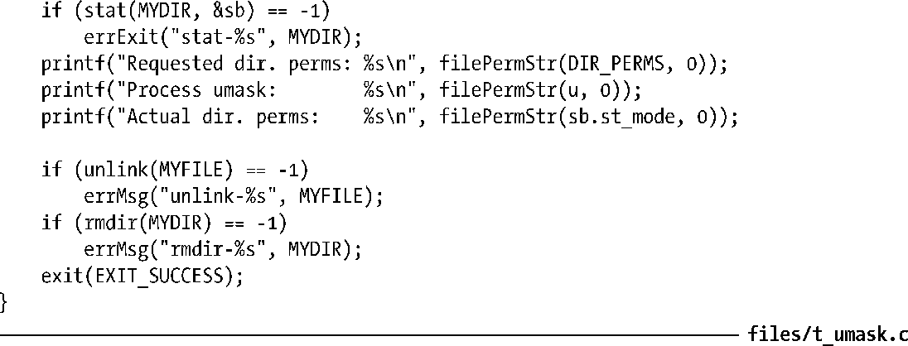

### 15.4.6　进程的文件模式创建掩码：umask()

本节将针对新建文件或目录的权限设置展开深入讨论。对于新建文件，内核会使用open()或creat()中mode参数所指定的权限。对于新建目录，则会根据mkdir()的mode参数来设置权限。然而，文件模式创建掩码（简称为 umask）会对这些设置进行修改。umask是一种进程属性，当进程新建文件或目录时，该属性用于指明应屏蔽哪些权限位。

进程的umask通常继承自其父shell，其结果往往正如人们所期望的那样：用户可以使用shell的内置命令umask来改变shell进程的umask，从而控制在shell下运行程序的umask。

大多数shell的初始化文件会将umask默认置为八进制值022 (----w--w-)。其含义为对于同组或其他用户，应总是屏蔽写权限。因此，假定open()调用中的mode参数为0666（即令所有用户享有读、写权限，通常如此），那么对新建文件来说，其属主拥有读、写权限，所有其他用户只具有读权限（针对文件执行ls–l命令，会显示“rw-r--r—”）。同理，假定将mkdir()的mode参数指定为0777（即所有用户享有所有权限），那么对于新建目录来说，其属主享有所有权限，同组和其他用户则只拥有读取和执行权限（即rwxr-xr-x）。

系统调用umask()将进程的umask改变为mask参数所指定的值。

可以以八进制数或是表15-4中所列常量相或（|）来指定mask参数。

对umask()的调用总会成功，并返回进程的前一umask。

程序清单15-5演示了umask()与open()和mkdir()的相互配合。运行该程序的结果如下：

> 程序清单 15-5使用mkdir()和rmdir()系统调用来创建和删除目录，使用unlink()系统调用来删除文件。以上系统调用将在第18章再做讲解。

程序清单15-5：使用umask()

