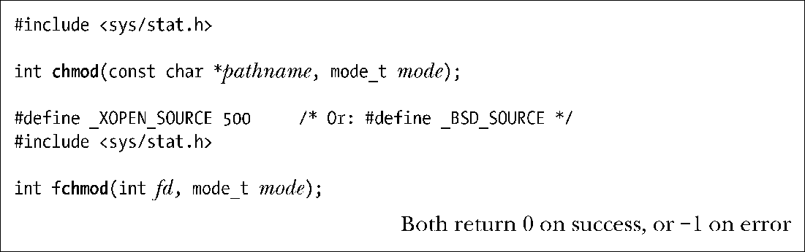
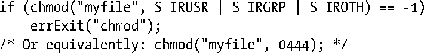
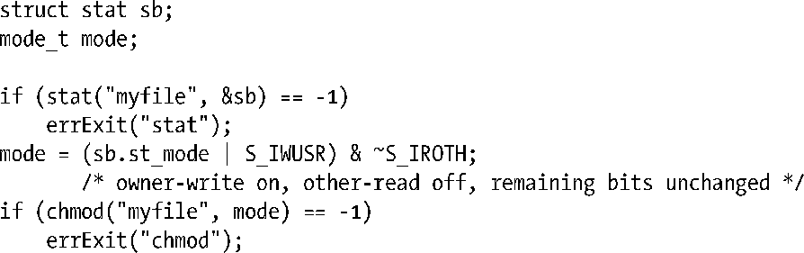
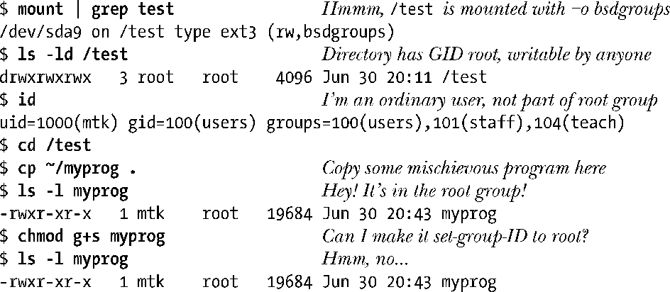

### 15.4.7　更改文件权限：chmod()和fchmod()

可利用系统调用chmod()和fchmod()去修改文件权限。

系统调用chmod()更改由pathname参数所指定文件的权限。若该参数所指为符号链接，调用chmod()会改变符号链接所指代文件的访问权限，而非对符号链接自身的访问权限。（符号链接自创建起，其所有权限便为所有用户共享，且这些权限也不得更改。对符号链接解引用时，将忽略所有这些权限。）

系统调用fchmod()更改由打开文件描述符fd所指代文件的权限。

参数mode用于描述文件的新权限，可以采用八进制数字形式，亦或是由表15-4所列权限位相或（|）而成的掩码。要想更改文件权限，进程要么具有特权级别（CAP_FOWNER），要么其有效用户ID于文件的用户ID（属主）相匹配。（准确说来，对于Linux系统上的非特权级进程，需与文件用户ID相匹配的是进程的文件系统用户ID，而非其有效用户ID，如9.5节所述。）

要将文件权限设为使所有用户仅具有读权限，需执行如下系统调用：

要修改文件的特定权限位，需先调用stat()来获取文件的现有权限，调整想修改的权限位，然后使用chmod()去更新权限。

执行以上代码，等价于执行如下shell命令：

15.3.1节曾提及，若一目录驻留于以–o bsdgroups选项装配的ext2文件系统之上，或是驻留于以–o sysvgroups选项装配的ext2文件系统上，并且开启了该目录的set-group-ID权限位，那么在该目录下新建的文件会继承其父目录（而非文件创建进程的有效组ID）的组所有权。可能会出现这样一种情况，即文件的组ID与创建文件进程的任一组ID都不匹配。正因如此，当非特权级（不具备CAP_FSETID能力的）进程调用chmod() (或fchmod())时，若文件的组ID不等于进程的有效组ID或是任一辅助组ID，内核则总是清除文件的set-group-ID权限位。这一安全举措意在防止用户为其不隶属的组创建set-group-ID程序。以下shell命令演示了上述安全措施所堵住的安全漏洞。

