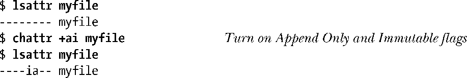
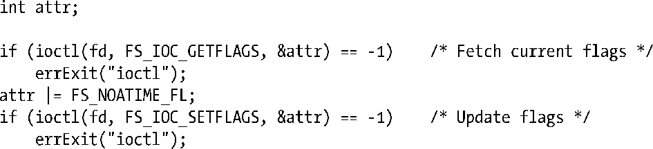

### 15.5　i节点标志（ext2扩展文件属性）

某些Linux文件系统允许为文件和目录设置各种各样的i-node flags(I节点标志)。该特性是一种非标准的Linux扩展功能。

> 现代BSD支持类似于I节点标志的特性，使用chflags(1)和 chflags(2)加以设置。

ext2是首个支持i节点标志的Linux文件系统，有时人们也将这些标志称为ext2扩展文件属性。随后，其他文件系统，诸如Btrfs、ext3、ext4、Reiserfs（自Linux 2.4.19起）、XFS（自Linux 2.4.25和2.6起）以及JFS（自Linux 2.6.17起），也纷纷加入对i节点标志的支持。

> 各种文件系统对i节点标志的支持范围略有不同。要在 Reiserfs 文件系统上使用I节点标志，需在装配文件系统时带上–o attrs选项。

在shell中，可通过执行chattr和lsattr命令来设置和查看i节点标志，如下例所示：

在程序中，可利用ioctl()系统调用来获取并修改i节点标志，本节稍后会加以详述。

对普通文件或目录均可设置i节点标志。大多数i节点标志是供普通文件使用的，也有少部分兼供（或专供）目录使用。表15-6对于所支持的i节点标志作了总结，展示了程序调用ioctl()时所使用的相应标志名称（定义于<linux/fs.h>中），以及配合chattr命令使用的选项字母。

<b class="my_markdown">表15-6：i节点标记</b>

| 常　　量 | Chattr选项 | 用　　途 |
| :-----  | :-----  | :-----  | :-----  | :-----  |
| FS_APPEND_FL | a | 仅能在尾部追加（需要特权） |
| FS_COMPR_FL | c | 启用文件压缩（未实现） |
| FS_DIRSYNC_FL | D | 目录更新同步（自Linux 2.6起） |
| FS_IMMUTABLE_FL | i | 不可变更（需要特权） |
| FS_JOURNAL_DATA_FL | j | 针对数据启用日志功能（需要特权） |
| FS_NOATIME_FL | A | 不更新文件的上次访问时间 |
| FS_NODUMP_FL | d | 不转储 |
| FS_NOTAIL_FL | t | 禁用尾部打包 |
| FS_SECRM_FL | s | 安全删除（未实现） |
| FS_SYNC_FL | S | 文件（和目录）同步更新 |
| FS_TOPDIR_FL | T | 以Orlov策略来处理顶层目录（自Linux 2.6起） |
| FS_UNRM_FL | u | 可恢复已删除的文件（未实现） |

> Linux 2.6.19之前，<linux/fs.h>尚未定义表15-6所列的FS系列常量。相反，针对各种文件系统有一套专门的头文件，将相同值定义为各文件系统所专有的常量名。因此，同一值在ext2文件系统中被定义为<linux/ext2_fs.h>内的EXT2_APPEND_FL，在Reiserfs文件系统中被定义为<linux/reiser_fs.h>内的REISERFS_APPEND_FL，其他文件系统以此类推。由于每种文件系统的头文件将相同的值定义为相应常量，因此在不提供<linux/fs.h>定义的老系统中，可以包含上述任一类型的头文件，并使用各文件系统所专有的名称。

FL系列变量及其含义如下所示

##### FS_APPEND_FL

仅当指定O_APPEND标志时，方能打开文件并写入。（因而迫使所有对文件的更新都追加到文件尾部。）例如，可以用该标志来写入日志文件。只有特权级进程（具备CAP_LINUX_IMMUTABLE能力）方可设置该标志。

##### FS_COMPR_FL

文件内容经压缩后存储于磁盘之上。在主流的纯Linux文件系统上，FS_COMPR_FL不属于标配特性。（有软件包针为ext2和ext3文件系统实现了该特性。）考虑到磁盘存储的低廉成本，以及压缩和解压缩所要耗费的CPU开销，再加之一旦将文件压缩起来，对其内容的随机访问也不会像原来那么随心所欲（通过lseek()），故而许多应用都会对此避之不及。

##### FS_DIRSYNC_FL（自Linux 2.6以后）

使得对目录的更新（例如：open(pathname，O_CREAT)、link()、unlink()、mkdir())同步发生。这类似于13.3节所述的文件同步更新机制。同样，目录同步更新也存在性能问题。这一设置可以只应用于目录。（14.8.1节所述的MS_DIRSYNC装配标志提供了类似功能，但是是针对每个装配而言的。）

##### FS_IMMUTABLE_FL

将文件设置为不可更改，既不能更新文件数据（write()和truncate()），也不能改变文件元数据（即chmod()、chown()、unlink()、link()、rename()、rmdir()、utime()、setxattr()和removexattr()）只有特权级进程（具备CAP_LINUX_IMMUTABLE能力的进程）可为文件设置这一标志。该标志一旦设定，即便是特权级进程也无法改变文件的内容或元数据。

##### FS_JOURNAL_DATA_FL

对数据启用日志功能。只有ext3和ext4文件系统才支持该标志。这些文件系统提供3种层次的日志记录：journal（日志）、ordered（排序），以及writeback（回写）。所有模式都会记录对文件元数据的更新，而journal（日志）模式额外还记录了对文件数据的变更。而在以排序或回写模式运行日志功能的文件系统上，特权级（具有CAP_SYS_RESOURCE能力的）进程可以为单个文件设置此标志，从而启用对该文件数据更新的日志功能。（mount(8)手册页描述了排序与回写两模式之间的区别。）

##### FS_NOATIME_FL

访问文件时不更新文件的上次访问时间。这省去了每次访问文件时对I节点的更新，故而改进了I/O性能。（参见14.8.1节介绍MS_NOATIME标志的内容。）

##### FS_NODUMP_FL

在使用dump(8)备份系统时跳过具有此标志的文件。正如dump(8)手册页所载，该标志有效与否取决于此命令的-h选项。

##### FS_NOTAIL_FL

禁用尾部打包。只有Reiserfs文件系统才支持该标志。此标志屏蔽了Reiserfs的尾部打包特性，即尝试将小文件（或是较大文件的最后一段）与其元数据置于同一磁盘块中。装配Reiserfs文件系统时，mount如带有–o notail选项将对整个文件系统禁用尾部打包。

##### FS_SECRM_FL

安全删除文件。该特性尚未实现，其用意在于删除文件时能够万无一失，将被删除文件的数据覆盖掉，以免磁盘扫描程序能够读取并重建该文件。（要做到对数据真正的安全删除其实颇为复杂。要想稳妥地“抹去”先前记录的数据，需要在磁盘介质上执行多次写入操作，详见[Gutmann，1996]。）

##### FS_SYNC_FL

令对文件的更新保持同步。当应用于文件时，该标志将致使对文件的写入操作同步完成（就好像对该文件执行的所有open()调用都引用了O_SYNC标志一样）。当应用于目录时，该标志的作用等同于前述的同步目录更新标志。

##### FS_TOPDIR_FL（自Linux 2.6起）

这标志着将在Orlov块分配策略的指导下对某一目录进行特殊处理。Orlov策略的灵感来自于BSD系统，是对ext2文件系统块分配策略的一种改良，试图增大相关文件（例如：同一目录下的各个文件）在磁盘中比邻而居的几率，进而缩短磁盘的寻道时间。详情请见[Corbet，2002]和[Kumar，et al. 2008]。只有EXT2及其升级版本EXT3、EXT4文件系统支持FS_TOPDIR_FL。

##### FS_UNRM_FL

允许该文件在遭删除后能得以恢复。由于可在内核之外实现文件的恢复机制，因此该特性尚未实现。

一般而言，如果针对某一目录设置了i节点标志，那么新建于其下的文件和子目录会自动将其继承。不过也有例外。

+ FS_DIRSYNC_FL (chattr +D)标志只能应用于目录，故而也只能为新建于该目录下的子目录所继承。
+ 当将FS_IMMUTABLE_FL (chattr +i)标志应用于目录时，不会有创建于该目录下的文件或子目录继承此标志，因为该标志会阻止在此目录中添加任何新的条目。

在程序中可以分别调用ioctl()的FS_IOC_GETFLAGS和FS_IOC_SETFLAGS操作，来获取和修改i节点标志（这两个常量定义于<linux/fs.h>）。以下代码演示了如何为打开文件描述符fd所指代的文件设置FS_NOATIME_FL标志。

想改变文件的i节点标志，至少要满足下列两种条件之一：其一，进程的有效用户ID需匹配文件的用户ID（属主）；其二，进程享有特权级别(具备CAP_FOWNER能力)。严格说来，对于Linux上运行的非特权进程，与文件的用户ID相匹配的是其文件系统用户ID，而非有效用户ID（详见9.5节）。

