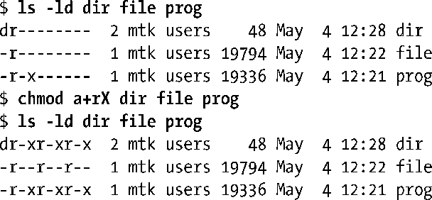

### 15.7　练习

**15-1.** 　15.4节中描述了针对各种文件系统操作所需的权限。请使用shell命令或编写程序来回答或验证以下说法。

a）将文件属主的所有权限“剥夺”后，即使“本组”和“其他”用户仍有访问权，属主也无法访问文件。

b）在一个可读但无可执行权限的目录下，可列出其中的文件名，但无论文件本身的权限如何，也不能访问其内容。

c）要创建一个新文件，打开一个文件进行读操作，打开一个文件进行写操作，以及删除一个文件，父目录和文件本身分别需要具备何种权限？对文件执行重命名操作时，源及目标目录分别需要具备何种权限？若重命名操作的目标文件已存在，该文件需要具备何种权限？为目录设置sticky位(chmod +t)，将如何影响重命名和删除操作？

**15-2.** 　你认为系统调用stat()会改变文件3个时间戳中的任意之一吗？请解释原因。

**15-3.** 　在运行Linux 2.6的系统上修改程序清单15-1(t_stat.c)，令其可以纳秒级精度来显示文件时间戳。

**15-4.** 　系统调用access()会利用进程的实际用户和组ID来检查权限。请编写相应函数， 根据进程的有效用户和组ID来进行权限检查。

**15-5.** 　如15.4.6节所述，umask()总会在设置进程umask的同时返回老umask的拷贝。请问，如何在不改变进程当前umask的同时获取到其拷贝？

**15-6.** 　命令chmod a+rX file的作用是对所有各类用户授予读权限，并且，当file是目录，或者 file 的任一用户类型具有可执行权限时，将向所有各类用户授予可执行权限，如下例所示：

使用stat()和chmod()编写一程序，令其等效于执行chmod a+rX命令。

**15-7.** 　编写chattr(1)命令的简化版来修改文件的i节点标志。参阅chattr(1) 手册页以掌握chattr命令行接口的细节。（无需实现-R、-V、-v选项。）

①译者注：对整个文件系统起作用。

②译者注：段。

③译者注：同组用户。

