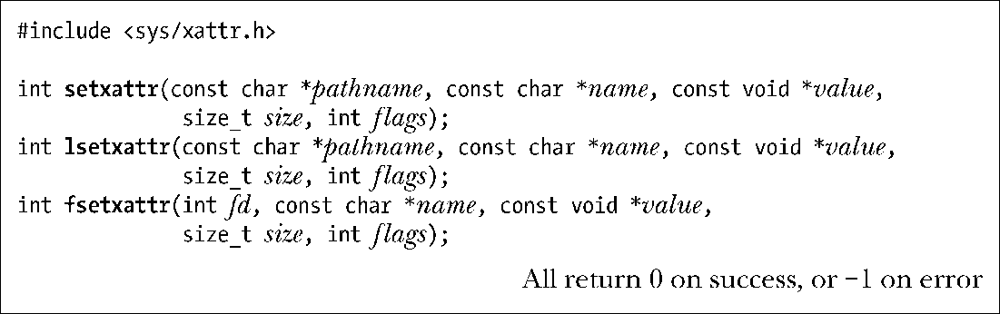
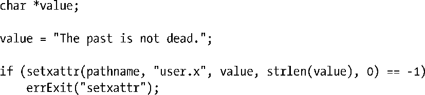
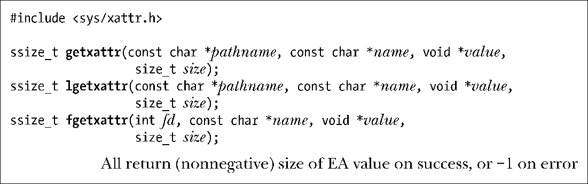
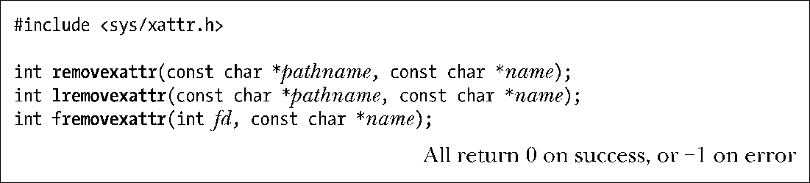
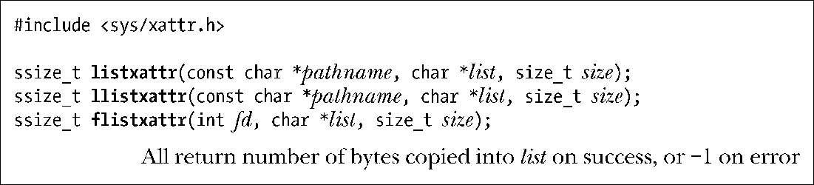
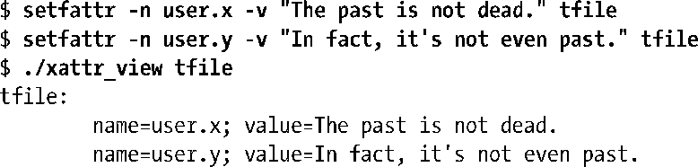
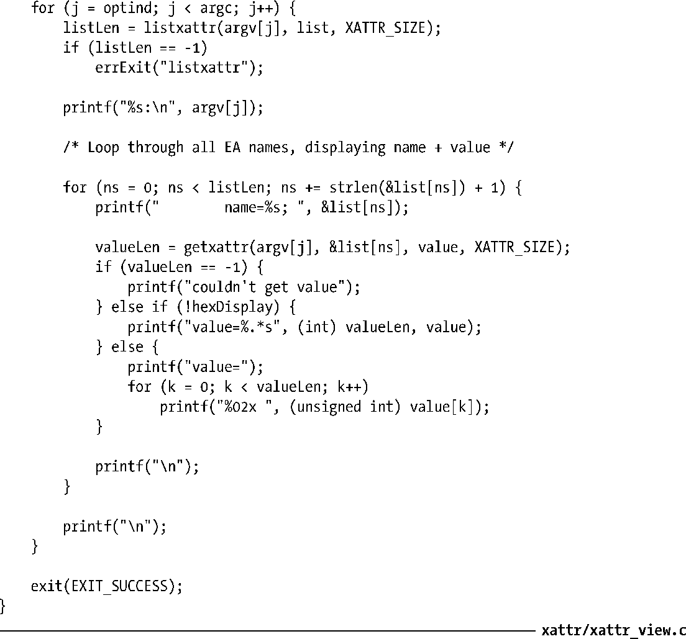

### 16.3　操控扩展属性的系统调用

本节将会介绍用来更新、获取以及删除EA的系统调用。

#### 创建和修改EA

系统调用setxattr()、lsetxattr()以及fsetxattr()用来设置文件的EA值之一。

这3个系统调用之间的区别类似于stat()、lstat()以及fstat()（15.1节）三者间的差异。

+ setxattr()通过pathname来标识文件，若文件名为符号链接，则对其解引用。
+ lsetxattr()通过pathname来标识文件，但不会对符号链接解引用。
+ fsetxattr()则通过打开文件描述符fd来标识文件。

以上3者之间的差异同样适用于本节下面将要介绍的其他各组系统调用。

参数name是一个以空字符结尾的字符串，定义了EA的名称。参数value是一个指向缓冲区的指针，包含了为EA定义的新值。参数size则指明了缓冲区大小。

默认情况下，若具有给定名称（name）的EA不存在，上述系统调用会创建一个新EA。若EA已经存在，则将替换EA值。可利用参数flags将这一行为控制得更为精准。将该参数指定为0，以获得默认行为，或者可将其指定为如下常量之一。

##### XATTR_CREATE

若具有给定名称（name）的EA已经存在，则失败。

##### XATTR_REPLACE

若具有给定名称（name）的EA不存在，则失败。

下例使用setxattr()创建了一个user EA：

#### 获取EA值

可利用系统调用getxattr()、lgetxattr()以及fgetxattr()来获取EA值。

参数name是一个以空字符结尾的字符串，用来标识欲取值的EA。返回的EA值保存于参数value所指向的缓冲区中。该缓冲区必须由调用者分配，其大小应在size中指定。若调用成功，上述系统调用会返回复制到value所指缓冲区中的字节数。

若文件不含名为“name”的属性 ，上述系统调用则会失败，并会返回错误ENODATA。若size值过小，上述系统调用也会失败，并返回错误ERANGE。

可把size指定为0，对于这种情况，将忽略vlaue值，但系统调用仍将返回EA值的大小。可利用这一机制来确定后续系统调用在实际获取EA值时所需的value缓冲区大小。但是应当注意，这并不能保证后续在通过系统调用获取EA值时，上述返回值就足够大。系统调用期间，另一进程可能为文件的这一属性分配了较大的值，或是将其完全删除。

#### 删除EA

系统调用removexattr()、lremovexattr()以及fremovexattr()用来删除文件的EA。

name所含以空字符结尾的字符串，用于标识打算删除的EA。若试图删除不存在的EA，调用将失败，并会返回错误ENODATA。

#### 获取与文件相关联的所有EA的名称

执行系统调用listxattr()、llistxattr()以及flistxattr()，所返回的列表会包含与某文件关联的所有EA的名称。

调用将EA的名称列表以一系列以空字符结尾的字符串形式置于list所指向的缓冲区中。缓冲区的大小由size指定。一旦成功，上述系统调用会返回复制到list中的字节数。

与getxattr()一样，也可将size指定为0，系统调用将忽略list，并返回后续调用实际获取EA名称列表（假定该列表尚未改变）时所需的缓冲区大小。

想获取与某文件相关联的EA名列表，只需对文件拥有“访问”权限（亦即对pathname下的所有路径均拥有执行权限），对文件本身则无需任何权限。

出于安全考虑，list中返回的EA名称可能不包含调用进程无权访问的属性名。比方说，在非特权进程中调用listxattr()时，大多数文件系统都会略去trusted属性。请注意上一句中的“可能”二字，这表明文件系统实现并非一定要如此。因而，使用list中返回的EA名去调用getxattr()，是有可能失败的，因为进程并不具有获得该EA值所需的特权。（同样，当另一进程在listxattr()和getxattr()调用之间将该属性删除，也会发生类似错误。）

#### 程序示例

程序清单16-1所示程序将获取并显示命令行所列文件的所有EA名和EA值。该程序使用listxattr()，去获取与每个文件相关联的所有EA名称，随后循环调用getxattr()，为每个名称获取相应的值。默认以纯文本方式显示属性值。若带有-x选项，那么属性值将以十六进制字符串形式显示。以下shell会话记录展示了该程序的使用。

.

程序清单16-1：显示文件的扩展属性

