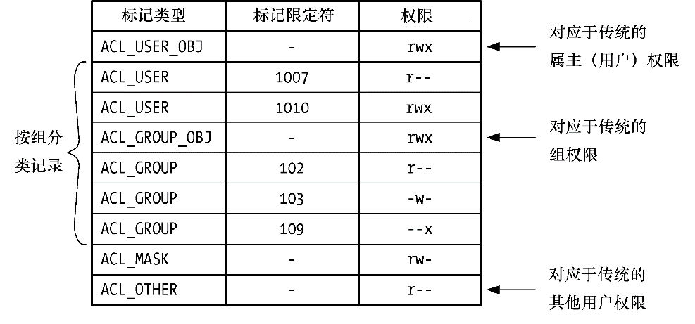

### 17.1　概述

一个ACL由一系列ACL记录（以下简称ACE）组成，其中每条记录都针对单个用户或用户组定义了对文件的访问权限（如图17-1所示）。

<b class="my_markdown">图17-1：访问控制列表示例</b>

#### ACL记录

每条ACE都由3部分组成。

+ 标记类型：表示该记录作用于一个用户、组，还是其他类别的用户。
+ 标记限定符（可选项）标识特定的用户或组（亦即，某个用户ID或组ID）。
+ 权限集合：本字段包含所授予的权限信息（读、写及执行）。

标记类型取值可为下列各值之一。

##### ACL_USER_OBJ

带有该标记的ACE记录了授予文件属主的权限。每个ACL只能包含一条该类型标记的记录。该记录与传统的文件属主（用户）权限相对应。

##### ACL_USER

携带该值的ACE记录了授予某用户（由标记限定符标识）的权限。一个ACL可包含零条或多条此标记类型的记录，但针对一个特定用户最多只能定义一条此类记录。

##### ACL_GROUP_OBJ

包含该值的ACE记录了授予文件组的权限。每个ACL只会包含一条此标记类型的记录。除非ACL还包含类型为“ACL_MASK ”的记录，否则此类记录对应于传统的文件组权限。

##### ACL_GROUP

包含该值的ACE记录了授予某个组（由标记限定符标识）的权限。每个ACL可包含零条或多条此标记类型的记录，但针对一个特定组最多只能定义一条此类记录。

##### ACL_MASK

包含该值的ACE记录了可由ACL_USER、ACL_GROUP_OBJ以及ACL_GROUP型ACE所能授予的最高权限。一个ACL最多只能包含一条标记类型为ACL_MASK的ACE。假如 ACL 含有标记类型为 ACL_USER或ACL_GROUP的记录，那么就必须包含一条ACL_MASK型的ACE。稍后会细述这一标记类型。

##### ACL_OTHER

对于不匹配任何其他ACE的用户，由包含该值的ACE授予权限。每个ACL只能包含一条标记类型为“ACL_OTHER”的ACE。该记录对应于传统的文件其他（other）用户权限。

只有标记类型为“ACL_USER”和“ACL_GROUP”的记录，才会采用标记限定符来指定用户ID和组ID。

#### 最小ACL和扩展ACL

最小化（minimal）ACL语义上等同于传统的文件权限集合，恰好由3条记录组成。每条标记的类型分别为ACL_USER_OBJ、ACL_GROUP_OBJ以及 ACL_OTHER。扩展ACL则是指除此之外，还包含标记类型为ACL_USER、ACL_GROUP和ACL_MASK的记录。

之所以要对最小化ACL和扩展ACL加以区分，原因之一是后者可对传统文件权限模型提供语义的扩展。而另一个原因则与ACL的Linux实现有关。Linux系统是以系统扩展属性来实现ACL的（详见第16章）。用于维护文件访问型ACL的系统扩展属性名为system.posix_ acl_access。仅当文件具有扩展ACL时，才需使用这一扩展属性。可将针对最小化ACL的权限信息存储于传统的文件权限位中。

