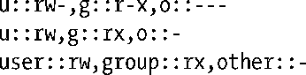

### 17.3　ACL的长、短文本格式

执行setfacl和getfacl命令，或是使用某些ACL库函数操纵ACL时，需指明ACE的文本表现形式。ACE的文本格式有两种。

+ 长文本格式的ACL：每行都包含一条ACE，还可以包含注释，注释需以“#”开始，直至行尾结束。getfacl命令的输出会以长文本格式显示ACL。getfacl命令的-M acl-file选项从指定文件中“提取”长文本格式的ACL定义。
+ 短文本格式的ACL：包含一系列以“，”分隔的ACE。

无论是上述哪种格式，每条ACE都由以“：”分隔的3部分组成。

标记类型字段的取值限于表17-1第一列所示范围之内。标记类型之后的标记限定符为可选项，采用名称或数字ID来标识用户或组。仅当标记类型为ACL_USER和ACL_GROUP时，才允许标记限定符的存在。

<b class="my_markdown">表17-1：对ACE文本格式的解释</b>

| 标记文本格式 | 是否存在标记限定符 | 对应的标记类型 | ACE的用途 |
| :-----  | :-----  | :-----  | :-----  | :-----  | :-----  |
| user | N | ACL_USER_OBJ | 文件属主（用户） |
| u，user | Y | ACL_USER | 特定用户 |
| g，group | N | ACL_GROUP_OBJ | 文件组 |
| g，group | Y | ACL_GROUP | 特定组 |
| m，mask | N | ACL_MASK | 组分类掩码 |
| o，other | N | ACL_OTHER | 其他用户 |

以下所示为短文本格式的ACL，对应于传统权限掩码0650：

下面这一短文本格式ACL则包含了两条命名用户ACE、一条命名组ACE以及一条掩码ACE。

