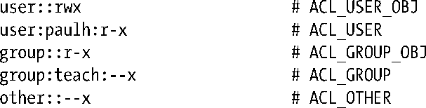
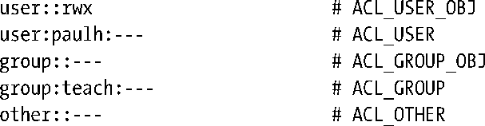

### 17.4　ACL_mask型ACE和ACL组分类

如果一个ACL包含了标记类型为ACL_USER或ACL_GROUP的ACE，那么也一定会包含标记类型为ACL_MASK的ACE。若ACL未包含任何标记类型为ACL_USER或ACL_GROUP的ACE，那么标记类型为ACL_MASK的ACE则为可选项。

对于ACL_MASK标记类型的ACE，其作用在于是所谓“组分类”（group class）中ACE所能授予权限的上限。组分类是指在ACL中，由所有标记类型为ACL_USER、ACL_GROUP以及ACL_GROUP_OBJ的ACE所组成的集合。

提供标记类型为ACL_MASK的ACE，其目的在于即使运行并无ACL概念的应用程序，也能保障其行为的一致性。作为这一论点的例证，假设与文件关联的ACL包含以下记录：

若某程序针对该文件按以下方式调用chmod()。

对于对ACL一无所知的应用程序而言，这意味着“除文件属主以外，不允许其他任何用户访问”。即便存在针对该文件的ACL，这层意思也不会变。如果ACL中不含ACL_MASK型记录，那么可以有多种方法来实现这一行为，但每种方法都存在缺陷。

+ 只是将ACL_GROUP_OBJ和ACL_OTHER型记录的掩码简单地修改为---是不足以解决问题的，因为用户paulh和组teach依旧对该文件拥有某些权限。
+ 另一种可能是，将针对组和其他用户的权限新设置（即，全部屏蔽）应用于标记类型为ACL_USER、ACL_GROUP、ACL_GROUP_OBJ以及ACL_OTHER的记录。

这一方法的问题在于，之前由具有ACL概念的应用所确立的文件权限语义会被对ACL一无所知的应用所“错杀”，因为如下调用（举例说明）不会将ACL中的ACL_USER和ACL_GROUP型记录恢复到其之前的状态：

+ 要避免这些问题，可以考虑将标记类型为ACL_GROUP_OBJ的记录置为对所有ACL_USER和ACL_GROUP类记录的约束。然而，这也意味着总是需要将ACL_GROUP_OBJ型记录置为ACL_USER和ACL_GROUP 型记录所允许权限的并集。而系统又会使用ACL_GROUP_OBJ型记录来判定赋予文件组的权限，这会引发冲突。

设计标记类型为ACL_MASK的记录，正是为了解决上述问题。这一机制在实现传统意义上的chmod()操作的同时，也无损于由具有ACL概念的应用所确立的文件权限语义。当ACL包含标记类型为ACL_MASK的ACE时：

+ 调用chmod()对传统组权限所做的变更，会改变ACL_MASK（而非ACL_GROUP_OBJ）标记类型ACE的设置。
+ 调用stat()，在st_mode字段（图15-1）的组权限位中会返回ACL_MASK权限（而非ACL_GROUP_OBJ权限）。

尽管ACL_MASK型记录的出现保护了ACL信息，使其免遭并无ACL概念的应用的“误伤”，反之却并非如此。ACL的优先级要高于对文件组权限的传统操作。例如，假设为某文件设置了如下ACL：

若针对该文件执行chmod g+rw命令，则ACL将会变为：

这时，组用户仍无法访问该文件。一种迂回策略是修改针对组的ACE，赋予其所有权限。结果，组用户总是能获得ACL_MASK型记录的所有权限。

