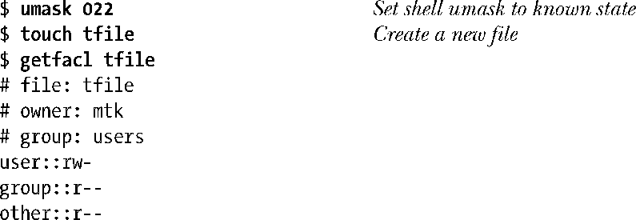
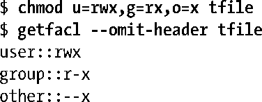
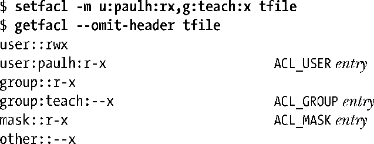
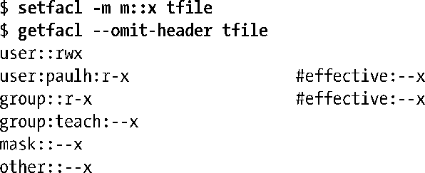
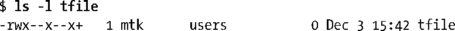
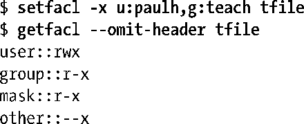

### 17.5　getfacl和setfacl命令

在shell中运行getfacl命令，可查看到应用于文件的ACL。

由getfacl命令的输出可知，新建文件具有最小的ACL权限。getfacl命令会在输出ACL记录的文本格式之前，显示该文件的名称和属主、属组。执行getfacl命令时，如带有--omit–header选项，可省略上述内容。

接下来的例子则显示，执行传统的chmod命令来改变文件访问权限时，其效果贯穿到文件的ACL上。

setfacl命令可用来修改文件的ACL。下例中执行setfacl –m命令，为文件的ACL追加标记类型为ACL_USER和ACL_GROUP的记录。

带-m选项的setfacl命令可修改现有ACE，或者，当给定标记类型和限定符的ACE不存在时，会追加新的ACE。setfacl命令还可使用-R选项，将指定的ACL“递归”应用于目录树中的所有文件。

由getfacl命令的输出可知，setfacl自动为该ACL新建了一条标记类型为ACL_MASK的记录。

追加了ACL_USER和ACL_GROUP标记类型的记录会将该ACL转变为扩展ACL。因此，在执行ls –l命令时，会在文件的传统权限掩码之后多一个加号（“+”）。

接下来继续执行setfacl命令，以禁用ACL_MASK标记类型记录中除执行权限以外的所有权限，然后再执行getfacl命令来查看文件的ACL。

在用户paulh和文件组输出后的“#effective：”注释是指在与ACL_MASK型记录相与（AND）后，由上述记录所赋予的权限实际上要小于记录中所描述的情况。

再次执行1s –1命令来观察文件的传统权限位，由输出可知，组分类权限位反映的是ACL_MASK型记录的权限 (--x)，而非ACL_GROUP型记录中的权限(r-x)。

setfacl –x则用来从ACL中删除记录。下例删除了用户paulh和组teach的记录（删除ACE时无需指定其权限）：

请注意，在执行上述操作时，setfacl命令会自动将掩码型ACE调整为所有组分类ACE权限的集合（只有一条此类ACE：ACL_GROUP_OBJ）。若不想进行这种调整，执行setfacl命令时要带上-n选项。

最后需要说明的是，执行带-b选项的setfacl命令，可从ACL中删除所有扩展ACE，而只保留最小化ACE（亦即，用户、组及其他）。

