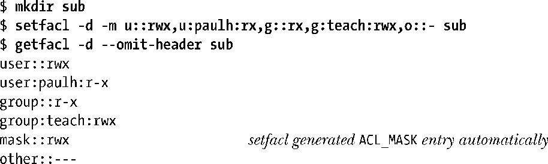
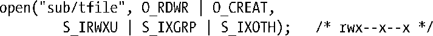

### 17.6　默认ACL与文件创建

行文至此，对ACL的讨论所描述的均属访问型（access）ACL。顾名思义，当进程访问与该ACL相关的文件时，将使用访问型ACL来判定进程对文件的访问权限。针对目录，还可创建第二种ACL：默认型（default）ACL。

访问目录时，默认型ACL并不参与判定所授予的权限。相反，默认型ACL的存在与否决定了在目录下所创建文件或子目录的ACL和权限。（默认型ACL存储于名为system.posix_acl_default的扩展属性中。）

想查看和设置与目录相关的默认型ACL，需要执行带有-d选项的getfacl和setfacl命令。

执行带有–k选项的setfacl命令，可删除针对目录而设的默认型ACL。

若针对目录设置了默认型ACL，则：

+ 新建于目录下的子目录会将该目录的默认型ACL继承为其默认型ACL。换言之，默认型ACL会随子目录的创建而沿目录树传播开来。
+ 新建于目录下的文件或子目录会将该目录的默认型ACL继承为其访问型ACL。与传统文件权限位相对应的ACL记录将和创建文件或子目录时系统调用（open()、mkdir()等等）中的mode参数相与（&）。所谓“对应的ACL记录”是指：
      + L_USER_OBJ；
    + ACL_MASK，若不含ACL_MASK，则为ACL_GROUP_OBJ；
    + ACL_OTHER。

一旦目录拥有默认型ACL，那么对于新建于该目录下的文件来说，进程的umask（15.4.6节）并不参与判定文件访问型ACL中所记录的权限。

试举一例，演示一新建文件如何将其父目录的默认型ACL继承为自身的访问型ACL。假设使用如下open()调用，在前例所建目录下创建一新文件：

这一新文件的访问型ACL如下：

若该目录并无默认ACL，则：

+ 新建于该目录下的子目录也不存在默认ACL。
+ 会沿用传统规则来设置目录下新建文件或目录的权限。除去按进程的 umask 而屏蔽权限位之外，将文件权限置为（open()、mkdir()等调用中）mode参数的值。这时，新文件将拥有最小化的ACL。

