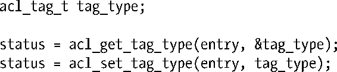
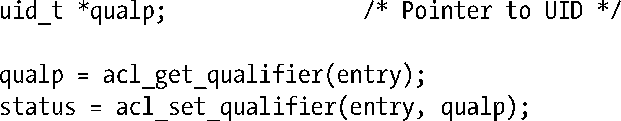
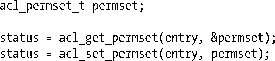
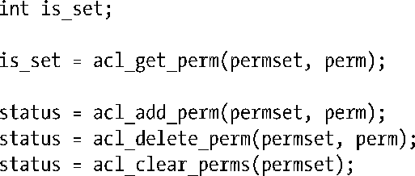

### 获取并修改ACL记录中的属性

函数acl_get_tag_type()和acl_set_tag_type()可分别用来获取和修改（由entry参数所指定）ACL记录中的标记类型。

tag_type参数类型为acl_type_t（整型），取值可为ACL_USER_OBJ、ACL_USER、ACL_GROUP_OBJ、ACL_GROUP、ACL_OTHER或ACL_MASK之一。

函数acl_get_qualifier()和acl_set_qualifier()可分别用来获取和修改（由entry参数所指定）ACL记录中的标记限定符。下面是两个函数的使用实例，这里假设通过对标记类型的检测，已然确定该记录属于ACL_USER。

仅当ACE的标记类型为ACL_USER或ACL_GROUP时，标记限定符才有意义。在上例中，qualp是指向用户ID (uid_t *)的一枚指针，在下例中，则是指向组ID (gid_t *)的指针。

函数acl_get_permset()和acl_set_permset()则可分别用来获取和修改（由entry参数所指代）ACE中的权限集合。

数据类型acl_permset_t是一个指代权限集合的句柄。

下列函数则用来操纵某一权限集合中的内容：

在上述各个调用中，可将perm参数指定为ACL_READ、ACL_WRITE或ACL_EXECUTE——顾名即可思义。上述函数的用法如下所述：

+ 若在（由permse参数指代的）权限集合中成功激活由perm参数所指定的权限，acl_get_perm()函数将返回1（真值），否则返回0。该函数为Linux对POSIX.1e标准草案的扩展。
+ acl_add_perm()函数用来向由permse参数所指代的权限集合中追加由perm参数所指定的权限。
+ acl_delete_perm()函数用来从permse参数所指代的权限集合中删除由perm参数所指定的权限。（即便要删除的权限在权限集合中并不存在，函数也不会报错。）
+ acl_clear_perm()函数用来从permse参数所指代的权限集合中删除所有权限。

