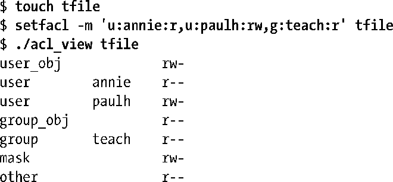
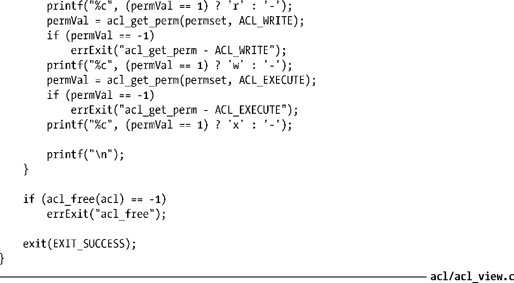

### 程序示例

程序清单17-1对某些ACL库函数的使用做了演示。该程序可获取并展示与文件相关的ACL（亦即，该程序提供了getfacl命令的部分功能）。若以-d命令行选项执行该程序，则将显示与目录相关的默认型ACL，而非访问型ACL。

以下为该程序的运行示例。

> 随本书发行的源码中还包含了另一程序：acl/acl_update.c，可用来更新 ACL（该程序提供了setfacl命令的部分功能）。

程序清单17-1：显示与文件挂钩的访问或默认ACL

