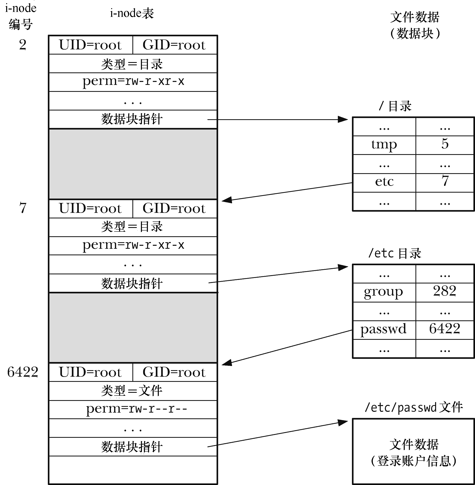
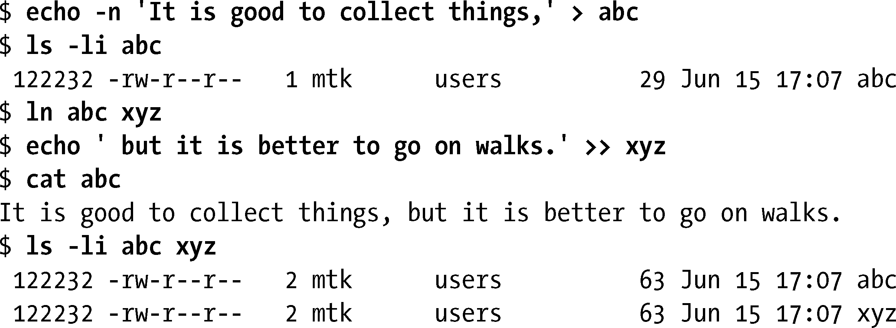
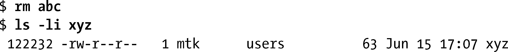

### 18.1　目录和（硬）链接

在文件系统中，目录的存储方式类似于普通文件。目录与普通文件的区别有二。

+ 在其i-node条目中，会将目录标记为一种不同的文件类型（参见14.4节）。
+ 目录是经特殊组织而成的文件。本质上说就是一个表格，包含文件名和i-node编号。

在大多数原生Linux文件系统上，文件名长度可达255个字符。图18-1所示为针对示例文件（/etc/passwd）所维护的文件系统i-node表以及相关目录文件的部分内容，展示了目录与i-node之间的关系。

> 虽然一个进程能够打开一个目录，但却不能使用read()去读取目录的内容。为了检索目录内容，进程必须使用本章后续讨论的系统调用和库函数。（在一些UNIX实现中，也可以对目录执行read()，但这会给应用带来可移植性方面的问题。）进程同样也不能使用write()来改变一个目录的内容，仅能借助于诸如open()（创建一个新文件）、link()、mkdir()、symlink()、unlink()及rmdir()之类的系统调用（4.3节描述了open()调用，本章稍后会介绍余下的系统调用）来间接（向内核请求）改变其内容。
> i-node表的编号始于1，而非0，因为若目录条目的i-node字段值为0，则表明该条目尚未使用。i-node 1用来记录文件系统的坏块。文件系统根目录(/)总是存储在i-node条目2中（如图18-1所示），所以内核在解析路径名时就知道该从哪里着手。

<b class="my_markdown">图18-1：以文件/etc/passwd为例，展示i-node和目录结构之间的关系</b>

回顾文件i-node（14.4节）中存储的信息列表，会发现其中并未包含文件名，而仅通过目录列表内的一个映射来定义文件名称。其妙用在于，能够在相同或者不同目录中创建多个名称，每个均指向相同的i-node节点。也将这些名称称为链接，有时也称之为硬链接（稍后介绍），以示与符号链接有所区别。

> 所有的原生Linux和UNIX文件系统均支持硬链接，然而，许多非UNIX文件系统（比如，微软的VFAT）则不支持。（微软的NTFS文件系统支持硬链接。）

可在shell中利用ln命令为一个业已存在的文件创建新的硬链接，正如下面shell会话日志所示。

Cat命令输出中一目了然的事，经过ls–li命令所示i-node编码（即第一列）得到了进一步证实。名称abc和xyz指向相同的i-node条目，因此均指向相同文件。ls–li命令所示内容的第三列为对i-node链接的计数。执行ln abc xyz命令后，abc所指向i-node的链接计数升至2，因为现在指向该文件的有两个名字。（由于指向相同的i-node，针对文件xyz输出的链接计数也是2。）

若移除其中一个文件名，另一文件名以及文件本身将继续存在。

仅当i-node的链接计数降为0时，也就是移除了文件的所有名字时，才会删除（释放）文件的i-node记录和数据块。总结如下：rm命令从目录列表中删除一文件名，将相应i-node的链接计数减一，若链接计数因此而降为0，则还将释放该文件名所指代的i-node和数据块。

同一文件的所有名字（链接）地位平等——没有一个名字（比如，第一个）会优于其他名字。正如上例所示，在移除与文件相关的第一个名称后，物理文件继续存在，但只能通过另一文件名来访问其内容。

在线论坛上经常会有这样的问题出现：在程序中如何找到与文件描述符X相关联的文件名？简单的回答是不能，至少缺乏明确而又便于移植的手段，因为一个文件描述符指向一个i-node，而指向这个i-node 的文件名则可能有多个（或者甚至如18.3节所述，一个都没有）。

> 在Linux系统上，借助于readdir()对Linux特有/proc/PID/fd目录内容（内含符号链接指向进程当前打开的每个文件描述符）的扫描，可以获知一个进程当前打开了哪些文件。此外，已经移植到多个UNIX系统中的lsof(1)和fuser(1)工具也精于此道。

对硬链接的限制有二，均可用符号链接来加以规避。

+ 因为目录条目（硬链接）对文件的指代采用了i-node编号，而i-node编号的唯一性仅在一个文件系统之内才能得到保障，所以硬链接必须与其指代的文件驻留在同一文件系统中。
+ 不能为目录创建硬链接，从而避免出现令诸多系统程序陷于混乱的链接环路。

> 早期的UNIX实现一度曾允许超级用户为目录创建硬链接。这在当时是必要的，因为这些实现并未提供mkdir()系统调用。相反，当时会使用mknode()调用创建一个目录，然后为.和..创建链接（[Vahalia, 1996]）。虽然这一特性已是昨日黄花，但一些现代UNIX实现出于向后兼容的目的仍对其加以保留。
> 使用绑定挂载（bind mount）可以获得与为目录创建硬链接相似的效果。

