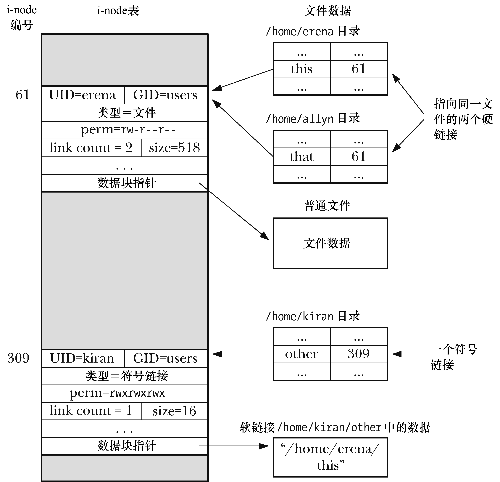

### 18.2　符号（软）链接

符号链接，有时也称为软链接，是一种特殊的文件类型，其数据是另一文件的名称。图18-2展示的情况是：两个硬链接——/home/erena/this和/home/allyn/that——指向同一个文件，而符号链接/home/kiran/other，则指代文件名/home/erena/this。

在shell中，符号链接是由ln–s命令创建的。ls–F命令的输出结果中会在符号链接的尾部标记@。

符号链接的内容既可以是绝对路径，也可以是相对路径。解释相对符号链接时以链接本身的位置作为参照点。

符号链接的地位不如硬链接。尤其是，文件的链接计数中并未将符号链接计算在内。（因此，图18-2中编号为61的i-node，其链接计数为2，而不是3。）因此，如果移除了符号链接所指向的文件名，符号链接本身还将继续存在，尽管无法再对其进行解引用（下溯）操作，也将此类链接称之为悬空链接。更有甚者，还可以为并不存在的文件名创建一个符号链接。

<b class="my_markdown">图18-2：对硬链接和符号链接的展现</b>

> 引入符号链接的是4.2BSD。虽然未获POSIX.1-1990接纳，但SUSv1和SUSv3随后还是将其纳入规范。

因为符号链接指代一个文件名，而非i-node编号，所以可以用其来链接不同文件系统中的一个文件。对硬链接的那些制约也就不会困扰到符号链接，可以为目录创建符号链接。诸如find和tar之类的工具命令有能力识别硬链接和符号链接之间的差异，要么会在默认情况下不对符号链接进行解引用，要么会避免因使用符号链接而陷入引用环路。

符号链接之间可能会形成链路（例如，a是指向b的符号链接，而b是指向c的符号链接）。当在各个文件相关的系统调用中指定了符号链接时，内核会对一系列链接层层解去引用，直抵最终文件。

SUSv3规定，针对路径名中的每个符号链接部件，系统实现应允许对其实施至少_POSIX_SYMLOOP_MAX次解除引用操作。_POSIX_SYMLOOP_MAX的规定值为8。然而，在内核2.6.18之前，Linux将解析符号链接链路时的解引用操作次数限制为5次。始于版本2.6.18，Linux内核实现了SUSv3所规定的最小解引用次数：8次。Linux还将对一个完整路径名的解引用总数限制为40次。施加这些限制，意在应对超长符号链接链路以及符号链接环路，从而使内核代码在解析符号链接时免于引发堆栈溢出。

> 某些UNIX文件系统的优化举措，不但没有在正文中提及，而且也未见诸于图18-2。如果构成符号链接内容的字符串总长度很小，足以放入i-node中通常用于存放数据指针的位置，那么就会将字符串直接存储在那里。这省去对一个磁盘块的分配，也加速了对符号链接信息的访问，因为获取信息时仅涉及到文件的i-node。例如，ext2、ext3及ext4采用这一技术，将i-node中通常用于存放数据块指针的60个字节转而用于存放长度合适的符号字符串。实践证明，这一优化措施卓有成效。在笔者检查过的某一系统中，符号链接共计20 700个，其中内容长度不超过60个字节的占97%。

#### 系统调用对符号链接的解释

许多系统调用都会对符号链接进行解引用处理（即下溯follow），从而对链接所指向的文件展开操作。还有一些系统调用对符号链接则不作处理，直接操作于链接文件本身。书中会在论及每个系统调用的同时，描述其针对符号链接的行为。表18-1对此作了总结。

<b class="my_markdown">表18-1：各个函数对符号链接的解释</b>

| 函　　数 | 是否对链接解引用 | 备　　注 |
| :-----  | :-----  | :-----  | :-----  | :-----  |
| access() | ● |
| acct() | ● |
| bind() | ● | UNIX域套接字带有路径名 |
| chdir() | ● |
| chmod() | ● |
| chown() | ● |
| chroot() | ● |
| creat() | ● |
| exec() | ● |
| getxattr() | ● |
| lchown() |
| lgetxattr() |
| link() |  | 参见18.3节 |
| listxattr() | ● |
| llistxattr() |
| lremovexattr() |
| lsetxattr() |
| lstat() |
| lutimes() |
| open() | ● | 除非指定了O_NOFOLLOW或者O_EXCL │ O_CREAT |
| opendir() | ● |
| pathconf() | ● |
| pivot_root() | ● |
| quotactl() | ● |
| readlink() |
| removexattr() | ● |
| rename() |  | 无论哪个参数中的链接，都不会对其进行解引用 |
| rmdir() |  | 若参数为符号链接，则调用失败，并将errno置为 ENOTDIR |
| setxattr() | ● |
| stat() | ● |
| statfs(), statvfs() | ● |
| swapon(), swapoff() | ● |
| truncate() | ● |
| unlink() |
| uselib() | ● |
| utime(), utimes() | ● |

少数情况下，符号链接本身及其所指向的文件会需要类似的功能，系统这时就会提供两套系统调用：一套会对链接解除引用，另一套则反之，后者在命名时会冠以字母l。stat()和lstat()就是一例。

有一点是约定俗成的：总是会对路径名中目录部分（即最后一个斜线字符前的所有组成部分）的符号链接进行解除引用操作。因此，在路径/somedir/somesubdir/file中，若somedir 和somesubdir 属于符号链接，则一定会解除对这两个目录的引用，而针对file是否进行解引用与否，则取决于路径名所传入的系统调用。

> 18.11节描述了一组自版本2.6.16加入的系统调用，对表18-1所展示的部分接口功能有所扩展。对于其中的某些调用而言，可以利用flags参数来控制是否对符号链接进行解引用操作。

#### 符号链接的文件权限和所有权

大部分操作会无视符号链接的所有权和权限（创建符号链接时会为其赋予所有权限）。是否允许操作反而是由符号链接所指代文件的所有权和权限来决定。仅当在带有粘性权限位（15.4.5节）的目录中对符号链接进行移除或改名操作时，才会考虑符号链接自身的所有权。

