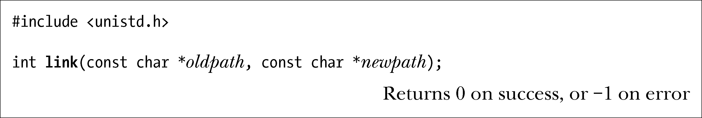
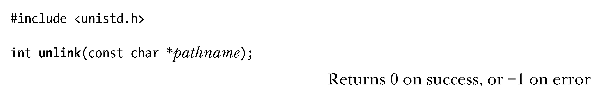
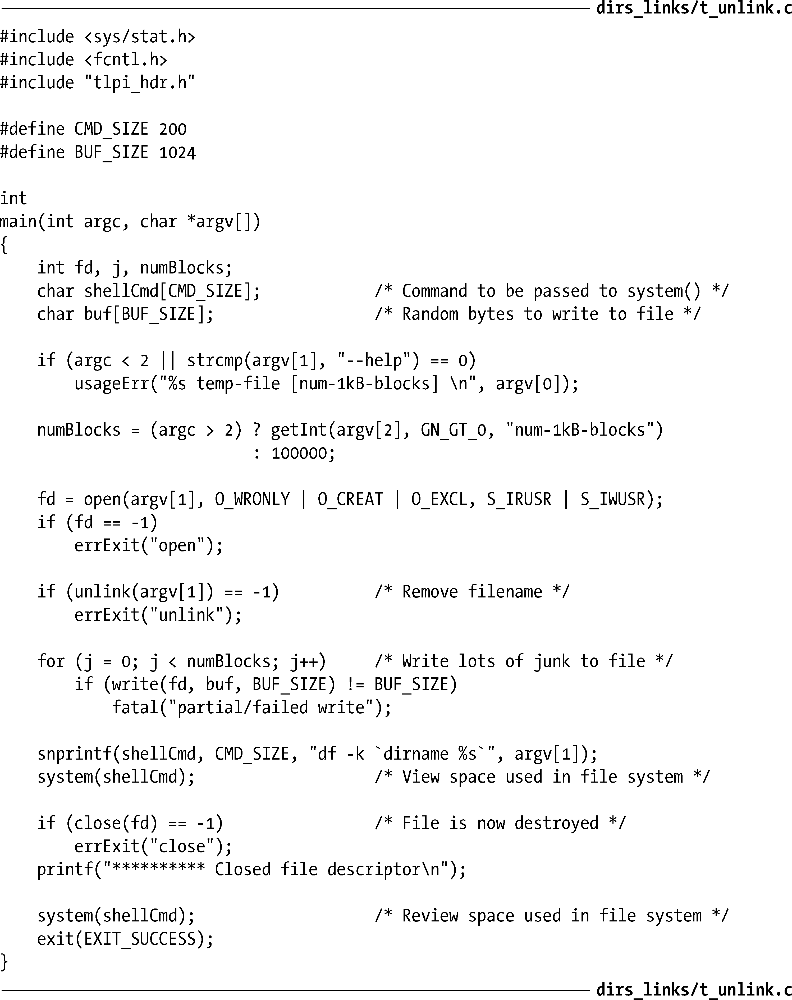
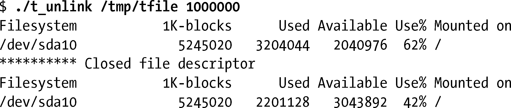

### 18.3　创建和移除（硬）链接：link()和 unlink()

link()和unlink()系统调用分别创建和移除硬链接。

若oldpath中提供的是一个已存在文件的路径名，则系统调用link()将以newpath参数所指定的路径名创建一个新链接。若newpath指定的路径名已然存在，则不会将其覆盖；相反，将产生一个错误（EEXIST）。

在Linux中，link()系统调用不会对符号链接进行解引用操作。若oldpath属于符号链接，则会将newpath创建为指向相同符号链接文件的全新硬链接。（换言之，newpath也是符号链接，指向oldpath所指代的同一文件。）这一行为有悖于SUSv3规范。SUSv3要求，除非另行规定（link()系统调用不在此列），否则所有执行路径名解析操作的函数都应对符号链接进行解引用。大多数其他UNIX实现的行事方式都与SUSv3相符。值得注意的是，Solaris是个例外，默认情况下的行为与Linux相同。但若采用适当的编译器选项，又可提供符合SUSv3规范的行为。鉴于系统实现间的这种差异，应避免将oldpath参数指定为符号链接，以保障程序的可移植性。

> SUSv4承认现有实现间存在不一致性，同时规定link()调用对符号链接解引用与否由实现定义。SUSv4还将linkat()纳入规范，在执行与link()相同任务的同时，可利用flag参数来控制调用是否解析符号链接。更多细节参见18.11节。

unlink()系统调用移除一个链接（删除一个文件名），且如果此链接是指向文件的最后一个链接，那么还将移除文件本身。若pathname中指定的链接不存在，则unlink()调用失败，并将errno置为ENOENT。

unlink()不能移除一个目录，完成这一任务需要使用rmdir()或remove()，将于18.6节进行介绍。

> SUSv3规定，若pathname中指定的是一个目录，则unlink()调用失败，并将errno置为EPERM。然而，在Linux中，unlink()在这种情况下会将errno置为EISDIR值。（对于与SUSv3间的这一差别，LSB 倒也并不讳言。）为保障可移植性，应用程序在检查这种情况时应做两手准备。

unlink()系统调用不会对符号链接进行解引用操作，若pathname为符号链接，则移除链接本身，而非链接指向的名称。

#### 仅当关闭所有文件描述符时，方可删除一个已打开的文件

内核除了为每个i-node维护链接计数之外，还对文件的打开文件描述（参见图5-2）计数。当移除指向文件的最后一个链接时，如果仍有进程持有指代该文件的打开文件描述符，那么在关闭所有此类描述符之前，系统实际上将不会删除该文件。这一特性的妙用在于允许取消对文件的链接，而无需担心是否有其他进程已将其打开。（然而，对于链接数已降为0的打开文件，就无法将文件名与其重新关联起来。）此外，基于上述事实，还可以玩点小技巧：先创建并打开一个临时文件，随即取消对文件的链接（unlink），然后在程序中继续使用该文件。（这正是5.12节所述tmpfile()函数的所作所为。）

程序清单18-1对此现象做了展示。

程序清单18-1：使用unlink()移除一个链接

程序清单18-1中程序接受两个命令行参数。第一个参数标识程序应该创建的文件名称。程序打开此文件后随即取消与文件名的链接。虽然文件名已消失，但是文件本身依然存在。然后程序向文件随机写入一些数据块，数据块数量由程序的第二个命令行参数（可选项）指定。这时，程序会利用df(1)命令显示文件系统的空间使用情况。程序接着会关闭文件描述符，系统因之而将文件移除，程序会再次使用df(1)命令来显示有所下降的磁盘使用情况。如下shell会话演示了运行程序清单18-1程序的情况：

> 程序清单18-1使用system()函数来执行shell命令，27.6节将对此函数做详细描述。

