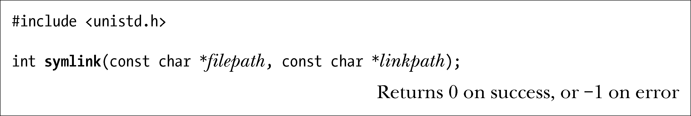
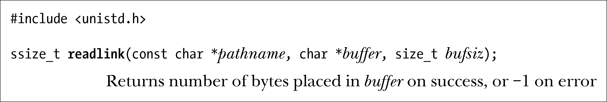

### 18.5　使用符号链接：symlink()和readlink()

现在来看看用于创建符号链接，以及检查其内容的系统调用。

symlink()系统调用会针对由filepath所指定的路径名创建一个新的符号链接——linkpath。（想移除符号链接，需使用unlink()调用。）

若linkpath中给定的路径名已然存在，则调用失败（且将errno置为EEXIST）。由filepath指定的路径名可以是绝对路径，也可以是相对路径。

由filepath所命名的文件或目录在调用时无需存在。即便当时存在，也无法阻止后来将其删除。这时，linkpath成为“悬空链接”，其他系统调用试图对其进行解引用操作都将出错（通常错误号为ENOENT）。

如果指定一符号链接作为open()调用的pathname参数，那么将打开链接指向的文件。有时，倒宁愿获取链接本身的内容，即其所指向的路径名。这正是readlink()系统调用的本职工作，将符号链接字符串的一份副本置于buffer指向的字符数组中。

bufsiz是一个整型参数，用以告知readlink()调用buffer中的可用字节数。

如果一切顺利，readlink()将返回实际放入buffer中的字节数。若链接长度超过bufsiz，则置于buffer中的是经截断处理的字符串（并返回字符串大小，亦即bufsiz）。

由于buffer尾部并未放置终止空字符，故而也无法分辨readlink()所返回的字符串到底是经过截断处理，还是恰巧将buffer填满。验证后者的方法之一是重新分配一块更大的buffer，并再次调用readlink()。另外，还可以将pathname的长度定义为常量PATH_MAX（参见11.1节），该常量定义了程序可拥有的最长路径名长度。

程序清单18-4演示了readlink()的用法。

> 为限制符号链接中所能存储的最大字节数，SUSv3定义了一个新限制SYMLINK_ MAX，要求系统实现对此加以定义，并规定其不得少于255个字节。写作本书时，Linux尚未对此限制作出定义。而正文之所以建议使用PATH_MAX，是因为该限制至少与SYMLINK_MAX大小相当。
> SUSv2将readlink()的返回类型定义为int，而当前的许多实现（以及Linux中较老版本的glibc）对此奉行不悖。SUSv3则将readlink()的返回值类型改为ssize_t。

