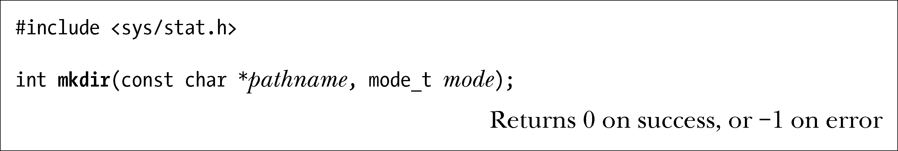
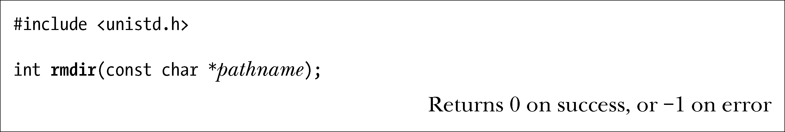

### 18.6　创建和移除目录：mkdir()和rmdir()

mkdir()系统调用创建一个新目录。

pathname参数指定了新目录的路径名。该路径名可以是相对路径，也可以是绝对路径。若具有该路径名的文件已经存在，则调用失败并将errno置为EEXIST。

对新目录所有权的设置遵循15.3.1节所述规则。

mode参数指定了新目录的权限。（15.3.1、15.3.2和15.4.5各节描述了目录权限位的含义。）对该位掩码值的指定方式既可以与open()调用相同——对表15-4所列各常量进行或(|)操作，也可直接赋予八进制数值。既定的mode值还将于进程掩码相与（&）（参见15.4.6节）。另外，set-user-ID位始终处于关闭状态，因为该位对于目录而言毫无意义。

如果在mode中设置了粘滞位（S_ISVTX），那么将对新目录设置该权限。

调用还会忽略在mode中设置的set-group-ID位（S_ISGID）。相反，若对其父目录设置了set-group-ID位，则同样会对新建目录设置该权限。15.3.1节曾指出，对目录设置set-group-ID权限位将导致目录中新建文件的组ID取自目录组ID，而非进程有效组ID。mkdir()系统调用按此处描述的方式来传播set-group-ID权限位，以保证目录下所有子目录的行为均保持一致。

SUSv3明文规定，mkdir()对set-user-ID、set-group-ID以及粘滞位的处理方式由实现定义。某些UNIX实现在新建目录时总是关闭这3个权限位。

新建目录包括两个条目：.（点），即指向目录自身的链接；..（点点），即指向父目录的链接。

> SUSv3并未要求目录中包括.和..条目，只是要求当路径中出现.和..时，实现应能正确解释。若要保证应用程序的可移植性，则不应假设目录中存在这些条目。

mkdir()系统调用所创建的仅仅是路径名中的最后一部分。换言之，mkdir("aaa/bbb/ccc"，mode)仅当目录aaa和aaa/bbb已经存在的情况下才会成功。（这相当于mkdir(1)命令的默认行为，但mkdir(1)同时也提供-p选项，可将不存在的中间目录一一创建。）

> GNU C语言库提供有mkdtemp(template)函数，可谓mkstemp()函数的“目录”版。该函数会创建一个唯一命名的目录，在对所有者开启读、写和执行权限的同时，不对任何其他用户赋予任何权限。不过，mkdtemp()所返回的并非一个文件描述符，而是一枚指针，指向经过修改处理的字符串，内含template 中的实际目录名。该函数并未纳入SUSv3规范，也未获得所有UNIX实现的支持，但SUSv4对其作了定义。

rmdir()系统调用移除由pathname指定的目录，该目录可以是绝对路径名，也可以是相对路径名。

要使rmdir()调用成功，则要删除的目录必须为空。如果pathname的最后一部分为符号链接，那么rmdir()调用将不对其进行解引用操作，并返回错误，同时将errno置为ENOTDIR。

