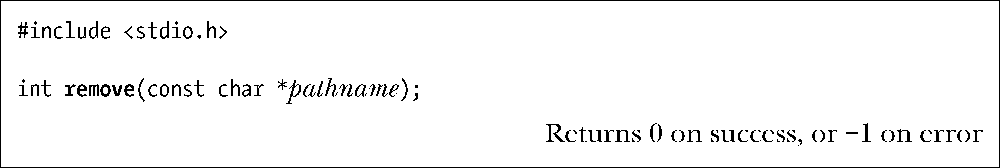

### 18.7　移除一个文件或目录：remove()

remove()库函数移除一个文件或一个空目录。

如果pathname是一文件，那么remove()去调用unlink()；如果pathname为一目录，那么remove()去调用rmdir()。

与unlink()、rmdir()一样，remove()不对符号链接进行解引用操作。若pathname是一符号链接，则remove()会移除链接本身，而非链接所指向的文件。

如果移除一个文件只是为创建同名新文件做准备，那么编码时使用remove()函数会更加简单，无需再去检查目录名所指是文件还是目录，然后再决定是调用unlink()还是rmdir()。

> remove()属于C语言标准库函数，广为UNIX和非UNIX系统所支持。大多数非UNIX系统并不支持硬链接，所以将移除文件的函数命名为unlink()也不合情理。

