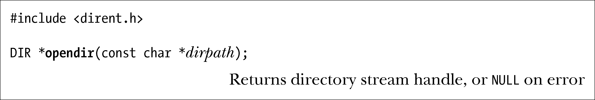
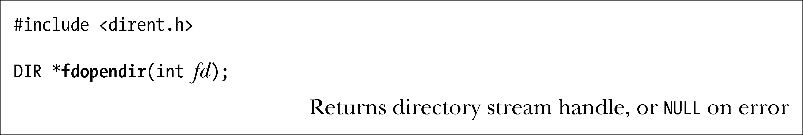
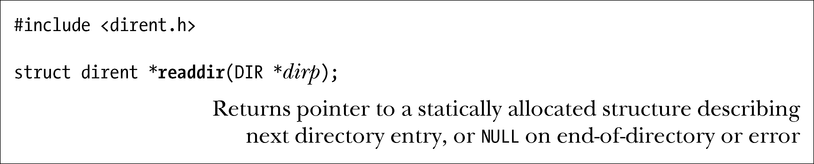
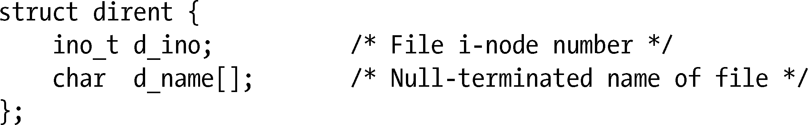
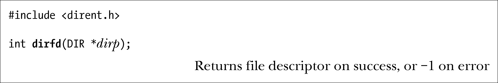
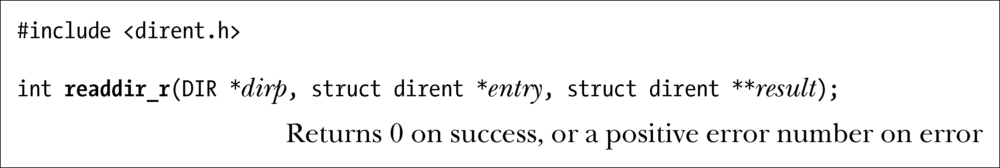
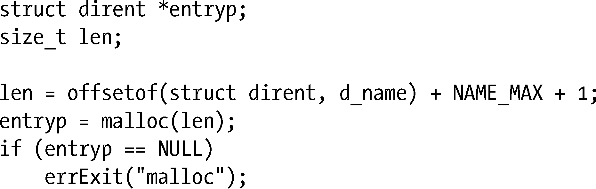

### 18.8　读目录：opendir()和readdir()

本节所述库函数可用于打开一个目录，并逐一获取其包含文件的名称。

> 读取目录的库函数均以getdents()系统调用（未纳入SUSv3规范）为基础，但其接口更易于使用。Linux还提供了readdir(2)系统调用（相对于此处描述的readdir(3)库函数），所执行的任务类似于getdents()，也因之而遭废止。

opendir()函数打开一个目录，并返回指向该目录的句柄，供后续调用使用。

opendir()函数打开由dirpath指定的目录，并返回指向DIR类型结构的指针。该结构即所谓目录流（directory stream），亦即调用者传递给下述其他函数的句柄。一旦从opendir()返回，则将目录流指向目录列表的首条记录。

除了要创建的目录流所针对的目录由打开文件描述符指代之外，fdopendir()与opendir()并无不同。

提供fdopendir()函数，意在帮助应用程序免受18.11节所述各种竞态条件的困扰。

调用fdopendir()成功后，文件描述符将处于系统的控制之下，且除了利用本节余下部分所描述的函数之外，程序不应采取任何其他方式对其进行访问。

SUSv4定义了fdopendir()函数（但SUSv3并未将其纳入规范）。

readdir()函数从一个目录流中读取连续的条目。

每调用readdir()一次，就会从dirp所指代的目录流中读取下一目录条目，并返回一枚指针，指向经静态分配而得的dirent类型结构，内含与该条目相关的如下信息：

每次调用readdir()都会覆盖该结构。

> 出于对程序可移植性的考虑，上述定义略去了Linux dirent结构中的各种非标准字段。这其中最令人感兴趣的当属d_type，它同时获得了BSD流派的支持，但并未在其他UNIX系统中实现。该属性值用于标识命名于d_name之中文件的类型，诸如DT_REG（普通文件）、DT_DIR（目录）、DT_LNK（符号链接）或DT_FIFO（FIFO）。（这些名称类似于表15-1所列诸宏。）利用该属性值可省去为确定文件类型而对lstat ()的调用。注意，写作本书时，该属性仅获得Btrfs、ext2、ext3以及ext4的全面支持。

调用lstat()（或者stat()，如果应对符号链接解引用时）可获得d_name所指向文件的更多信息，其中，路径名由之前调用opendir()时指定的dirpath参数与“/”字符以及d_name 字段的返回值拼接组成。

readdir()返回时并未对文件名进行排序，而是按照文件在目录中出现的天然次序（这取决于文件系统向目录添加文件时所遵循的次序，及其在删除文件后对目录列表中空隙的填补方式）。（命令ls–f对文件列表的排列与调用readdir()时一样，均未做排序处理。）

> 使用scandir(3)函数可以获得经过排序处理的文件列表，且排列规则可由程序员定义，具体细节请参考手册页。尽管该函数未获SUSv3接纳，但得到了大多数UNIX实现的支持。SUSv4也对scandir()作了定义。

一旦遇到目录结尾或是出错，readdir()将返回NULL，针对后一种情况，还会设置errno以示具体错误。为了区别这两种情况，可编码如下：

如果目录内容恰逢应用调用readdir()扫描该目录时发生变化，那么应用程序可能无法观察到这些变动。SUSv3明确指出，对于readdir()是否会返回自上次调用opendir()或rewinddir()后在目录中增减的文件，规范不做要求。至于最后一次执行上述调用前就存在的文件，应确保其全部返回。

rewinddir()函数可将目录流回移到起点，以便对readdir()的下一次调用将从目录的第一个文件开始。

closedir()函数将由dirp指代、处于打开状态的目录流关闭，同时释放流所使用的资源。

SUSv3还定义了两个高级函数：telldir()和seekdir()，允许随机访问目录流。有关这些函数的深入信息请参考手册页。

#### 目录流与文件描述符

有一个目录流，就有一个文件描述符与之关联。dirfd()函数返回与dirp目录流相关联的文件描述符。

例如，将dirfd()返回的文件描述符传递给fchdir()（参见18.10节），就可以把进程的当前工作目录改成相应目录。此外，还可以将其传递给18.11节所述各函数的dirfd参数。

dirfd()函数还见诸于BSD系统，但在其他实现中则鲜有踪迹。该函数未获SUSv3接纳，但SUSv4则对其做了规范。

这里值得一提的是，opendir()会为与目录流相关联的文件描述符自动设置close-on-exec标志（FD_CLOEXEC），以确保当执行exec()时自动关闭该文件描述符。（SUSv3要求这一行为。）close-on-exec标志将在27.4节加以描述。

#### 示例程序

程序清单18-2使用opendir()、readdir()和closedir()函数来列出由命令行参数所指定各目录的内容（若未提供参数则为当前工作目录）。以下是运行该程序的一个例子：

程序清单18-2：扫描一个目录

#### readdir_r()函数

readdir_r()函数是readdir()的变体。二者之间语义上的关键差异在于前者是可重入的，而后者不是。这是因为readdir_r()对文件条目的返回利用的是由调用者分配的entry参数，而readdir()则是将信息置于静态分配的结构并返回其指针。21.1.2节和31.1节讨论了可重入性（reentrancy）。

针对既定dirp，亦即之前调用opendir()所打开的目录流，readdir_r()将下一项目录条目置于由entry指向的dirent结构中。另外，还会在result①中放置指向该结构的一枚指针。如果抵达目录流尾部，那么会在result②中返回NULL（且readdir_r()返回0）。当出现错误时，readdir_r()不会返回−1，而是返回一个对应于errno的正整型值。

在Linux中，dirent结构的d_name字段是大小为256字节的一个数组，足以容纳可能出现的最长文件名。虽然有几个其他的UNIX实现也为d_name定义了相同的大小，但SUSv3对此却并做规定，而另一些UNIX实现则将该字段定义为1字节的数组，并将正确分配结构大小的工作交给调用程序。这时，应将d_name字段大小设定为常量NAME_MAX+1（考虑终止空字节）。为确保可移植性，应用程序应以如下方式分配dirent结构：

鉴于dirent结构中d_name字段（该属性总是位于结构的最后）之前各类属性的数量和大小在不同系统中实现不一，采用offsetof()宏（定义于<stddef.h>中）可避免程序对此产生依赖。

> offsetof()宏接受两个参数——结构类型和该结构中某一字段的名称——并返回一size_t类型值，亦即该字段距结构起点的字节偏移量。这个宏之所以必要，是由于编译器为满足诸如int之类的类型的对齐要求，可能在结构中插入填充字节。这会导致结构中某一字段的偏移量可能要大于该属性之前所有字段的长度总和。

