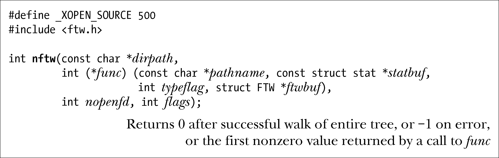
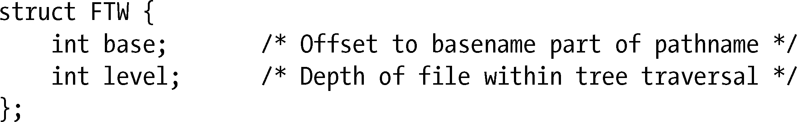
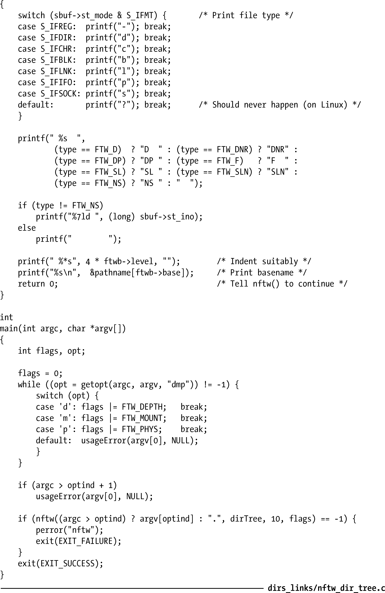
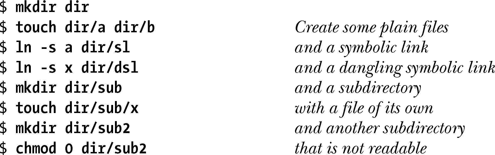
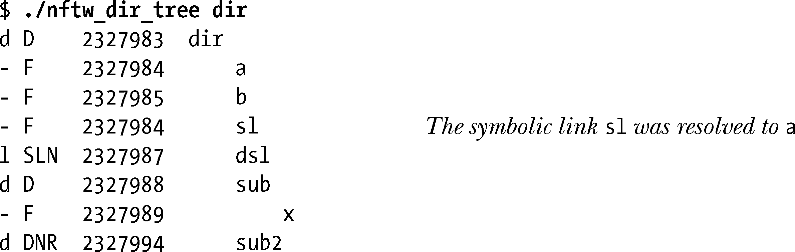
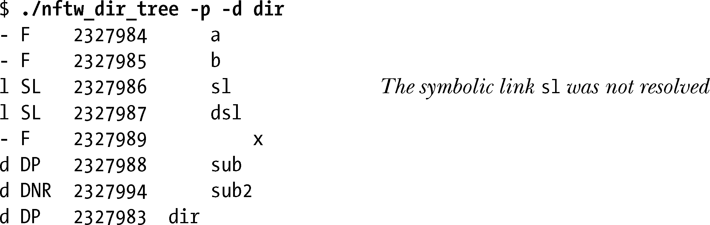

### 18.9　文件树遍历：nftw()

nftw()函数允许程序对整个目录子树进行递归遍历，并为子树中的每个文件执行某些操作（即，调用由程序员定义的函数）。

> nftw()函数是对执行类似功能的老函数ftw()的加强。由于提供了更多功能，对符号链接的处理也更易于把握（SUSv3规定，ftw()的函数实现无论是否对符号链接进行解引用，均符合规范），故而新近开发的应用程序应考虑采用nftw()（new ftw）。SUSv3将nftw()和ftw()均纳入规范，但SUSv4将后者标记为“已废止”。
> GNU C语言函数库也提供了派生自BSD分支的fts API(fts_open()、fts_read()、fts_children()、fts_set()和fts_close())。这些函数执行的任务类似于ftw()和nftw()，但在遍历树方面为应用程序提供了更大的灵活性。然而，因为这些API目前尚未获得业界标准的接纳，也鲜有见诸于BSD后裔之外的其他UNIX实现，所以在此略而不论。

nftw()函数遍历由dirpath指定的目录树，并为目录树中的每个文件调用一次由程序员定义的func函数。

默认情况下，nftw()会针对给定的树执行未排序的前序遍历，即对各目录的处理要先于各目录下的文件和子目录。

当nftw()遍历目录树时，最多会为树的每一层级打开一个文件描述符。参数nopenfd指定了nftw()可使用文件描述符数量的最大值。如果目录树深度超过这一最大值，那么nftw()会在做好记录的前提下，关闭并重新打开描述符，从而避免同时持有的描述符数目突破上限nopenfd（从而导致运行越来越慢）。在较老的UNIX实现中，有的系统要求每个进程可打开的文件描述符数量不得超过20个，这更突显出这一参数的必要性。现代UNIX实现允许进程打开大量的文件描述符，因此，在指定该数目时出手可以大方一些（比如，10或者更多）。

nftw()的flags参数由0个或多个下列常量相或(|)组成，这些常量可对函数的操作做出修正。

##### FTW_CHDIR

在处理目录内容之前先调用chdir()进入每个目录。如果打算让func在pathname 参数所指定文件的驻留目录下展开某些工作，那么就应当使用这一标志。

##### FTW_DEPTH

对目录树执行后序遍历。这意味着，nftw()会在对目录本身执行func之前先对目录中的所有文件（及子目录）执行func调用。（这一标志名称容易引起误会——nftw()遍历目录树遵循的是深度优先原则，而非广度优先。而这一标志的作用其实就是将先序遍历改为后序遍历。）

##### FTW_MOUNT

不会越界进入另一文件系统。因此，如果树中某一子目录是挂载点，那么不会对其进行遍历。

##### FTW_PHYS

默认情况下，nftw()对符号链接进行解引用操作。而使用该标志则告知nftw()函数不要这么做。相反，函数会将符号链接传递给func函数，并将typeflag值置为FTW_SL，如下所述。

nftw()为每个文件调用func时传递4个参数。第一个参数pathname是文件的路径名。这个路径名可以是绝对路径，也可以是相对路径。如果指定dirpath时使用的是绝对路径，那么pathname就可能是绝对路径。反之，如果指定dirpath时使用的是相对路径名，则pathname中的路径可能是相对于进程调用ntfw()时的当前工作目录而言。第二个参数statbuf是一枚指针，指向stat结构（参见15.1节），内含该文件的相关信息。第三个参数typeflag提供了有关该文件的深入信息，并具有如下特征值之一。

##### FTW_D

这是一个目录。

##### FTW_DNR

这是一个不能读取的目录（所以nftw()不能遍历其后代）。

##### FTW_DP

正在对一个目录进行后序遍历，当前项是一个目录，其所包含的文件和子目录已经处理完毕。

##### FTW_F

该文件的类型是除目录和符号链接以外的任何类型。

##### FTW_NS

对该文件调用stat()失败，可能是因为权限限制。Statbuf中的值未定义。

##### FTW_SL

这是一个符号链接。仅当使用FTW_PHYS 标志调用nftw()函数时才返回该值。

##### FTW_SLN

这是一个悬空的符号链接。仅当未在flags参数中指定FTW_PHYS标志时才会出现该值。

Func的第四个参数ftwbuf是一枚指针，所指向结构定义如下：

该结构的base字段是指func函数中pathname参数内文件名部分（最后一个“/”字符之后的部分）的整型偏移量。level字段是指该条目相对于遍历起点（其level为0）的深度。

每次调用func都必须返回一个整型值，由nftw()加以解释。如果返回0，nftw()会继续对树进行遍历，如果所有对func的调用均返回0，那么nftw()本身也将返回0给调用者。若返回非0值，则通知nftw()立即停止对树的遍历，这时nftw()也会返回相同的非0值。

由于 nftw()使用的数据结构是动态分配的，故而应用程序提前终止目录树遍历的唯一方法就是让func调用返回一个非0值。调用longjmp()（6.8节）从func退出会导致不可预期的结果——至少会引起内存泄漏。

#### 示例程序

程序清单18-3展示了nftw()的使用。

程序清单18-3：使用nftw()遍历目录树

程序清单18-3中程序以层级缩进方式显示了一个目录树中的文件。每行显示一个文件，内容包括文件名、文件类型及i-node编号。可通过命令行选项来指定nftw()调用中的flags参数值。下面的shell会话展示了运行程序的示例结果。首先创建一个新的空目录，并在其中填充各种类型的文件。

然后使用该程序调用nftw()函数，其flags参数为0：

从以上输出可见，对符号链接s1进行了解析。

然后再使用该程序来调用nftw()函数，令flags参数包含FTW_PHYS 和 FTW_DEPTH标志：

从以上输出可见，未对符号链接s1进行解析。

#### nftw()的FTW_ACTIONRETVAL标识

始于2.3.3版本，glibc允许在ntfw()的flags参数中指定一个额外的非标准标志FTW_ACTIONRETVAL。此标志改变了nftw()函数对func()返回值的解释方式。当指定该标识时，func()应返回下列值之一。

##### FTW_CONTINUE

与传统func()函数返回0时一样，继续处理目录树中的条目。

##### FTW_SKIP_SIBLINGS.

不再进一步处理当前目录中的条目，恢复对父目录的处理。

##### FTW_SKIP_SUBTREE

如果pathname是目录（即typeflag为FTW_D），那么就不对该目录下的条目调用func()。恢复进行对该目录的下一个同级目录的处理。

##### FTW_STOP

与传统func()函数返回非0值时一样，不再进一步处理目录树下的任何条目。nftw()将返回FTW_STOP给调用者。

想从<ftw.h>文件中获得对FTW_ACTIONRETVAL的定义，必须定义_GNU_SOURCE特性测试宏。

