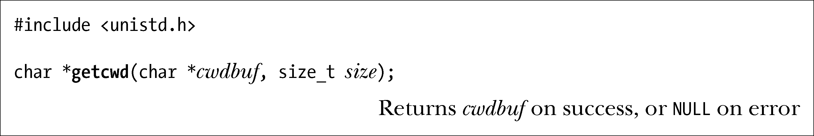
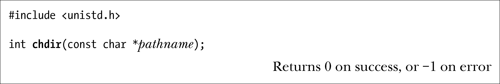
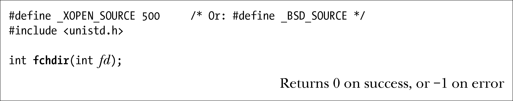
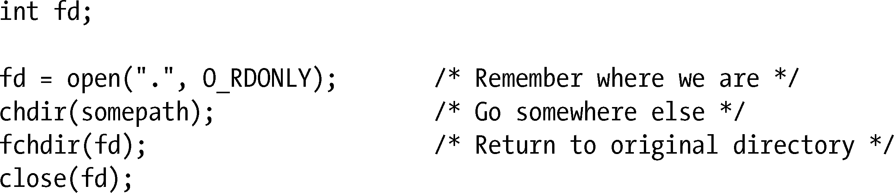
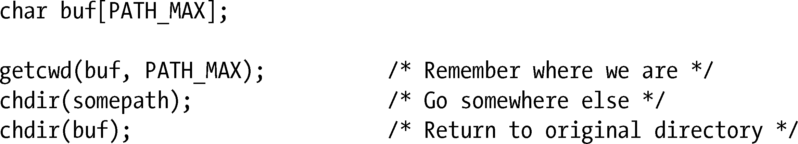

### 18.10　进程的当前工作目录

一个进程的当前工作目录（current working directory）定义了该进程解析相对路径名的起点。新进程的当前工作目录继承自其父进程。

#### 获取当前工作目录

进程可使用getcwd()来获取当前工作目录。

getcwd()函数将内含当前工作目录绝对路径的字符串（包括结尾空字符）置于cwdbuf指向的已分配缓冲区中。调用者必须为cwdbuf缓冲区分配至少sizeg个字节的空间。（通常，cwdbuf的大小与PATH_MAX常量相当。）

一旦调用成功，getcwd()将返回一枚指向cwdbuf的指针。如果当前工作目录的路径名长度超过size个字节，那么getcwd()会返回NULL，并将errno置为ERANGE。

在Linux/x86-32系统中，getcwd()返回指针所指向的字符串最大长度可达4096个字节。如果当前工作目录（以及cwdbuf和size）突破了这一限制，那么就会直接对路径名做截断处理，移去始于起点的整个目录前缀（字符串仍以空字符结尾）。换言之，当当前工作目录的绝对路径超出这一限制时，getcwd()的行为也不再可靠。

> 实际上，Linux的getcwd()系统调用为要返回的路径名在内部分配了一个虚拟内存页。x86-32架构的页大小为4096字节，而在页尺寸更大的架构中（比如，Alpha的页大小为8192字节），getcwd()能返回更长的路径名。

若cwdbuf为NULL，且size为0，则glibc封装函数会为getcwd()按需分配一个缓冲区，并将指向该缓冲区的指针作为函数的返回值。为避免内存泄漏，调用者之后必须调用free()来释放这一缓冲区。对可移植性有所要求的应用程序应当避免依赖该特性。大多数其他实现则针对SUSv3规范提供了一个更为简单的扩展。如果cwdbuf是NULL，那么getcwd()将分配一个大小为size字节的缓冲区，用于向调用者返回结果。glibc的getcwd()也实现了这一特性。

> GNU C函数库还为获取当前工作目录提供了另外两个函数。派生自BSD的getwd(path)函数容易引起缓冲区溢出，因为该函数无法为返回的路径名长度设定上限。get_current_dir_name()函数也会返回包含当前工作目录名的一个字符串。虽然该函数易于使用，但却不具有可移植性。考虑到安全性和可移植性，getcwd()无疑是不二之选（前提是避免使用GNU扩展功能）。

只要具有合适的权限（大体要求是，身为进程属主或者具有CAP_SYS_PTRACE能力），就可通过读取（readlink()）Linux专有符号链接/proc/PID/cwd的内容来确定任何进程的当前工作目录。

#### 改变当前工作目录

chdir()系统调用将调用进程的当前工作目录改变为由pathname指定的相对或绝对路径名（如属于符号链接，还会对其解除引用）。

fchdir()系统调用与chdir()作用相同，只是在指定目录时使用了文件描述符，而该描述符是之前调用open()打开相应目录时获得的。

以下代码片段所示为使用fchdir()将进程的当前工作目录变为另一位置，然后再改回原始位置：

使用chdir()达到同等效果的代码如下所示：

