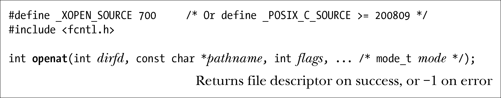

### 18.11　针对目录文件描述符的相关操作

始于版本2.6.16，Linux内核提供了一系列新的系统调用，在执行与传统系统调用相似任务的同时，还提供了一些附加功能，对某些应用程序非常有用。表18-2对这些调用进行了归纳。之所以在本章介绍这些系统调用，是因为它们对进程当前工作目录的传统语义做了改动。

<b class="my_markdown">表18-2：系统调用使用目录文件描述来解释相对路径</b>

| 新　接　口 | 类似的传统接口 | 备　　注 |
| :-----  | :-----  | :-----  | :-----  | :-----  |
| faccessat() | access() | 支持AT_EACCESS和AT_SYMLINK_NOFOLLOW标志 |
| fchmodat() | chmod() |
| fchownat() | chown() | 支持AT_SYMLINK_NOFOLLOW标志 |
| fstatat() | stat() | 支持AT_SYMLINK_NOFOLLOW标志 |
| linkat() | link() | 支持（始于Linux 2.6.18）AT_SYMLINK_FOLLOW标志 |
| mkdirat() | mkdir() |
| mkfifoat() | mkfifo() | 基于mknodat()的库函数 |
| mknodat() | mknod() |
| openat() | open() |
| readlinkat() | readlink() |
| renameat() | rename() |
| symlinkat() | symlink() |
| unlinkat() | unlink() | 支持AT_REMOVEDIR标志 |
| utimensat() | utimes() | 支持AT_SYMLINK_NOFOLLOW标志 |

为便于描述这些系统调用，这里就以openat()为例。

openat()系统调用类似于传统的open()系统调用，只是添加了一个dirfd参数，其作用如下。

+ 如果pathname中为一相对路径名，那么对其解释则以打开文件描述符dirfd所指向的目录为参照点，而非进程的当前工作目录。
+ 如果pathname中为一相对路径，且dirfd中所含为特殊值AT_FDCWD，那么对pathname的解释则相对与进程当前工作目录（即与open(2)行为一致）而言。
+ 如果pathname中为绝对路径，那么将忽略dirfd参数。

openat()的flag参数目的与open()相同。然而，部分表18-2中所列系统调用还支持flags参数，这是相应的传统系统调用所不具备的，其目的在于修改调用语义。出现频率最高的标志为AT_SYMLINK_NOFOLLOW，其含义是如果pathname为符号链接，那么系统调用将操作于符号链接本身，而非符号链接所指向的文件。（linkat()系统调用提供了AT_SYMLINK_FOLLOW标志，其作用正好相反，即改变linkat()的默认行为，当oldpath属于符号链接时对其进行解引用操作。）有关其他标志的详情，请参考相应手册页。

之所以要支持表18-2中所列的系统调用，其原因有二（此处再以openat()为例）。

+ 当调用open()打开位于当前工作目录之外的文件时，可能会发生某些竞态条件。而使用openat()就能够避免这一问题。在调用open()的同时，如果pathname 目录前缀的某些部分发生了改变，就可能导致竞争。要想避免这类竞态，可以针对目标目录打开一个文件描述符，然后将该描述符传递给openat()。
+ 如第29章所述，工作目录是进程的属性之一，为进程中所有线程所共享。而对某些应用程序而言，需要针对不同线程拥有不同的“虚拟”工作目录。将openat()与应用所维护的目录文件描述符相结合，就可以模拟出这一功能。

SUSv3并未对这些系统调用加以规范，但SUSv4将其包括在内。为了获得对这些系统调用的声明，必须在包含相应头文件之前（比如定义open()的<fcntl.h>）将_XOPEN_SOURCE特性测试宏定义为大于或等于700的值。另外，将_POSIX_C_SOURCE宏的值定义为大于或等于200809也能收到同样效果。（在2.10版本之前的glibc中，要获得对这些系统调用的声明还需要定义_ATFILE_SOURCE宏。）

> Solaris 9及其更高版本也提供了一些表18-2所列接口的版本，只是语义略有不同。

