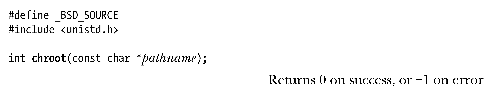

### 18.12　改变进程的根目录：chroot()

每个进程都有一个根目录，该目录是解释绝对路径（即那些以/开始的目录）时的起点。默认情况下，这是文件系统的真实根目录。（新进程从其父进程处继承根目录。）有些场合需要改变一个进程的根目录，而特权级（CAP_SYS_CHROOT）进程通过chroot()系统调用能够做到这一点。

chroot()系统调用将进程的根目录改为由pathname指定的目录（如果pathname是符号链接，还将对其解引用）。自此，对所有绝对路径名的解释都将以该文件系统的这一位置作为起点。鉴于这会将应用程序限定于文件系统的特定区域，有时也将此称为设立了一个 chroot 监禁区。

SUSv2包含了对chroot()的定义（标记为LEGACY），但SUSv3又将其删去。无论如何，chroot()还是获得了大多数UNIX实现的支持。

> 借助于chroot()系统调用，chroot命令可在chroot监禁区中执行shell命令。
> 而通过读取（readlink()）Linux专有/proc/PID/root符号链接的内容，可以获取任何进程的根目录。

ftp程序就是应用chroot()的典型实例之一。作为一种安全措施，当用户匿名登录ftp时，ftp程序将使用chroot()为新进程设置根目录——一个专门预留给匿名登录用户的目录。调用chroot()后，用户将受困于文件系统中新根目录下的子树中，无法在整个文件系统中信马由缰。（这里所依赖的事实是根目录是其自身的父目录。也就是说/..是/的一个链接，所以改变目录到/后再执行cd ..命令时，用户依然会待在同一目录下。）

> 一些UNIX实现（不包括Linux）允许多个硬链接指向同一目录，这时就有可能在一个子目录中创建指向其父目录（或者更高层级远祖目录）的硬链接。在这种系统实现中，如果存在指向监禁区目录树之外的硬链接，那么监禁区的安全将受到威胁。而指向监禁区之外目录的符号链接则不是问题，因为对这些符号链接的解释将在进程新根目录的框架之内进行，所以是无法染指到chroot监禁区之外的。

通常情况下，不是随便什么程序都可以在chroot监禁区中运行的，因为大多数程序与共享库之间采取的是动态链接的方式。因此，要么只能局限于运行静态链接程序，要么就在监禁区中复制一套标准的共享库系统目录（比如，包括/lib和/usr/lib）（针对这一点，14.9.4节描述的绑定挂载特性就派上了用场）。

chroot()系统调用从未被视为一个完全安全的监禁机制。首先，特权级程序可以在随后对chroot()的进一步调用中利用种种手段而越狱成功。例如，特权级（CAP_MKNOD）程序能够使用mknod()来创建一个内存设备文件（类似于/dev/mem），并通过该设备来访问RAM的内容，到那时，就一切皆有可能了。通常，最好不要在chroot监禁区文件系统内放置set-user-ID-root程序。

即便是对于无特权程序，也必须小心防范如下几条可能的越狱路线。

+ 调用chroot()并未改变进程的当前工作目录。因此，通常应在调用chroot()之前或者之后调用一次chdir()函数（例如，chroot()调用之后执行chdir("/")）。如果没有这么做，那么进程就能够使用相对路径去访问监狱之外的文件和目录。（一些BSD的衍生系统杜绝了这一可能性——如果当前工作目录位于新的根目录树之外，那么chroot()调用会将其修改为与根目录一致。）
+ 如果进程针对监禁区之外的某一目录持有一打开文件描述符，那么结合fchdir()和chroot()即可越狱成功，如下面代码所示：

为了防止这种可能性，必须关闭所有指向监禁区外目录的文件描述符。（其他一些UNIX实现提供了fchroot()系统调用，可用于获得与上述代码片段类似的结果。）

+ 即使针对上述可能性采取了防范措施，仍不足以阻止任意非特权程序（即无法控制其操作的程序）越狱成功。遭到囚禁的进程仍然能够利用UNIX域套接字来接受（自另一进程处）指向监禁区外目录的文件描述符。（61.13.3节简要描述了进程间利用套接字来传递文件描述符的概念。）将这一文件描述指定为fchdir()调用的入参，程序即可将其当前工作目录置于监禁区外，之后再通过相对路径来随意访问文件和目录。

> 一些BSD衍生系统提供的jail()系统调用解决了包括上述问题在内的不少问题，其所创建的监禁区即使针对特权级进程也是安全的。

