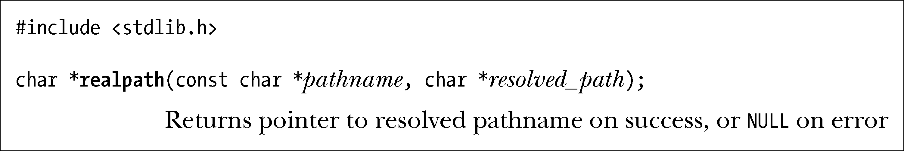
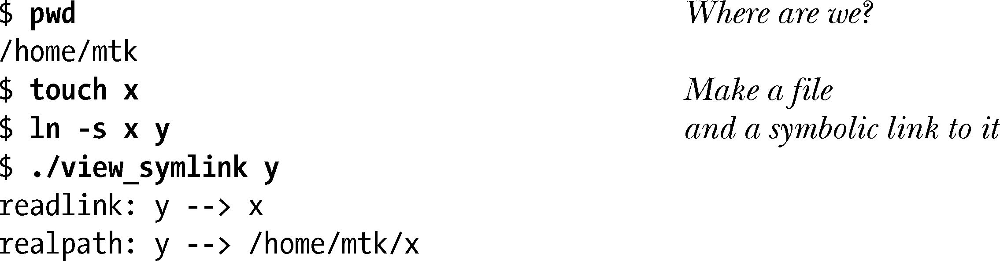
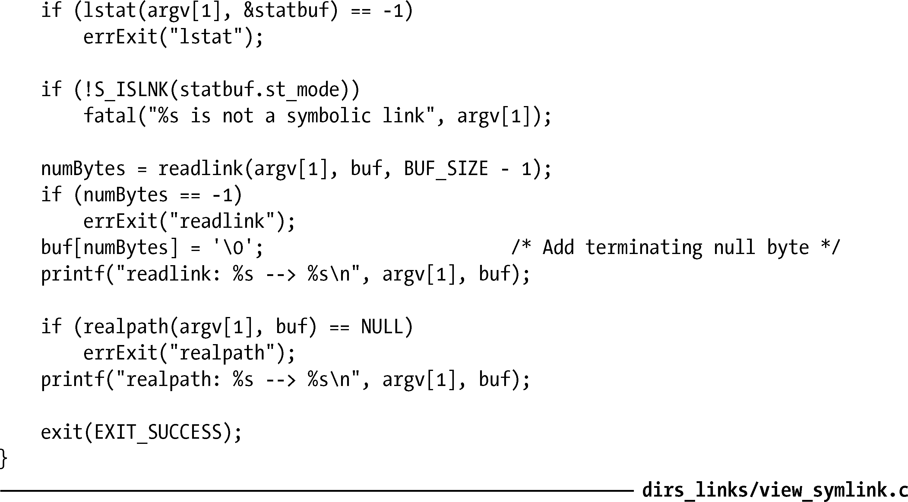

### 18.13　解析路径名：realpath()

realpath()库函数对pathname（以空字符结尾的字符串）中的所有符号链接一一解除引用，并解析其中所有对/.和/..的引用，从而生成一个以空字符结尾的字符串，内含相应的绝对路径名。

生成的字符串将置于resolved_path指向的缓冲区中，该字符串应当是一个字符数组，长度至少为PATH_MAX个字节。一旦调用成功，realpath()将返回指向该字符串的一枚指针。

glibc的realpath()实现允许调用者将resolved_path参数指定为空。这时，realpath()会为经解析生成的路径名分配一个多达PATH_MAX个字节的缓冲区，并将指向该缓冲区的指针作为结果返回。（调用者必须自行调用free()来释放该缓冲区。）SUSv3并未将该扩展功能纳入规范，但SUSv4对其进行了定义。

程序清单18-4中的程序采用readlink()和realpath()来读取符号链接的内容，并将该链接解析为一个绝对路径名。下面是运行该程序的一个示例：

程序清单18-4：读取并解析一个符号链接

