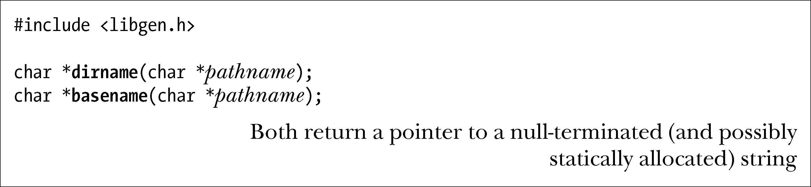
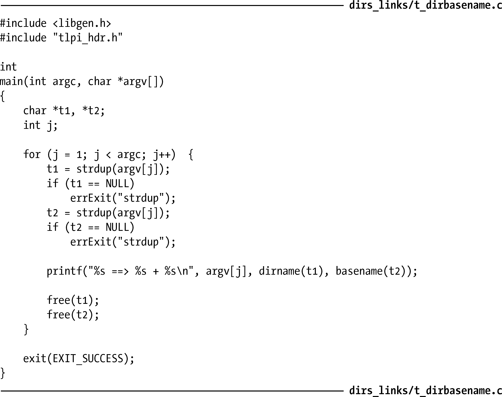

### 18.14　解析路径名字符串：dirname()和basename()

dirname()和basename()函数将一个路径名字符串分解成目录和文件名两部分。（这些函数执行的任务与dirname(1)和basename(1)命令相类似。）

比如，给定路径名为/home/britta/prog.c，dirname()将返回/home/britta，而basename()将返回prog.c。将dirname()返回的字符串与一斜线字符（/）以及basename()返回的字符串拼接起来，将生成一条完整的路径名。

关于dirname()和 basename()的操作请注意以下几点。

+ 将忽略pathname中尾部的斜线字符。
+ 如果pathname中未包含斜线字符，那么dirname()将返回字符串.（点），而basename()将返回pathname。
+ 如果pathname 仅由一个斜线字符组成，那么dirname()和basename()均将返回字符串/。将其应用于上述的拼接规则，所创建的路径名字符串为///。该路径名属于有效路径名。因为多个连续斜线字符相当于单个斜线字符，所以路径名///就相当于路径名/。
+ 如果pathname为空指针或者空字符串，那么dirname()和basename()均将返回字符串.（点）。（拼接这些字符串将生成路径名./.，对等于.，即当前目录。）

表18-3所示为dirname()和basename()针对各种示例路径名所返回的字符串。

<b class="my_markdown">表18-3：dirname()和basename()返回的字符串示例</b>

| 路径名字符串 | dirname() | basename() |
| :-----  | :-----  | :-----  | :-----  | :-----  |
| / | / | / |
| /usr/bin/zip | /usr/bin | zip |
| /etc/passwd//// | /etc | passwd |
| /etc////passwd | /etc | passwd |
| etc/passwd | etc | passwd |
| passwd | . | passwd |
| passwd/ | . | passwd |
| .. | . | .. |
| NULL | . | . |

程序清单18-5：dirname()和basename()的应用

dirname()和basename()均可修改pathname所指向的字符串。因此，如果希望保留原有的路径名字符串，那么就必须向dirname()和basename()传递该字符串的副本，如程序清单18-5所示。该程序使用strdup()（该函数调用了malloc()）来制作传递给dirname()和basename()的字符串副本，然后再使用free()将其释放。

最后需要指出的是，dirname()和basename()所返回的指针均可指向经由静态分配的字符串，对相同函数的后续调用可能会修改这些字符串的内容。

