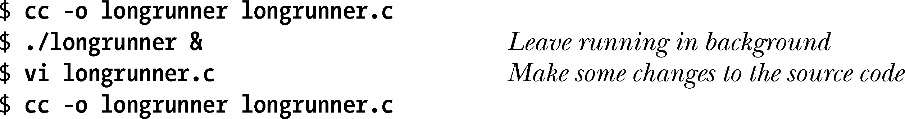
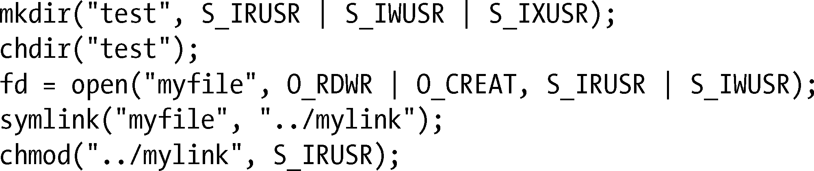

### 18.16　练习

**18-1.** 　4.3.2节曾指出，如果一个文件正处于执行状态，那么要将其打开以执行写操作是不可能的（open()调用返回−1，且将errno置为ETXTBSY）。然而，在shell中执行如下操作却是可能的：

最后一条命令覆盖了现有的同名可执行文件。原因何在？（提示：在每次编译后调用ls –li命令来查看可执行文件的i-node编号。）

**18-2.** 　以下代码中对chmod()的调用为什么会失败？

**18-3.** 　实现realpath()。

**18-4.** 　修改程序清单18-2中的程序，用readdir _r()来取代readdir()。

**18-5.** 　实现一个功能与getcwd()相当的函数。提示：要获得当前工作目录的名称，可调用opendir()和readdir()来遍历其父目录（..）中的各个条目，查找其中与当前工作目录具有相同i-node编号及设备编号（即，分别为stat()和lstat()调用所返回stat 结构中的st_ino和st_dev属性）的一项。如此这般，沿着目录树层层拾级而上（chdir("..")）并进行扫描，就能构建出完整的目录路径。当父目录与当前工作目录相同时（回忆/..与/相同的情况），就结束遍历。无论调用该函数成功与否，都应将调用者遣回其起始目录（使用open()和fchdir()能很方便地实现这一功能）。

**18-6.** 　使用FTW_DEPTH标志来修改程序清单18-3(nftw_dir_tree.c)中的程序。注意目录树遍历顺序的差异。

**18-7.** 　编写一程序，使用nftw()来遍历目录树，并打印出树中各类文件（普通文件、目录、符号链接等）的总和及百分比。

**18-8.** 　实现nftw()。（需要使用opendir()、readdir()、closedir()和stat()等系统调用。）

**18-9.** 　18.10节展示了两种技术（分别为fchdir()和chdir()），用于在将当前工作目录转到另一位置后，再返回之前的当前工作目录。假设需要反复执行这一操作，哪种方法更为高效？原因何在？请写一段程序加以验证。

①译者注：kernel.org的在线手册页则为*result，译者倾向于后者，但未与作者沟通。请读者自行验证。

②译者注：同上，疑为*result。

