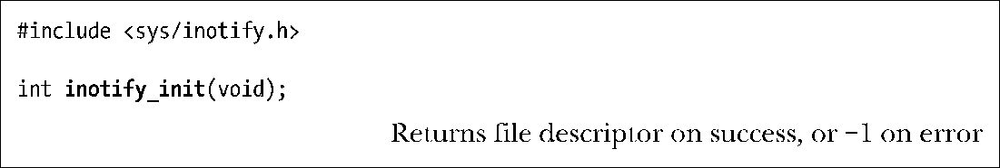
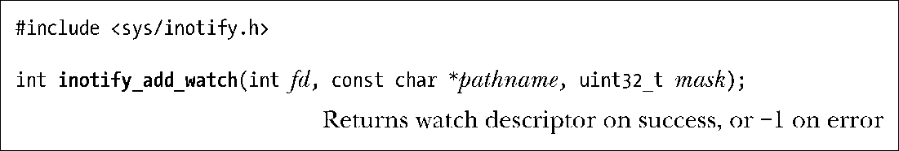
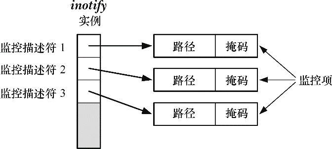
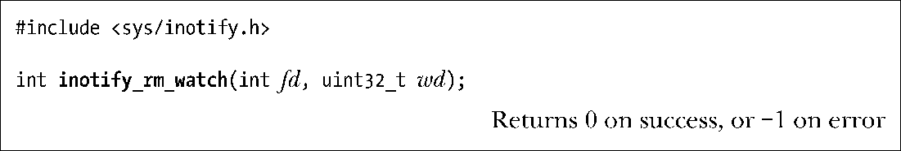

### 19.2　inotify API

inotify_init()系统调用可创建一新的inotify实例。

作为函数结果，inotify_init()会返回一个文件描述符（句柄），用于在后续操作中指代此inotify实例。

> Linux自内核2.6.27开始支持一个新的、非标准的系统调用inotify_init1()。该系统调所执行的任务与inotify_init()相同，但提供了一个额外的参数flag，用于修改系统调用的行为。该参数支持的标志有二：IN_CLOEXEC标志会使内核针对新文件描述符激活close-on-exec标志(FD_CLOEXEC)。引入该标志的原因正如4.3.1节所述open()的O_CLOEXEC标志一样。IN_NONBLOCK标志会导致内核激活底层打开文件描述的O_NONBLOCK标志，如此一来，未来的读操作将是非阻塞式的，省得还要额外调用fcntl()来获得相同效果。

针对文件描述符fd所指代inotify实例的监控列表，系统调用inotify_add_watch()既可以追加新的监控项，也可以修改现有监控项。（请参考图19-1。）

<b class="my_markdown">图19-1：一个inotify实例及与之相关的内核数据结构</b>

参数pathname标识欲创建或修改的监控项所对应的文件。调用程序必须对该文件具有读权限（调用inotify_add_watch()时，会对文件权限做一次性检查。只要监控项继续存在，即便有人更改了文件权限，使调用程序不再对文件具有读权限，调用程序依然会继续收到文件的通知消息）。

参数mask为一位掩码，针对pathname定义了意欲监控的事件。稍后会论及可在掩码中指定的各种位值。

如果先前未将pathname加入fd的监控列表，那么inotify_add_watch()会在列表中创建一新的监控项，并返回一新的、非负监控描述符，用来在后续操作中指代此监控项。对inotify实例来说，该监控描述符是唯一的。

若先前已将pathname加入fd的监控列表，则inotify_add_watch()会修改现有pathname监控项的掩码，并返回其监控描述符。（此描述符就是最初将pathname加入该监控列表的系统调用inotify_add_watch()所返回的监控描述符。）下节在讨论IN_MASK_ADD标志时会就掩码的修改过程做进一步描述。

系统调用inotify_rm_watch()会从文件描述符fd所指代的inotify实例中，删除由wd所定义的监控项。

参数wd是一监控描述符，由之前对inotify_add_watch()的调用返回。（uint32_t数据类型为一无符号32位整数。）

删除监控项会为该监控描述符生成IN_IGNORED事件。稍后将讨论该事件。

