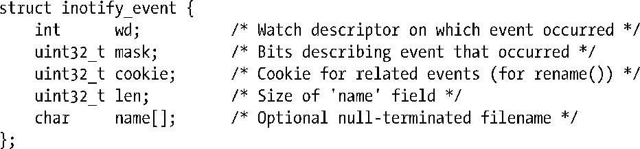
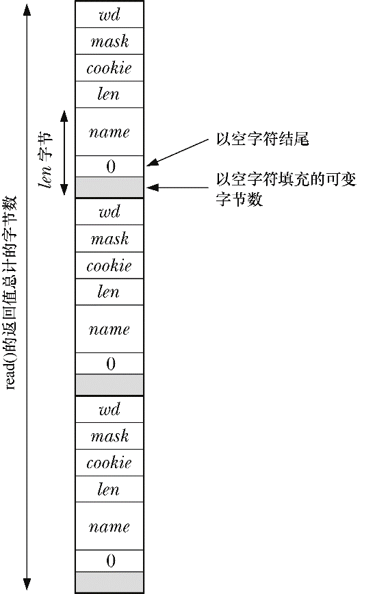
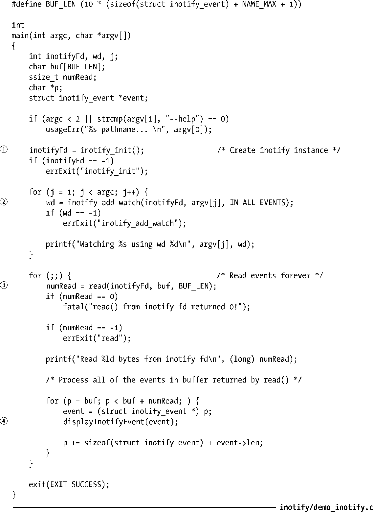
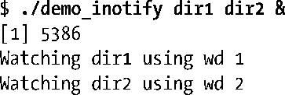
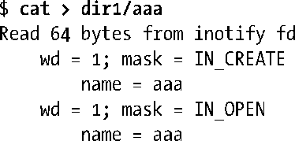
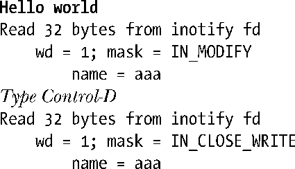
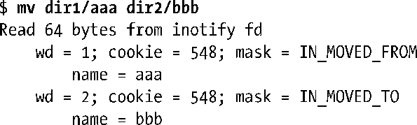
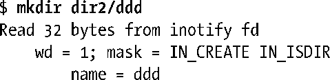
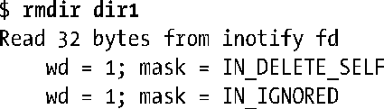

### 19.4　读取inotify事件

将监控项在监控列表中登记后，应用程序可用read()从inotify文件描述符中读取事件，以判定发生了哪些事件。若时至读取时尚未发生任何事件，read()会阻塞下去，直至有事件产生（除非对该文件描述符设置了O_NONBLOCK状态标志，这时若无任何事件可读，read()将立即失败，并报错EAGAIN）。

事件发生后，每次调用read()会返回一个缓冲区，内含一个或多个如下类型的结构（请见图19-2）：

<b class="my_markdown">图19-2：包含3个inotify_event结构的输入缓冲区</b>

字段wd指明发生事件的是那个监控描述符。该字段值由之前对inotify_add_watch()的调用返回。当应用程序要监控同一inotify文件描述符下的多个文件和目录时，字段wd就派上用场。应用利用其所提供的线索来判定发生事件的特定文件或目录。（要做到这一点，应用程序必须维护专有数据结构，记录监控描述符与路径名之间的关系。）

mask字段会返回描述该事件的位掩码。由表19-1所示的Out列展示了可出现于mask中的位范围。还要注意下列与特殊位相关的更多细节。

+ 移除监控项时，会产生IN_IGNORED事件。起因可能有两个：其一，应用程序使用了inotify_rm_watch()系统调用显式移除监控项；其二，因受监控对象被删除或其所驻留的文件系统遭卸载，致使内核隐式删除监控项。以IN_ONESHOT而建立的监控项因事件触发而遭自动移除时，不会产生IN_IGNORED事件。
+ 如果事件的主体为路径，那么除去其他位以外，在mask中还会设置IN_ISDIR位。
+ IN_UNMOUNT事件会通知应用程序包含受监控对象的文件系统已遭卸载。该事件发生之后，还会产生包含IN_IGNORED置位的附加事件。
+ 19.5节将介绍IN_Q_OVERFLOW，并讨论对排队inotify事件的限制。

使用cookie字段可将相关事件联系在一起。目前，只有在对文件重命名时才会用到该字段。当这种情况发生时，系统会针对待重命名文件所在目录产生IN_MOVED_FROM事件，然后，还会针对重命名后文件的所在目录生成IN_MOVED_TO事件。（若仅是在同一目录内为文件改名，系统则会针对同一目录产生上述两个事件。）两个事件的cookie字段值相等，故而应用程序得以将它们关联起来。

当受监控目录中有文件发生事件时，name字段返回一个以空字符结尾的字符串，以标识该文件。若受监控对象自身有事件发生，则不使用name字段，将len字段置0。

len字段用于表示实际分配给name字段的字节数。在read()所返回的缓冲区中，存储于name内的字符串结尾与下一个inotify_event结构的开始（请参见19.2节）之间，可能会有额外填充字节，故而len字段不可或缺。单个inotify事件的长度是sizeof(struct inotify_event)+ len。

如果传递给read()的缓冲区过小，无法容纳下一个inotify_event结构，那么read()调用将以失败告终，并以EINVAL错误向应用程序报告这一情况。（在2.6.21之前版本的内核中，这种情况下read()将返回0。在改为报告EINVAL错误之后，则对编程错误的提示更为清晰。）应用程序可再次以更大的缓冲区执行read()操作。然而，只要确保缓冲区足以容纳至少一个事件，这一问题将得以完全规避：传给read()的缓冲区应至少为sizeof(struct inotify_event)+ NAME_MAX + 1字节，其中NAME_MAX 是文件名的最大长度，此外在加上终止空字符使用的1个字节。

采用的缓冲区大小如大于最小值，则可自单个read()中读取多个事件，效率极高。对inotify文件描述符所执行的read()，将在已发生事件数量与缓冲区可容纳事件数量间取最小值并返回之。

> 针对文件描述符fd调用ioctl(fd, FIONREAD, &numbytes)，会返回其所指代的inotify实例中的当前可读字节数。

从inotify文件描述符中读取的事件形成了一个有序队列。打个比方，这样一来，对文件重命名时，便可保证在IN_MOVED_TO事件之前能读取到IN_MOVED_FROM事件。

在事件队列的末尾追加一个新事件时，如果此新事件与队列当前的尾部事件拥有相同的wd、mask、cookie和mask值，那么内核会将两者合并（以避免对新事件排队）。之所以这么做，是因为很多应用程序都并不关注同一事件的反复出现，而丢弃多余的事件能降低内核维护事件队列所需的内存总量。然而，这也意味着使用inotify将无法可靠判定出周期性事件的发生次数或频率。

#### 程序示例

虽然在前文中描述了inotify API的诸多细节，但实际上，该API使用起来却颇为简单。程序清单19-1展示了对inotify的运用。

程序清单19-1：运用inotify API

程序清单19-1中程序将执行以下步骤。

+ 使用inotify_init()，创建inotify文件描述符①。
+ 使用inotify_add_watch()，将程序命令行参数中指定的每个文件加入监控项②。每个监控项都将监控所有可能发生的事件。
+ 执行无限循环。
      + 从inotify描述符读取事件缓冲区③。
    + 调用displayInotifyEvent()函数，以显示上述缓冲区中各inotify_event结构的内容④。

以下shell会话演示了对程序清单19-1所列程序的使用。首先，在后台运行该程序的实例，对两个目录进行监控。

然后，执行某些命令，从而在两个目录中产生事件。先使用cat(1)创建一个文件：

由后台程序所生成的上述输出表明，read()读取了包含两个事件的缓冲区。继续在该文件中执行某些输入操作，然后输入end-of-file字符串：

接下来，将该文件转移至另一个受监控的目录，同时对其重新命名。这会产生两个事件，一个对应于文件的源目录（监控描述符1），另一个对应于文件的目标目录（监控描述符2）。

以上两个事件共享相同的cookie值，允许应用程序将它们联系起来。

当在其中一个受监控目录下创建子目录时，由此产生的事件掩码会置IN_ISDIR位，以示该事件的对象是一目录。

此处，再次提醒大家，inotify监控是非递归的。如果应用程序有意对新创建的子目录进行监控，则需进一步执行inotify_add_watch()系统调用，并指明子目录的路径名。

最后，将其中一个受监控目录删除：

系统会生成最后一个事件，以通知应用程序，内核已从监控列表中删除该监控项。

