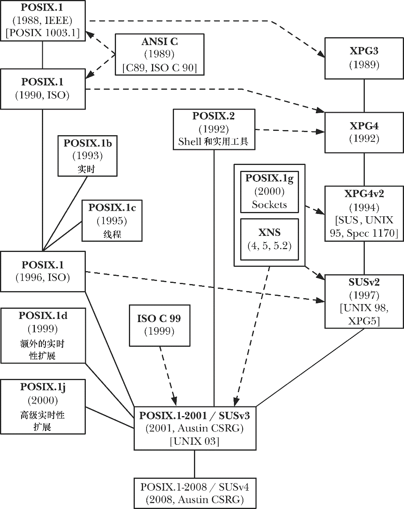

### 1.3.6　UNIX标准时间表

图1-1总结了上述各节所述及各种标准之间的关系，并按时间顺序对标准进行了排列。图中的实线表示标准间的直接过渡，虚线则表示标准间有一定的瓜葛，这无非有两种情况：其一，一个标准被并入了另一标准；其二，一个标准依附于另一个标准。

<b class="my_markdown">图1-1：各种UNIX和C标准之间的关系图</b>

在网络标准方面，情况稍微有些复杂。该领域的标准化工作始于20世纪80年代末期，成立了POSIX 1003.12委员会，对套接字API、XTI（X/Open传输接口）API（另一套基于System V传输层接口的网络编程API）以及各种相关的API进行规范。该标准的酝酿历时数年，并于2000年获得了批准。其间，POSIX 1003.12被更名为POSIX 1003.1g。

在开发POSIX 1003.1g的同时，X/Open也在开发自己的X/Open网络规范（XNS）。该规范的第一版XNS第4号隶属于SUS首版。其后继版本为XNS第5号，隶属于SUSv2。XNS第5号与当时的POSIX.1g草案（6.6）基本相同。紧随其后的XNS第5.2号与XNS第5号以及获批为标准的POSIX.1g有所不同，将XTI API标记为作废，并纳入了于20世纪90年代中期开发出的IPv6。XNS第5.2号构成了SUSv3中网络编程相关内容的基础，如今已被取代。出于类似原因，POSIX.1g在获批后不久也退出了历史舞台。

