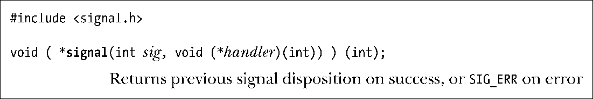
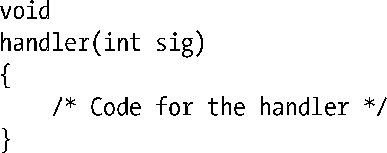
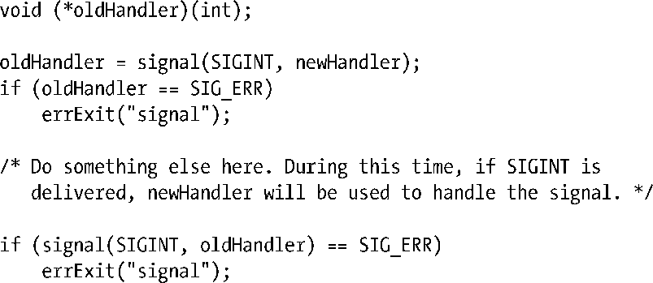

### 20.3　改变信号处置：signal()

UNIX系统提供了两种方法来改变信号处置：signal()和sigaction()。本节描述的signal()系统调用，是设置信号处置的原始 API，所提供的接口比sigaction()简单。另一方面，sigaction()提供了signal()所不具备的功能。进一步而言，signal()的行为在不同UNIX实现间存在差异（22.7节），这也意味着对可移植性有所追求的程序绝不能使用此调用来建立信号处理器函数。故此，sigaction()是建立信号处理器的首选API（强力推荐）。自20.13节介绍了sigaction()调用的用法之后，本书示例将一律采用该调用来建立信号处理器程序。

> signal()函数虽然记录在Linux手册页的第2部分，但实际却被实现为一个基于sigaction()系统调用的glibc库函数。

这里需要对signal()函数的原型做一些解释。第一个参数sig，标识希望修改处置的信号编号，第二个参数handler，则标识信号抵达时所调用函数的地址。该函数无返回值（void），并接收一个整型参数。因此，信号处理器函数一般具有以下形式：

20.4节将描述处理器函数中sig参数的目的。

signal()的返回值是之前的信号处置。像handler参数一样，这是一枚指针，所指向的是带有一个整型参数且无返回值的函数。换言之，编写如下代码，可以暂时为信号建立一个处理器函数，然后再将信号处置重置为其本来面目：

> 使用signal()，将无法在不改变信号处置的同时，还能获取到当前的信号处置。要想做到这一点，必须使用sigaction()。

针对信号处理器函数指针做如下类型定义，将有助于理解signal()的原型：

signal()原型可以改写成如下形式：

> 如果定义了_GNU_SOURCE特性测试宏，那么glibc将在<signal.h>头文件中暴露非标准的sighandler_t数据类型。

在为signal()指定handler参数时，可以以如下值来代替函数地址：

##### SIG_DFL

将信号处置重置为默认值（表20-1）。这适用于将之前signal()调用所改变的信号处置还原。

##### SIG_IGN

忽略该信号。如果信号专为此进程而生，那么内核会默默将其丢弃。进程甚至从未知道曾经产生了该信号。

调用signal()成功将返回先前的信号处置，有可能是先前安装的处理器函数地址，也可能是常量SIG_DFL和SIG_IGN之一。如果调用失败，signal()将返回SIG_ERR。

