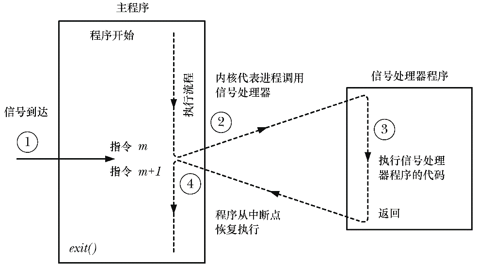
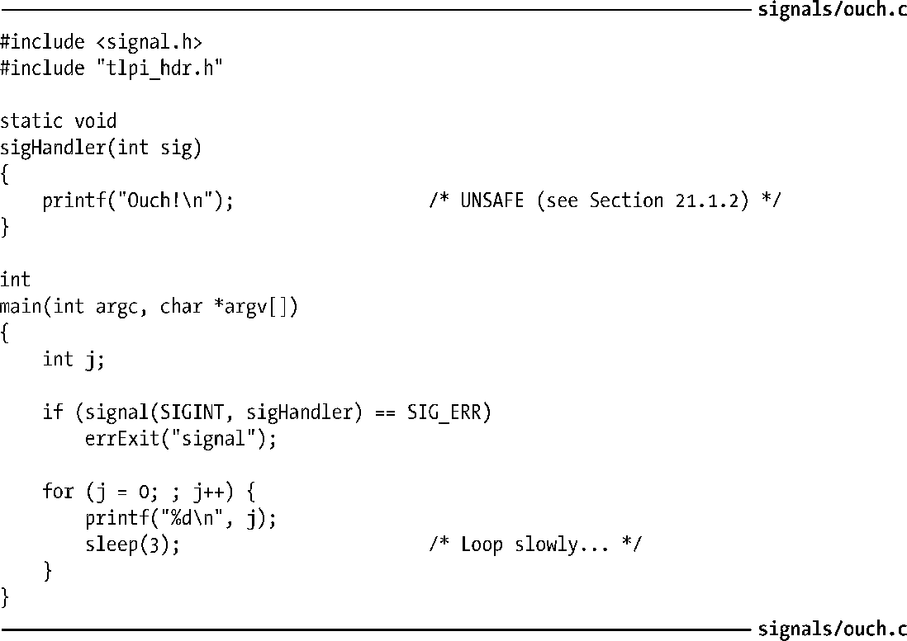
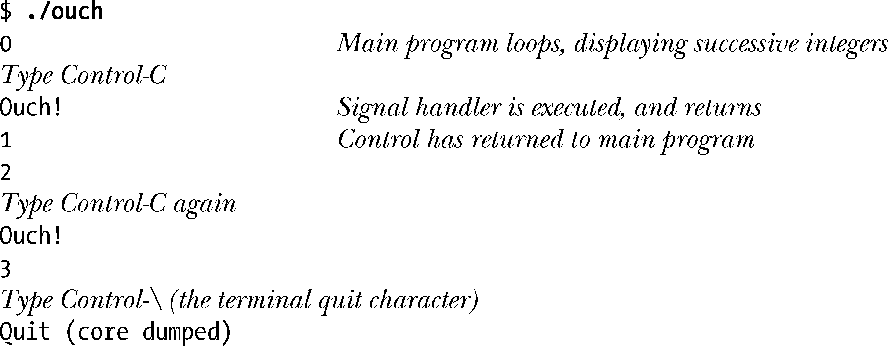
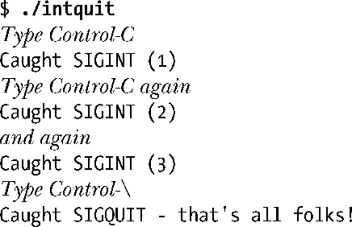
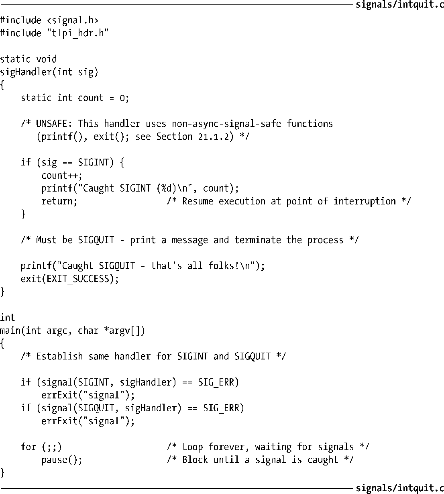

### 20.4　信号处理器简介

信号处理器程序（也称为信号捕捉器）是当指定信号传递给进程时将会调用的一个函数。本节描述了信号处理器的基本原理，而第21章将继续做详细介绍。

调用信号处理器程序，可能会随时打断主程序流程；内核代表进程来调用处理器程序，当处理器返回时，主程序会在处理器打断的位置恢复执行。这一工作序列可用图20-1来加以说明。

<b class="my_markdown">图20-1：信号到达并执行处理器程序</b>

虽然信号处理器程序几乎可以为所欲为，但一般而言，设计应力求简单。21.1节将对这一点展开论述。

程序清单20-1：为SIGINT信号安装一个处理器程序

程序清单20-1所示为一个简单的信号处理器函数，由主程序为SIGINT信号而建立。当键入中断字符（通常为Control-C）时，终端驱动程序将产生该信号。处理器只是简单打印一条消息，随即返回。

主程序会持续循环。每次迭代，程序都将递增计数器值并将其打印出来，然后休眠几秒钟。（为了按这种方式休眠，程序使用了sleep()函数，该函数会令调用者处于暂停状态，持续时间则由指定的秒数决定。该函数将在23.4.1节中进行描述。）

运行程序清单20-1中程序的结果如下：

内核在调用信号处理器程序时，会将引发调用的信号编号作为一个整型参数传递给处理器函数。（就是程序清单20-1中处理器函数的sig参数）。如果信号处理器程序只捕获一种类型的信号，那么这个参数几乎无用。然而，如果安装相同的处理器来捕获不同类型的信号，那么就可以利用此参数来判定引发对处理器调用的是何种信号。

程序清单20-2中程序展示了这一思路，为SIGINT和SIGQUIT信号建立了同一处理器程序。（当键入终端退出字符时，通常为Control-\，终端驱动程序将产生SIGQUIT信号。）处理器程序代码通过检查sig参数来区分这两种信号，并为每种信号采取不同措施。main()函数则使用pause()函数（参见20.14节的描述）来阻塞进程，直至捕获到信号。

如下shell会话日志演示了对该程序的使用：

程序清单20-1和程序清单20-2都在信号处理器程序中使用了printf()函数来显示消息。现实世界的应用程序一般绝不会在信号处理器程序中使用stdio函数，21.1.2节将就其原因进行讨论。然而，本书各种示例仍然会在信号处理器程序中调用printf()函数，作为观察处理器程序调用的一种简单手段。

程序清单20-2：为两个不同信号建立同一处理器函数

