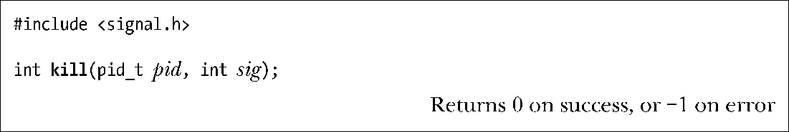
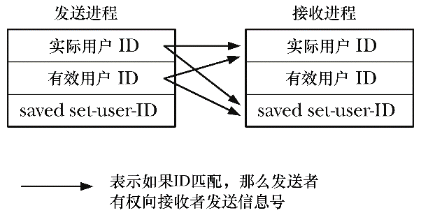

### 20.5　发送信号：kill()

与shell的kill命令相类似，一个进程能够使用kill()系统调用向另一进程发送信号。（之所以选择kill作为术语，是因为早期UNIX实现中大多数信号的默认行为是终止进程。）

pid参数标识一个或多个目标进程，而sig则指定了要发送的信号。如何解释pid，要视以下4种情况而定。

+ 如果pid大于0，那么会发送信号给由pid指定的进程。
+ 如果pid等于0，那么会发送信号给与调用进程同组的每个进程，包括调用进程自身。（SUSv3声明，除去“一组未予明确的系统进程”②之外，应将信号发送给同一进程组中的所有进程，且这一排除条件同样适用于余下的两种情况。）
+ 如果pid小于−1，那么会向组ID等于该pid绝对值的进程组内所有下属进程发送信号。向一个进程组的所有进程发送信号在 shell 作业控制中有特殊用途（参见34.7 节）。
+ 如果pid等于−1，那么信号的发送范围是：调用进程有权将信号发往的每个目标进程，除去init（进程ID为1）和调用进程自身。如果特权级进程发起这一调用，那么会发送信号给系统中的所有进程，上述两个进程除外。显而易见，有时也将这种信号发送方式称之为广播信号。（SUSv3并未要求将调用进程排除在信号的接收范围之外，Linux此处所遵循的是BSD系统的语义。）

如果并无进程与指定的pid相匹配，那么kill()调用失败，同时将errno置为ESRCH（“查无此进程”）。

进程要发送信号给另一进程，还需要适当的权限，其权限规则如下。

+ 特权级（CAP_KILL）进程可以向任何进程发送信号。
+ 以root用户和组运行的init进程（进程号为1），是一种特例，仅能接收已安装了处理器函数的信号。这可以防止系统管理员意外杀死init进程——这一系统运作的基石。
+ 如图20-2所示，如果发送者的实际或有效用户ID匹配于接受者的实际用户ID或者保存设置用户ID(saved set-user-id)，那么非特权进程也可以向另一进程发送信号。利用这一规则，用户可以向由他们启动的set-user-ID程序发送信号，而无需考虑目标进程有效用户ID的当前设置。将目标进程有效用户ID排除在检查范围之外，这一举措的辅助作用在于防止用户某甲向用户某乙的进程发送信号，而该进程正在执行的set-user-ID程序又属于用户某甲。（SUSv3要求强制执行图20-2所示的规则，但如kill(2)手册页所述，Linux内核在2.0版本之前所遵循的规则略有不同。）

<b class="my_markdown">图20-2：非特权进程发送信号所需的权限</b>

+ SIGCONT信号需要特殊处理。无论对用户ID的检查结果如何，非特权进程可以向同一会话中的任何其他进程发送这一信号。利用这一规则，运行作业控制的shell可以重启已停止的作业（进程组），即使作业进程已经修改了它们的用户ID。（亦即，使用9.7节所述系统调用来改变其凭据，进而成为特权级进程。）

如果进程无权发送信号给所请求的pid，那么kill()调用将失败，且将errno置为EPERM。若pid所指为一系列进程（即pid是负值）时，只要可以向其中之一发送信号，则kill()调用成功。

程序清单20-3中展示了kill()的用法。

