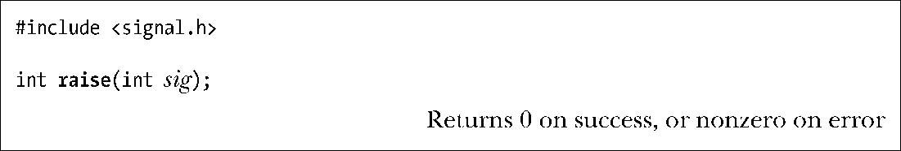
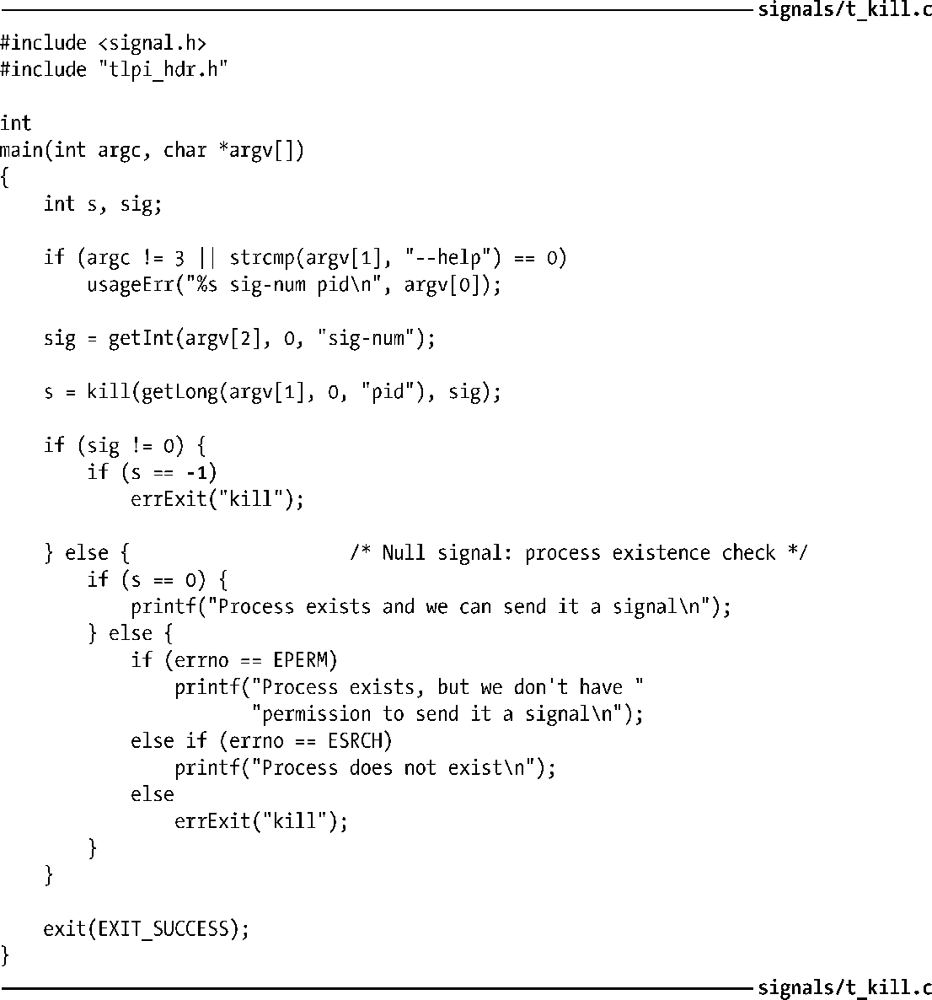
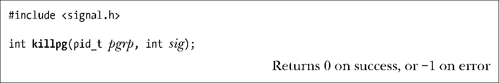

### 20.7　发送信号的其他方式：raise()和killpg()

有时，进程需要向自身发送信号（34.7.3节就有此一例）。raise()函数就执行了这一任务。

在单线程程序中，调用raise()相当于对kill()的如下调用：

支持线程的系统会将raise(sig)实现为：

33.2.3节描述了pthread_kill()函数，但目前仅需了解一点就已足够，该实现意味着将信号传递给调用raise()的特定线程。相比之下，kill(getpid(), sig)调用会发送一个信号给调用进程，并可将该信号传递给该进程的任一线程。

> raise()函数起源于C89。C语言标准不包含诸如进程ID之类的操作系统细节，raise()函数之所以得以定义，是因为该函数不需要引用进程ID。

当进程使用raise()（或者kill()）向自身发送信号时，信号将立即传递（即，在raise()返回调用者之前）。

注意，raise()出错将返回非0值（不一定为–1）。调用raise()唯一可能发生的错误为EINVAL，即sig无效。因此，在任何指定了某一SIGxxxx常量的位置，都未检查该函数的返回状态。

程序清单20-3：使用kill()系统调用

killpg()函数向某一进程组的所有成员发送一个信号。

killpg()调用相当于对kill()的如下调用：

如果指定pgrp的值为0，那么会向调用者所属进程组的所有进程发送此信号。SUSv3对此未作规范，但大多数UNIX实现对该情况的处理方式与Linux相同。

