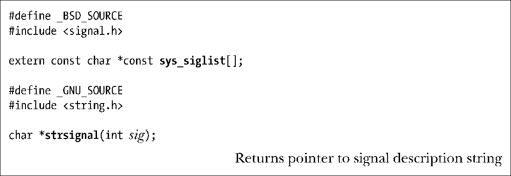

### 20.8　显示信号描述

每个信号都有一串与之相关的可打印说明。这些描述位于数组sys_siglist中。例如，可以用sys_siglist[SIGPIPE]来获取对SIGPIPE信号（管道断开）的描述。然而，较之于直接引用sys_siglist数组，还是推荐使用strsignal()函数。

strsignal()函数对sig参数进行边界检查，然后返回一枚指针，指向针对该信号的可打印描述字符串，或者是当信号编号无效时指向错误字符串。（在其他一些UNIX实现中，strsignal()函数会在sig无效时返回空值。）

除去边界检查之外，strsignal()函数较之于直接引用sys_siglist数组的另一优势是对本地（locale）设置敏感（10.4节），所以显示信号描述时会使用本地语言。

程序清单20-4中所示为使用strsignal()的例子之一。

psignal()函数（在标准错误设备上）所示为msg参数所给定的字符串，后面跟有一个冒号，随后是对应于sig的信号描述。和strsignal()一样，psignal()函数也对本地设置敏感。

尽管SUSv3并未将psignal()、strsignal()和sys_siglist纳入标准，但还是有许多UNIX实现支持它们。（SUSv4中加入了对psignal()和strsignal()的规范。）

