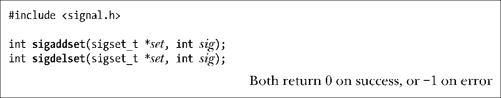
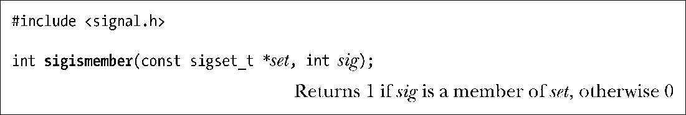
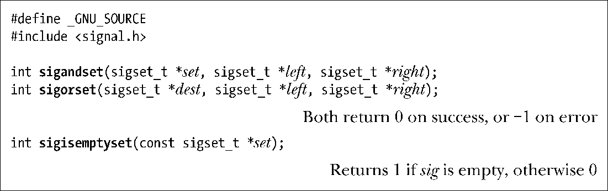
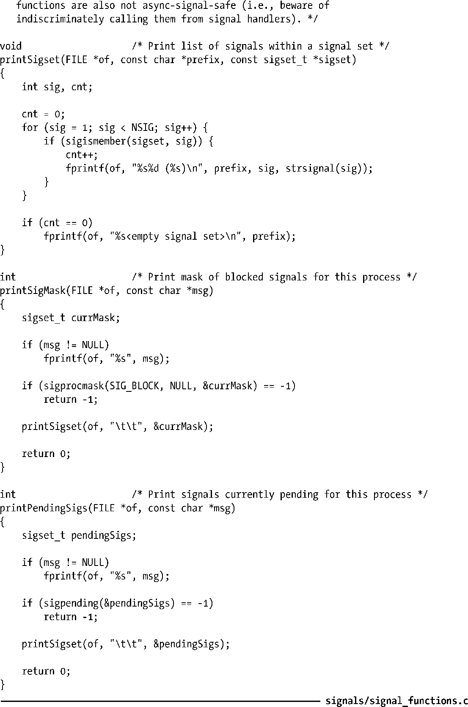

### 20.9　信号集

许多信号相关的系统调用都需要能表示一组不同的信号。例如，sigaction()和sigprocmask()允许程序指定一组将由进程阻塞的信号，而sigpending()则返回一组目前正在等待送达给一进程的信号。（稍后将描述这些系统调用。）

多个信号可使用一个称之为信号集的数据结构来表示，其系统数据类型为sigset_t.。SUSv3规定了一系列函数来操纵信号集，现在将描述这些函数。

> 像在大多数UNIX实现中一样，sigset_t数据类型在Linux中是一个位掩码。然而，SUSv3对此并无要求。使用其他一些类型的结构来表示信号集也是有可能的。SUSv3仅要求可对sigset_t类型赋值即可。因此，必须使用某些标量类型（比如一个整数）或者一个C语言结构（也许包含了一个整型数组）来实现该类型。

sigemptyset()函数初始化一个未包含任何成员的信号集。sigfillset()函数则初始化一个信号集，使其包含所有信号（包括所有实时信号）。

必须使用sigemptyset()或者sigfillset()来初始化信号集。这是因为C语言不会对自动变量进行初始化，并且，借助于将静态变量初始化为0的机制来表示空信号集的作法在可移植性上存在问题，因为有可能使用位掩码之外的结构来实现信号集。（出于同一原因，为将信号集标记为空而使用memset(3)函数将其内容清零的做法也不正确。）

信号集初始化后，可以分别使用 sigaddset()和 sigdelset()函数向一个集合中添加或者移除单个信号。

在sigaddset()和sigdelset()中，sig参数均表示信号编号。

sigismember()函数用来测试信号sig是否是信号集set的成员。

如果sig是set的一个成员，那么sigismember()函数将返回1（true），否则返回0（false）。

GNU C库还实现了3个非标准函数，是对上述信号集标准函数的补充。

这些函数执行了如下任务。

+ sigandset()将left集和right集的交集置于dest集。
+ sigorset()将left集和right集的并集置于dest集。
+ 若set集内未包含信号，则sigisemptyset()返回true。

#### 示例程序

程序清单20-4所示为使用本节介绍的函数来编写的函数，供本书后续各程序调用。第一个函数printSigset()显示了指定信号集的成员信号。该函数使用了定义于<signal.h>文件中的NSIG常量，其值等于信号最大编号加1。当获取信号集成员时，会在测试所有信号编号的循环中将该值作为循环上限。

> 虽然SUSv3并未定义NSIG，但是大多数UNIX实现都支持这一常量。只不过，要想使其可见，可能需要使用特定于实现的编译器选项。例如，在Linux中，就必须定义如下功能测试宏之一：BSD_SOURCE、_SVID_SOURCE或者_GNU_SOURCE。

利用printSigset()函数，printSigMask()和printPendingSigs()函数分别用于显示进程的信号掩码和当前处于等待状态的信号集。这两个函数还分别使用了sigprocmask()和sigpending()系统调用。sigprocmask()和sigpending()系统调用将分别在20.10节和20.11节中予以描述。

程序清单20-4：显示信号集的函数

