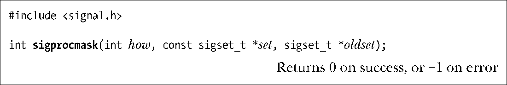
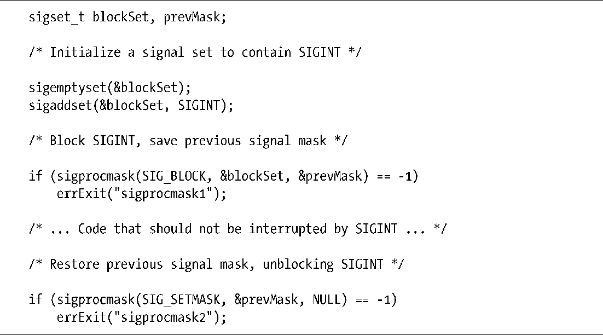
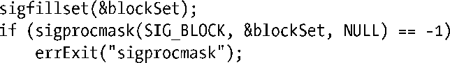

### 20.10　信号掩码（阻塞信号传递）

内核会为每个进程维护一个信号掩码，即一组信号，并将阻塞其针对该进程的传递。如果将遭阻塞的信号发送给某进程，那么对该信号的传递将延后，直至从进程信号掩码中移除该信号，从而解除阻塞为止。（由33.2.1节可知，信号掩码实际属于线程属性，在多线程进程中，每个线程都可使用pthread_sigmask()函数来独立检查和修改其信号掩码。）

向信号掩码中添加一个信号，有如下几种方式。

+ 当调用信号处理器程序时，可将引发调用的信号自动添加到信号掩码中。是否发生这一情况，要视sigaction()函数在安装信号处理器程序时所使用的标志而定。
+ 使用sigaction()函数建立信号处理器程序时，可以指定一组额外信号，当调用该处理器程序时会将其阻塞。
+ 使用sigprocmask()系统调用，随时可以显式向信号掩码中添加或移除信号。

对前两种情况的讨论将推迟到 20.13 节对sigaction()函数的介绍之后，现在先来讨论sigprocmask()函数。

使用sigprocmask()函数既可修改进程的信号掩码，又可获取现有掩码，或者两重功效兼具。how参数指定了sigprocmask()函数想给信号掩码带来的变化。

##### SIG_BLOCK

将set指向信号集内的指定信号添加到信号掩码中。换言之，将信号掩码设置为其当前值和set的并集。

##### SIG_UNBLOCK

将set指向信号集中的信号从信号掩码中移除。即使要解除阻塞的信号当前并未处于阻塞状态，也不会返回错误。

##### SIG_SETMASK

将set指向的信号集赋给信号掩码。

上述各种情况下，若oldset参数不为空，则其指向一个sigset_t结构缓冲区，用于返回之前的信号掩码。

如果想获取信号掩码而又对其不作改动，那么可将set参数指定为空，这时将忽略how参数。

要想暂时阻止信号的传递，可以使用程序清单20-5中所示的一系列调用来阻塞信号，然后再将信号掩码重置为先前的状态以解除对信号的锁定。

程序清单20-5：暂时阻塞信号传递

SUSv3规定，如果有任何等待信号因对sigprocmask()的调用而解除了锁定，那么在此调用返回前至少会传递一个信号。换言之，如果解除了对某个等待信号的锁定，那么会立刻将该信号传递给进程。

系统将忽略试图阻塞SIGKILL和SIGSTOP信号的请求。如果试图阻塞这些信号，sigprocmask()函数既不会予以关注，也不会产生错误。这意味着，可以使用如下代码来阻塞除SIGKILL和SIGSTOP之外的所有信号：

