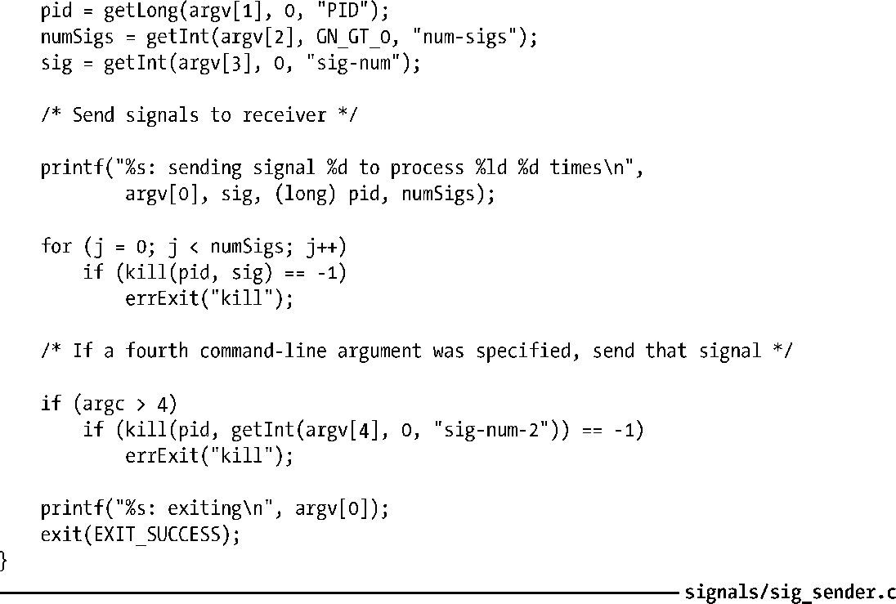
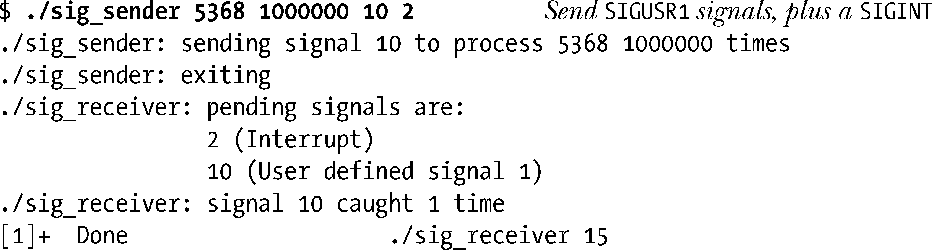
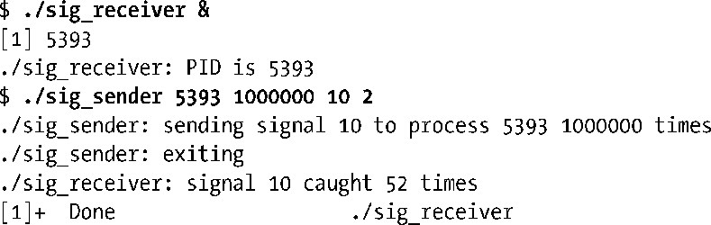
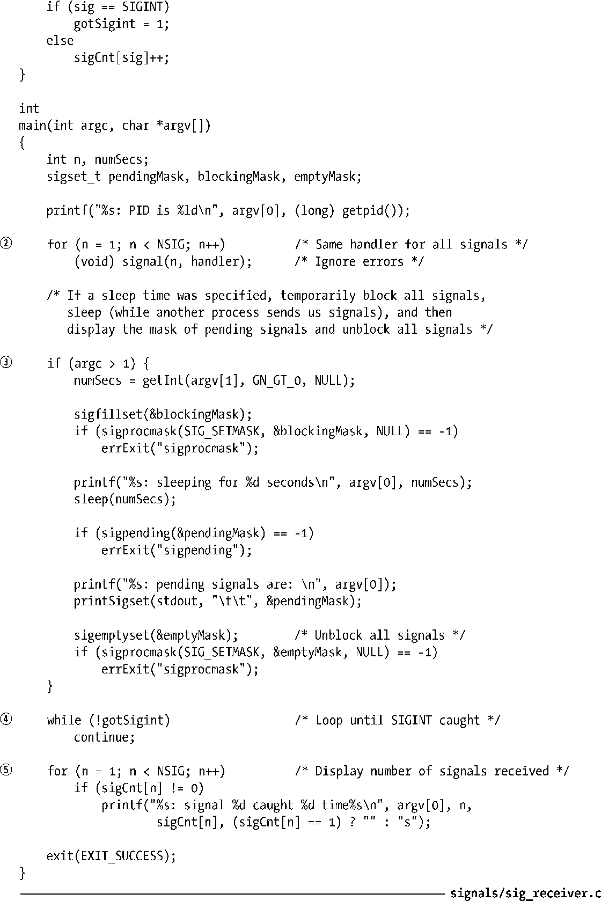

### 20.12　不对信号进行排队处理

等待信号集只是一个掩码，仅表明一个信号是否发生，而未表明其发生的次数。换言之，如果同一信号在阻塞状态下产生多次，那么会将该信号记录在等待信号集中，并在稍后仅传递一次。（标准信号和实时信号之间的差异之一在于，如22.8节所述，对实时信号进行了排队处理。）

程序清单20-6和程序清单20-7显示了两个程序，可用于观察未作排队处理的信号。清单20-6的程序可接受多达四个命令行参数，如下所示：

第一个参数是程序发送信号的目标进程ID。第二个参数则指定发送给目标进程的信号数量。第三个参数指定发往目标进程的信号编号。如果还提供了一个信号编号作为第四个参数，那么当程序发送完之前参数所指定的信号之后，将发送该信号的一个实例。在如下shell会话示例中，就使用了最后一个参数向目标进程发送一个SIGINT信号，发送该信号的目的将在稍后揭晓。

程序清单20-6：发送多个信号

程序清单20-7中程序则被设计为去捕获程序清单20-6程序所发送的信号并汇总其统计数据。该程序执行了以下步骤。

+ 该程序建立了单个处理器程序来捕获所有信号。（捕获SIGKILL和SIGSTOP信号是不可能的，不过将忽略在尝试为这些信号建立处理器时所发生的错误。）对于大多数类型的信号，处理器程序只是简单地使用一个数组来对信号计数。如果收到的信号为SIGINT，那么处理器程序将对标志（gotSigint）置位，从而使程序退出主循环（下面所描述的while循环）。（至于volatile修饰符以及声明gotSigint变量的sig_atomic_t数据类型，将在21.1.3节中解释其用途。）
+ 如果提供有一个命令行参数给程序，那么程序对所有信号的阻塞秒数将由该参数指定，并且在解除阻塞之前会显示待处理的信号集，从而使用户在进程执行下面的步骤前向其发送信号。
+ 程序执行while循环以消耗CPU时间，直至将gotSigint标志置位。（20.14节和22.9节描述了pause()和sigsuspend()的用法，二者在等待信号到来期间对CPU的使用方式都颇为高效。）
+ 退出while循环后，程序显示对所有接收信号的计数。

首先使用这两个程序来展示的是遭阻塞的信号无论产生了多少次，仅会传递一次。这里为接收者指定了一个睡眠间隔，并在醒来之前发送所有信号。

发送程序的命令行参数指定了SIGUSR1和SIGINT信号，其在Linux/x86中的编号分别为10和2。

从以上输出可知，即使一个信号发送了一百万次，但仅会传递一次给接收者。

即使进程没有阻塞信号，其所收到的信号也可能比发送给它的要少得多。如果信号发送速度如此之快，以至于在内核考虑将执行权调度给接收进程之前，这些信号就已经到达，这时就会发生上述情况，从而导致多次发送的信号在进程等待信号集中只记录了一次。如果不带任何命令行参数来执行程序清单20-7中程序（因此，进程没有阻塞信号，也没有睡眠），那么将看到如下情况：

在所发送的一百万次信号之中，接收进程仅捕获到52次。（捕获信号的精确数目每每不同，这取决于内核调度算法变幻莫测的决策结果。）之所以如此，原因在于，发送程序会在每次获得调度而运行时发送多个信号给接收者。然而，当接收进程得以运行时，传递来的信号只有一个，因为只会将这些信号中的一个标记为等待状态。

程序清单20-7：捕获信号并对其计数

